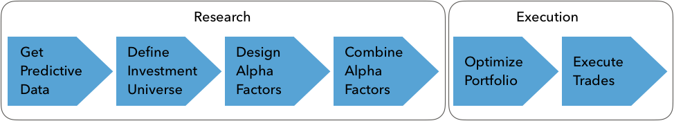

# Financial Feature Engineering

## Summary
* Which categories of factors exist, why they work, and how to measure them?
* Creating alpha factors using NumPy, pandas, and TA-Lib
* How to denoise data using wavelets and the Kalman filter
* Using [Zipline](../../../programming/python/zipline.md) offline and on Quantopian to test individual and multiple alpha factors
* How to use Alphalens to evaluate predictive performance and turnover using, among other metrics, the **information coefficient**
* This chapter focuses on the research phase

## Alpha factors in practice - from data to signals

#### Alpha Factors
Alpha factors are transformations of raw data that aim to predict asset price movements. Put differently alpha factors are transformations of market, fundamental, and alternative data that contain predictive signals. They are designed to **capture risks that drive asset returns**. A factor may combine one or several inputs, but outputs a single value for each asset. Trade decisions may rely on relative factor values across assets or patterns for a single asset. Some factors describe fundamental, economy-wide variables such as growth, inflation, volatility, productivity, and demographic risk. Other factors represent investment styles, such as value or growth, and momentum investing that can be traded and are thus prices by the market. Ideally, risk factors should be independent of each other, yield positive risk premia, and forma complete set that spans all dimensions of risk and explains the systematic risks for assets in a given class. In reality, this is only approximate.

## Building on decades of factor research

* This chapter will review a few key factor categories prominent in financial research and trading applications, explain their economic rationale, and present metrics typically used to capture these drivers of returns.

#### Momentum and Sentiment

**Momentum investing** follows the adage: *the trend is your friend or let your winners run*. Momentum factors are designated to go long on assets that have performed well, while going short on assets with poor performance over a certain period. The premise of strategies using this factor is that **asset prices exhibit a trend**, reflected in positive serial correlation. Price momentum defies the efficient markets hypothesis (past price returns cannot predict future performance) despite the fact that momentum strategies have produced positive returns across asset classes and are essential to many trading strategies.

The momentum factor outperformed other risk factors up to the 2008 crisis. Other factors include the **high-minus-low (HML)** value factor, the **robust-minus-weak (RMW)** profitability factor, and the **conservative-minus-aggressive (CMA)** investment factor. The equity premium is the difference between the market return and the risk-free rate. 

Reasons for the momentum effect include investor behavior, persistent supply and demand imbalances, a positive feedback loop between risk assets and the economy, or the market microstructure:
* The **behavioral rationale** reflects the biases of under-reaction and over-reaction to market news. After initial under-reaction to news, investors often extrapolate past behavior and create price momentum. Fear and greed psychology also motivates investors to increase exposure to winning assets and continue selling losing assets.
* Momentum can also have **fundamental drivers** such as a positive feedback loop between risk assets and the economy. Economic growth boosts economies, and the resulting wealth effect feeds back into the economy fueling growth. 
* Another cause of momentum can be persistent **demand-supply** imbalances due to market frictions. For example, oil production may lag higher demand from a booming economy for years, and persist supply shortages can trigger and support upward price momentum.
* Over short, intraday horizons, **market microstructure** effects can also create price momentum as investors implement strategies that mimic their biases. For example, the trading wisdom to cut losses and let profits run has investors using trading strategies such as stop-loss, **constant proportion insurance (CPPI)**. dynamical delta hedging, or option-based strategies such as protective puts. These strategies create momentum because they imply advance commitment to sell when an asset underperforms and buys when its outperforms.

#### How to measure momentum and sentiment

Momentum factors are typically derived from changes in price time series by identifying trends and patterns. They can be constructed based on absolute or relative return by comparing a cross-section of assets or analyzing an asset's time series.

* **Price momentum**: This factor computes the total return for a given number of prior trading days. In academic literature, it is common to use the last 12 months except for the most recent month due to a short-term reversal effect.
* **12-month price momentum volume adjustment**: The indicator normalizes the total return over the previous 12 months by dividing it by the standard deviation of these returns.
*  **Price acceleration**: Price acceleration calculates the gradient of the price trend (adjusted for volatility) using linear regression on daily prices for a longer and shorter period and compares the change in the slope as a measure of price acceleration.
* **Percent off 52-week high**: This factor uses the percent difference between the most recent and the highest price for the last 52 weeks.

#### Value factors - hunting fundamental bargains

Stocks with low prices relative to their fundamental value tend to deliver returns in excess of a capitalization-weighted benchmark. Value factors reflect this correlation and are designed to send buy signals for undervalued assets that are relatively cheap and sell signals for overvalued assets. A value strategy is a model that estimates the asset's fair or fundamental value. Fair value can be defined as an absolute price level, a spread relative to other assets, or a range in which an asset should trade.

##### Relative value strategies

Value strategies rely on mean-reversion of prices to the asset's fair price. They assume that prices temporarily deviate due to behavioral effects like over-reaction or heading, or liquidity effects such as temporary market impact or long term supply/demand friction. Value factors often exhibit properties opposite to those of momentum factors because they rely on mean-reversion. 

Value factors enable a broad array of systematic strategies:

* **Fundamental value strategies**: These strategies derive fair asset values from economic and fundamental indicators that depend on target asset class. In fixed income, currencies and commodities, indicators include levels and changes in the capital account balance, economic activity, inflation, or fund flows. Equity value approaches compare a stock price to fundamental metrics such as book value, top-line sales, bottom-line earnings, or various cash-flow metrics.
* **Market value strategies**: They use statistical or machine learning models to identify mispricing due to inefficiencies in liquid provision.
* **Cross-asset relative value strategies: Cross-asset relative value strategies focus on mispricing across asset classes.

##### Why do value factors help predict returns?

The **value effect**, defined as excess return on portfolio of value stocks relative (low market value relative to fundamentals) to a portfolio of growth stocks (high market value relative to fundamentals). 
* In a **rational, efficient markets view** the value premium compensates for higher real or perceived risks. Value firms have less flexibility to adapt to the unfavorable economic environments than leaner and more flexible growth companies, or that value stock risks relate to high financial leverage and more uncertain future earnings. Value and small-cap portfolios have been shown to be more sensitive to macro shocks than growth and large-cap stock portfolios.
* From a **behavioral perspective**, the value premium can be explained by loss aversion and mental accounting biases. Investors may be less concerned about losses on assets with a strong recent performance due to the cushions offered by prior gains. This loss aversion bias induces investors to perceive the stock as less risky than before and discount its future cash flows at a lower rate.
* These **differential return expectations** can produce a value premium: growth stocks with a high price multiple relative to fundamentals have done well in the past, but investors will require a lower average return going forward due to their biased perception of lower risks, while the inverse is true for value stocks.

##### How to capture value effects

* **Cash flow yield**: This ratio divides the operational cash flow per share by the share price. A higher ratio implies better cash returns for shareholders (if paid out by dividends)
* **Free cash flow yield**: The ratio divides the free cash flow per share, which reflects the amount of cash available for distribution after necessary expenses and investments, by the share price. Higher and growing free cash flow yield is commonly viewed as a signal of outperformance.
* **Cash flow return on invested capital (CFROIC)**: CFROIC measures a company's cash flow profitability. It divides operating
cash flow by invested capital, defined as total debt plus net assets. A higher
return means the business has more cash for a given amount of invested capital, generating more value for shareholders. 

##### Volatility and size anomalies

The **size effect** relates to the excess performance of stocks with a low market capitalization. More recently, the low-volatility factor has been shown to capture excess returns on
stocks with below-average volatility, beta, or idiosyncratic risk. Stocks with a larger market capitalization tend to have lower volatility so that the traditional size factor is often combined with the more recent volatility factor. The **CAPM** asserts higher risk should earn higher returns but the opposite has been true, with less risky assets outperforming riskier assets. 

##### Why do volatility and size predict returns?

* **Lottery effect**: The lottery effect builds on empirical evidence that individuals take on bets that resemble lottery tickets with a small expected loss but a large potential win. As a result, investors may overpay for high-volatility stocks and underpay for low-volatility stocks due to their biased preferences.
* **Representativeness bias**: The representativeness bias suggests that investors extrapolate the success of a few, well‑publicized volatile stocks to all volatile stocks while ignoring the speculative nature of such stocks.
* **Overconfidence: Investors may be overconfident in their ability to forecast the future, and their difference in opinions are higher for volatile stocks with more uncertain outcomes.

##### How to measure volatility and size

Metrics used to identify low-volatility stocks cover a broad spectrum, with
realized volatility (standard deviation) on one end and forecast (implied) volatility and correlations on the other end.

#### Quality factors for quantitative investing

**Quality factors** aim to capture the excess returns reaped by companies that are highly profitable, operationally efficient, safe, stable, and well-governed—in short, high quality. The markets also appear to reward relative earnings certainty and penalize stocks with high quality. Quality factors are often combined with other risk factors in a multi-factor strategy, most frequently with value to produce the quality at a reasonable price. Long-short quality factors tend to have negative market beta because long quality stocks have low volatility, and short more volatile, low quality stocks. Quality factors are positively correlated with low volatility and momentum factors, and negatively correlated with value and broad market exposure. 

##### Why quality matters

* Quality factors may signal outperformance because superior fundamentals such as
sustained profitability, steady growth in cash flow, prudent leveraging, a low need for capital market financing, or low financial risk underpin the demand for equity shares and support the price of such companies in the long run. From a corporate finance perspective, the price of such companies in the long run.
* Investors under-react to information about quality.
* Herd argument: fund managers may find it east to justify buying a company with strong fundamentals, even when it is getting expensive.

##### How to measure asset quality

* Quality factors rely on metrics computed from the balance sheet and income statement, which indicate profitability reflected in high profit or cash flow margins, operating efficiency, financial strength, and competitiveness more broadly because it implies the ability to sustain a profitability position over time. Hence, quality has been measured using gross profitability (which has been recently added to the Fama–French factor model; see Chapter 7, Linear Models – From Risk Factors.

