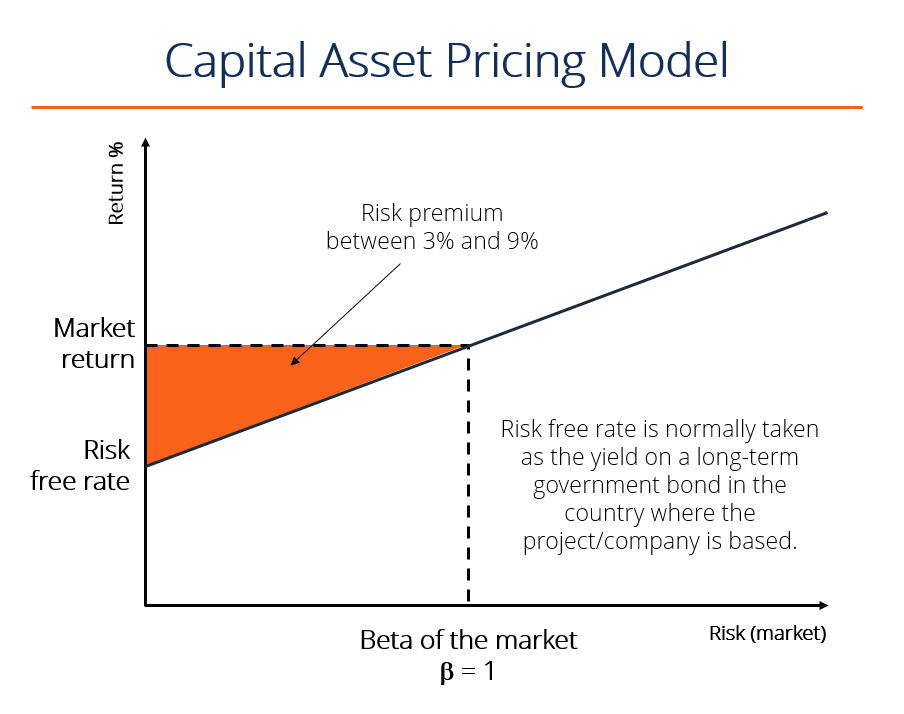

# Fundamental Analysis

Fundamental analysis (FA) is a method of measuring a security's intrinsic value by examining related economic and financial factors. Fundamental analysts study anything that can affect the security's value, from macroeconomic factors such as the state of the economy and industry conditions to microeconomic factors like the effectiveness of the company's management. The end goal is to arrive at a number (real or "fair market" value) that an investor can compare with a security's current price in order to see whether the security is undervalued or overvalued.

* Analysts typically study the overall state of the economy and then the strength of the specific industry before concentrating on the individual company performance to arrive at a fair market value (intrinsic value) for the stock.
* For stocks, fundamental analysis uses revenues, earnings, future growth, return on equity, profit margins, and other data to determine a company's underlying value and potential for future growth, i.e., financial statements.
* If the intrinsic value is higher than the stock's market price, then the analyst will publish a buy or overweight rating. If the intrinsic value is lower, then the stock is considered overvalued and a sell or underweight recommendation is issued.

Various fundamental factors can be grouped into two categories:  
1. Quantitative 
	* **The balance sheet**:  $\text{Assets} = \text{Liabilities} + \text{Shareholders' equity}$
	* **The income statement**: The income statement presents information about revenues, expenses, and profit that was generated as a result of the business' operations for that period (quarterly).
	* **Statement of cash flows**: The statement of cash flows represents a record of a business' cash inflows and outflows over a period of time. Typically **cash from investing (CFI)**, **cash from financing (CFF)**, **operating cash flow (OCF)**.
2. Qualitative
	* **The business model**: What exactly does the company do?
	* Competitive advantage 
	* **Management**: How is the management performing?
	* **Corporate governance**: This describes the policies in place within an organization denoting the relationship and responsibilities between management, directors, and stakeholders. Is the company ethical and legal?
	* **Company's industry**: Customer base, market share among firms, industry-wide growth, competition, regulation, and business cycles.

## Alpha

An alpha is a combination of mathematical expressions, computer source code, and configuration parameters
that can be used, in combination with historical data, to make predictions about future movements of various
financial instruments.

## Capital Asset Pricing Model (CAPM)
 
### Definition

1. **Systematic Risk**: These are market risks that cannot be diversified away. Interest rates, recessions, and wars are examples.
2. **Unsystematic Risk**: This related to individual stocks. It represents the correlated of a stock's return that is not correlated with general market moves. Modern portfolio theory shows that specific risk can be removed or at least mitigated through diversification of a portfolio.

The Capital Asset Pricing Model (CAPM) is the model that describes the relationship between the expected returns and risk of investing in a security. CAPM is a way to measure systematic risk. The return on an individual stock, or a portfolio of stocks, should equal its cost of capital. It shows that the expected return on a security is equal to the risk-free return plus a **risk premium**, which is based on the **beta** of that security. It is based on the idea of systematic risk (otherwise known as non-diversifiable risk) that investors need to compensate for in the form of a **risk premium**.

According to CAPM, beta is the only relevant measure of a stock's risk. It measures a stock's volatility; it shows how much the price of a stock jumps up and down **compared** with how much the entire stock market jumps up and down.

 **Risk Premium**: A risk premium is a rate of return greater than the risk-free rate. When investing, investors desire a higher risk premium when taking on more risky investments.
* **Expected Return**: Represents the expected return of a capital asset over time, given all the other variable in the equation. "Expected return" is a long term assumption about how an investment will play over its entire life.
* **Risk-Free Rate** The risk-free rate is typically equal to the yield on a 10-year US government bond. The risk-free rate should correspond to the country where the investment is being made, and the maturity of the bond should match the time horizon of the investment. Professional convention, however, is to typically use the 10-year no matter what, because it's the most heavily quoted and most liquid bond.
* **Beta**: The beta is a measure of a stock's risk (volatility of returns) reflected by measuring the fluctuation of its price changes relative to the overall market. In other words, it is the stock's sensitivity to market risk. For instance, if a company's beta is equal to 1.5 the security has 150% of the volatility of the market average. However, if the beta is equal to 1, the expected return on a security is equal to the average market return. A beta of -1 means security has a perfect negative correlation with the market. For example, a stock with a beta of 1.5 would rise 15% if the market rose by 10% and fall by 15% if the market fell by 10%.

### Equation

$$R = R_{f} + \beta_{c} (R_{m} - R_{f})$$

$R = \text{Expected return on an investment} \newline$ 
$R_{f} = \text{Risk free rate} \newline$
$\beta_{c} = \text{Beta of the investment} \newline$
$R_{m} = \text{Expected return on the market}$

---

### The Bottom Line

The capital asset pricing model is by no means a perfect theory. But the spirit of CAPM is correct. It provides a useful measure that helps investors determine a useful measure that helps investors determine what return they deserve on an investment, in exchange for putting their money at risk on it.

---
## Fama and French Three Factor Model

### Definition

The Fama and French Three-Factor Model is an asset pricing model that expands on the capital asset pricing model (CAPM) by adding size risk and value risk factors to the market risk factor in CAPM. It considers the fact that value and small-cap stocks outperform markets on a regular basis. By including these two additional factors, the models adjusts for this outperforming tendency, which is thought to make it a better tool for evaluating manager performance. It was found that **value stocks** outperform growth stocks and small-cap stocks tend to outperform large-cap stocks. The performance of portfolios with a large number of value stocks would be lower than the CAPM result, as the Three-Factor model adjusts downward for observed small-cap and value stock outperformance.

* **Small Minus Big (SMB)**: SMB is used to explain portfolio returns. This factor is also referred to as the "small firm effect," or the "size effect," where size is based on a company's market capitalization. It says smaller companies outperform larger ones over the long-term.  
* **High Minus Low (HML)**: HML, also referred to as the value premium, accounts for the spread in returns between value stocks and growth stocks. This system argues that companies with high **book-to-market** ratios, also known as **value stocks**, outperform those with lower **book-to-market** values, known as **growth stocks**.  

### Equation

$$R_{it}-R_{ft} = \alpha_{it} + \beta_{1}(R_{Mt} - R_{ft}) + \beta_{2}SMB_{t} + \beta_{3}HML_{t} + \epsilon_{it}$$

$R_{it} = \text{total return of a stock or portfolio}$ $i$ $\text{at time}$ $t \newline$
$R_{ft} = \text{risk free rate of return at time}$ $t \newline$
$R_{Mt} = \text{total market portfolio return at time}$ $t \newline$
$R_{it} - R_{ft} = \text{expected excess return} \newline$
$R_{Mt} - R_{ft} = \text{excess return on the market portfolio (index)} \newline$
$SMB_{t} = \text{size premium (small minus big)} \newline$
$HML_{t} = \text{value premium (high minus low)} \newline$
$\beta_{1,2,3} = \text{factor coefficients}$

## Statistical Arbitrage

### Definition

A group of trading strategies that utilize mean reversion analyses to invest in diverse portfolios of up to thousands of securities for a very short period of time. This type of strategy assigns stocks a desirability ranking and then constructs a portfolio to reduce risk as much as possible. They are market neutral (pairs-trading) because they involve opening a long and short position simultaneously to take advantage of inefficient pricing in correlated securities.

### Risks

It heavily depends on market prices returning to a historical or predictive normal, known as mean reversion. However, two stocks that operate in the same industry can remain uncorrelated for a significant amount of time due to both micro and macro factors. Therefore, most statistical arbitrage strategies take advantage of high-frequency trading (HFT).

## Lagging indicators

A lagging indicator is an observable or measurable factor that changes sometime after the economic, financial, or business variable with which it is correlated changes. Lagging indicators confirm trends and changes in trends. 

Examples:
* Unemployment rate
* Corporate profits
* Labor cost per unit of output

**Lagging indicators confirm long-term trends, but they do not predict them.**
